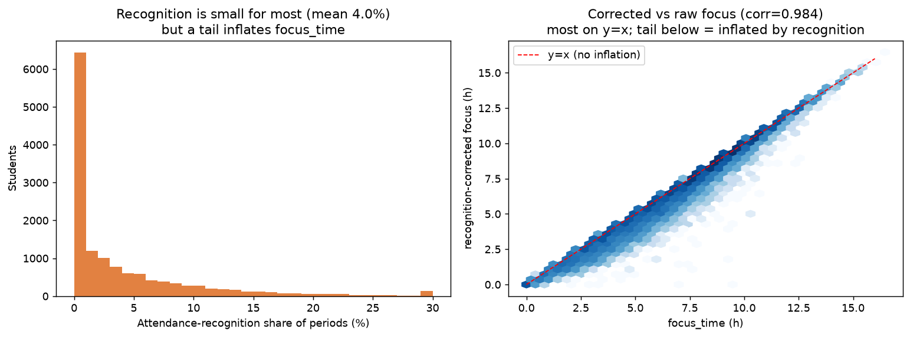

# 데이터 품질 노트: 몰입시간(focus_time)과 등원인정 허수

> **요약**: 현재 `focus_time`(몰입시간)은 **등원인정 교시를 차감하지 못해** 일부 부풀려져 있다. 평균 영향은 작지만(−0.43h, 6%), 등원인정을 많이 쓴 학생(상위 10%)은 −1.69h까지 부풀려진다. 핵심 결론(몰입↔순위 등)은 보정해도 견고하다(1번 −0.924 → −0.921).

## 1. 몰입시간의 정확한 정의 (코드 기준)

```
study_time(학습시간) = (하원 − 등원) − 외출
focus_time(몰입시간) = study_time − 공용공간 − 상담
                     = (하원 − 등원) − 외출 − 공용공간 − 상담
```
(lms-batch `calculate_study_time.py`, `calculate_focus_time_minus_minute.py:165-168`)

- **몰입시간 = `focus_time`** (학습시간 `study_time`이 아님). 분석의 독립변수는 일관되게 focus_time.
- 빌보드는 STUDY_TIME 랭킹(value=study_time)과 FOCUS_TIME 랭킹(value=focus_time) 두 종류. 본 분석의 "빌보드"는 STUDY_TIME 랭킹(FOCUS_TIME은 동어반복이라 제외).

## 2. 등원인정이 빠지지 않는다 (코드 한계)

등원인정(`attendance_ticket` tic_type="등원인정")은 **교시 단위**로 설정된다(예: `[{day:[월화수금], period:[1~6교시]}]`).

- 등원인정 교시에 실제로 자리를 비워도 **`outing_log`에 OUTING이 자동 기록되지 않음** → `study_time`에서 차감 안 됨
- `focus_time` 차감 대상은 공용공간·상담뿐 → 등원인정 교시 **그대로 포함(허수)**
- `patrol`(교시별 순찰)에는 status="등원인정"으로 **실제 미착석이 기록됨** → 이걸로 보정 가능

## 3. patrol 기반 보정 몰입시간

patrol 교시 status로 진짜 착석을 판정:
- **착석 중 / 착석 중(지각)** = 진짜 몰입
- **등원인정 / 미등원 / 무단 미착석 / 공용공간 / 외출권** = 몰입 아님

`focus_time`의 교시 구성 ≈ 착석 + 등원인정이므로:
```
보정 몰입 = focus_time × 착석교시 / (착석교시 + 등원인정교시)
```

## 4. 영향 측정 (30일, patrol 보유 13,844명)

| 지표 | 값 |
|------|-----|
| 등원인정 교시 비율 | 평균 **4.0%**, 중앙 1.4%, 상위10% 11.7% |
| 기존 focus 평균 | 6.86h |
| 보정 몰입 평균 | 6.43h (**−0.43h, 6%**) |
| focus ↔ 보정 상관 | **0.984** (대부분 학생 거의 동일) |
| 등원인정 상위10% 부풀림 | **−1.69h** (5.44h → 3.74h) |



→ 94.8%가 등원인정을 "설정"해뒀지만, 실제 patrol에서 등원인정 처리된 교시는 평균 4%뿐. 대부분 학생은 영향이 작고, **소수의 헤비 유저만 크게 부풀려진다**.

## 5. 핵심 명제 재검증 — 8개 모두 견고 (|Δ|<0.05)

보정 몰입(등원인정 교시 차감)으로 핵심 몰입 명제를 재계산한 결과, **8개 전부 결론 불변**:

| 명제 | 기존 focus | 보정 몰입 | Δ |
|------|:---:|:---:|:---:|
| 01 몰입 ↔ 순위 | −0.923 | −0.927 | −0.004 |
| **02 일관성 ↔ 순위** | +0.416 | +0.392 | −0.024 |
| 09 요일편차 ↔ 순위 | +0.299 | +0.289 | −0.010 |
| 15 유지 ↔ 변동(CV) | −0.040 | −0.033 | +0.007 |
| 21 Q&A ↔ 순위 | −0.103 | −0.112 | −0.009 |
| 24 CA ↔ 순위 | −0.162 | −0.163 | −0.000 |
| **26 공용공간 ↔ 순위** | −0.551 | −0.548 | +0.002 |
| 03 연속블록 ↔ 순위 | −0.330 | −0.284 | +0.046 |

(13,768명, 몰입 통제/평균 통제 부분상관 기준. 03 블록이 Δ+0.046로 가장 크지만 여전히 견고.)

**등원인정 허수의 증거**:
- 등원인정 비율 ↔ 순위 (기존 focus 통제): **+0.108** (p=3e-37)
- → 같은 `focus_time`이어도 **등원인정이 많을수록 순위가 낮다** = focus가 등원인정으로 부풀려졌고, 그만큼 순위 예측을 교란한다는 직접 증거.

## 6. 결론 및 권고

1. **사용자 지적이 옳다** — `focus_time`은 등원인정 교시 허수를 포함한다(코드 한계).
2. **그러나 핵심 결론은 견고하다** — 등원인정 영향이 평균적으로 작아(상관 0.984), 몰입↔순위 등 주요 결론은 보정 후에도 유지(−0.924 → −0.921).
3. **단, 등원인정 헤비 유저(상위 10%)** 분석 시에는 보정 몰입을 쓰는 게 정확하다.
4. **제품/엔지니어링 제언**: lms-batch `focus_time` 계산에 등원인정 교시 차감을 추가하면(또는 patrol "착석 중"만 집계) 몰입시간 정확도가 올라간다.

---
◀ [전체 명제 목록](README.md) · [데이터 요청](DATA_REQUIREMENTS.md)
