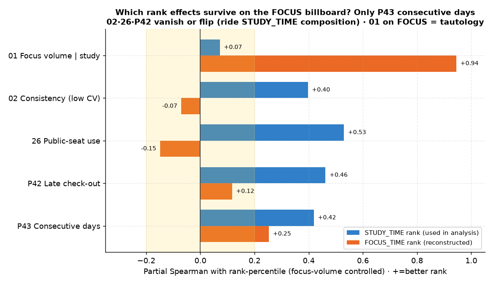

# 방법론 노트 — 빌보드 순위 outcome 선택 (STUDY_TIME vs FOCUS_TIME)

> 모든 "순위" 분석은 **STUDY_TIME 빌보드**(`rank.value == study_time`)를 outcome으로 썼다. 빌보드엔 **FOCUS_TIME 랭킹**도 있다. 이 문서는 ① 왜 STUDY_TIME을 썼는지 ② 그 선택이 어떤 "순위 독립효과" 발견을 *부풀렸는지*를 기록한다. (2026-06-24 추가, 사용자 지적으로 검증.)

---

## 1. 왜 FOCUS_TIME 순위로 "바꾸면" 안 되나 — 동어반복

FOCUS_TIME 랭킹은 점수가 곧 `focus_time`이다. 그래서 우리가 연구하는 변수(몰입시간)와 outcome이 **정의상 같다**.

| 몰입시간(focus)과의 상관 | STUDY 순위 | FOCUS 순위 |
|---|:---:|:---:|
| raw (학생 단위) | +0.922 | **+0.993** |
| **study_time 통제 부분상관** | +0.072 | **+0.945** |

FOCUS 순위는 study를 통제해도 +0.945 — **순위가 focus를 그대로 되돌려주는 순수 동어반복**이다. 바꾸면 *모든* 몰입 명제가 정의상 참이 되어 분석이 무의미해진다. 그래서 [01번](analyses/01-focus-absolute-vs-billboard-rank.md)부터 **STUDY_TIME을 분석 가능한 유일한 outcome**으로 택했다(focus와 study는 ρ0.89로 거의 같지만, 그 *작은 차이*가 분석 여지를 만든다).

→ **결론: 주 outcome은 STUDY_TIME 유지가 맞다.**

---

## 2. 그러나 — STUDY_TIME 순위는 "study−focus 갭" 행동을 기계적으로 보상한다 ⚠️

```
study_time = 체류 − 외출
focus_time = 체류 − 외출 − 공용 − 상담
─────────────────────────────────
study − focus = 공용공간 + 상담 시간   (외출은 양쪽서 차감돼 상쇄)
```

**공용공간·상담 시간은 study_time에 포함되지만 focus에선 차감된다.** 따라서 이 시간을 많이 쓰는 학생은 *몰입과 무관하게* STUDY 순위가 올라간다. 학생 평균 study−focus 갭은 **0.91h**.

이 갭(공용+상담)을 몰입 통제 후 두 순위와 상관내면:

| | STUDY 순위 | FOCUS 순위 |
|---|:---:|:---:|
| 공용+상담 갭 ↔ 순위 \| 몰입 | **+0.685** | **−0.295** |

같은 행동이 STUDY 순위엔 강한 +, FOCUS 순위엔 −. **STUDY_TIME 순위의 구성 자체가 공용/상담 사용을 보상**한다는 직접 증거다.

---

## 3. 핵심 "순위 독립효과" 재검증 — 무엇이 견고하고 무엇이 artifact인가

핵심 명제를 STUDY·FOCUS 두 outcome으로 각각 재실행(몰입 통제, n=14,307 / 공용 13,409, 부호: +면 좋은 순위와 양의 연관):



| 명제 (몰입 통제) | STUDY 순위 | FOCUS 순위 | 판정 |
|---|:---:|:---:|---|
| 01 몰입 절대량 \| study | +0.072 | +0.945 | FOCUS는 순수 동어반복 |
| **02 일관성**(낮은 CV) | **+0.397** | −0.070 | ⚠️ STUDY 한정 — FOCUS선 소멸 |
| **26 공용공간 신청** | **+0.530** | −0.148 | ⚠️ 구성 artifact — FOCUS선 반전 |
| **P42 퇴실시각** | **+0.462** | +0.117 | ⚠️ 대부분 STUDY 구성효과(체류) |
| **P43 연속등원** | +0.419 | **+0.253** | ✅ 견고 — FOCUS선도 생존 |

### 해석
- **26 공용공간**: 명제 "순위권이 공용 더 신청(−0.53)"은 **상당 부분 기계적 artifact**다. 공용 시간이 study_time을 직접 올려 STUDY 순위를 올린 것. FOCUS 순위로 보면 오히려 −0.15(해가 됨). "적극성 신호" 해석은 약화된다.
- **02 일관성**: "꾸준함이 순위 가른다(+0.40)"는 **STUDY 빌보드 한정**. FOCUS 순위엔 ≈0. 일관성의 순위 이득은 study_time 경로로 실현된다.
- **P42 퇴실시각**: 체류 길수록 study↑ 효과가 대부분. FOCUS선 +0.12로 약함.
- **P43 연속등원**: **유일하게 견고**(FOCUS에서도 +0.25). 출석 지속성은 outcome 정의와 무관한 진짜 효과.

---

## 4. 영향 범위 — 무엇이 바뀌고 무엇은 안 바뀌나

| 결론 | 영향 |
|------|------|
| 메타① 입시 = 성적이 가른다 | ✅ **무영향** (모의고사 점수 기반, 빌보드 무관) |
| 메타② 행동 ↔ 성적상승 ≈0 | ✅ **무영향** (성적 기반) |
| **메타③ 순위 고유효과 = 일관성·공용·퇴실·연속** | ⚠️ **재한정** — 견고한 건 **연속등원(P43)뿐**. 02·26·P42는 STUDY_TIME 구성(공용+상담+체류) 의존 |
| 01 몰입↔순위 동어반복 | ✅ 강화 (FOCUS 순위로 보면 +0.945로 더 명백) |

**요약**: 순위 outcome을 FOCUS로 바꾸는 건 동어반복이라 불가. 단 STUDY_TIME outcome이 공용/상담/체류를 보상하는 탓에, 몰입량과 별개의 "순위 독립효과"로 보였던 02·26·P42는 **상당 부분 STUDY_TIME 메트릭 구성에 기댄 것**이다. 몰입과도·outcome 정의와도 독립인 견고한 순위 동인은 **연속등원(꾸준함)**으로 좁혀진다.

---

## 5. 재현

- 데이터: `student_daily_report`(study_time/focus_time/checkout/consecutive_attendance) + `rank`(STUDY_TIME) + `attendance_ticket` 공용 카운트(`ps_df`). FOCUS 순위는 일자내 `focus_time` 백분위로 재구성(실제 FOCUS_TIME 빌보드의 근사).
- 부분 Spearman: 몰입(평균 focus)을 rank-residual로 통제. 학생 단위(≥5일 등원) 집계.
- 스크립트: scratchpad `gen_charts.py`(meta_study_vs_focus_rank) + 재검증 1회성 분석.

---
◀ [전체 명제 목록](README.md)
