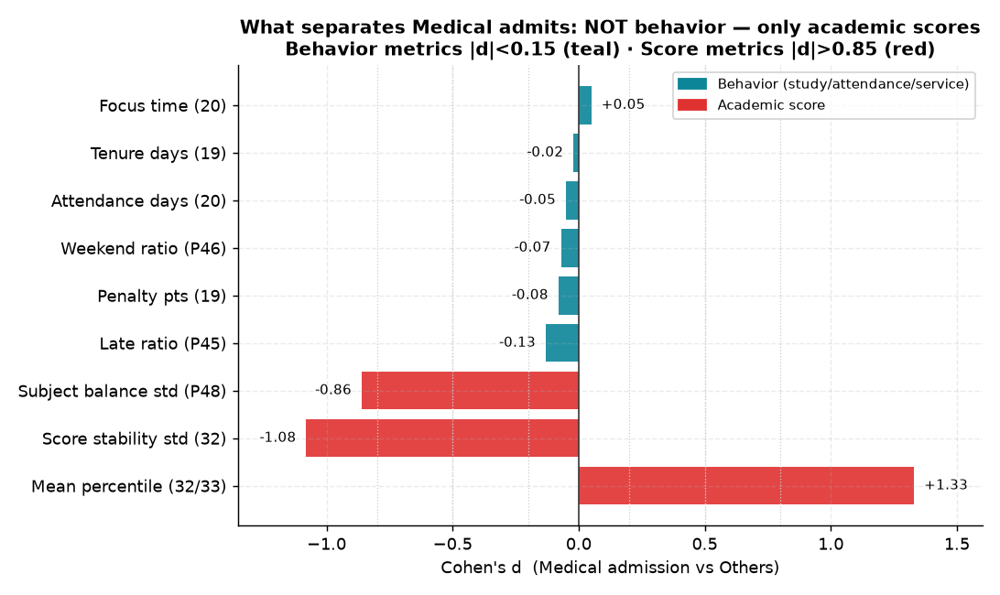
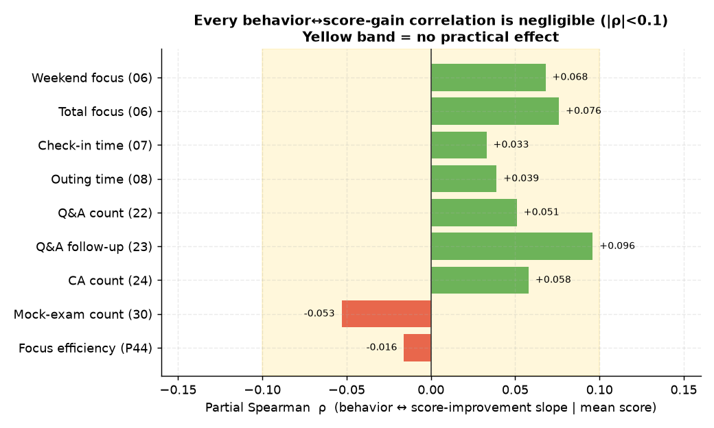
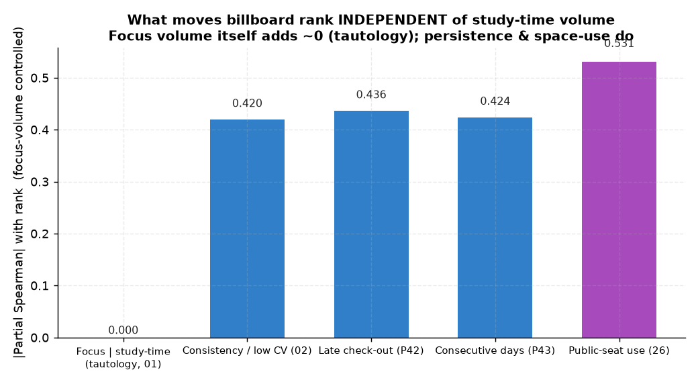

# 잇올 학습데이터 분석 — 명제 백로그

> 📌 origin.xlsx 41개 외에 AI가 추가 도출한 **제안 명제 11개(P42~P52)**: [proposed/README.md](proposed/README.md) — P48 과목균형↔메디컬(d−0.86), P52 성적수준↔몰입(연속 ρ+0.12) 등.

`origin.xlsx`의 가설들을 **검증 가능한 명제 41개**로 통합 정리한 마스터 인덱스.
각 명제는 `analyses/NN-*.md` 개별 문서로 관리한다.

## 진행 현황

| ✅ 완료 | 🔶 예비(장기데이터 보강) | 🟢 분석가능 | 🟡 데이터확인필요 | ⛔ 데이터부재(불가) | 합계 |
|:---:|:---:|:---:|:---:|:---:|:---:|
| 39 | 0 | 0 | 0 | 2 | 41 |

- **🟢 분석가능**: 운영 DB에서 데이터가 확인되어 바로 착수 가능
- **🟡 데이터확인필요**: 성적·입시결과·Q&A·CA·멘토 등 소스 컬렉션 확인 후 가능

## 📊 핵심 시각 요약 — 세 장의 그림으로 보는 결론

51개 명제를 관통하는 세 가지 발견. 개별 분석의 상세는 각 문서를 참고.

### ① 입시(메디컬)는 행동이 아니라 **성적**이 가른다

몰입시간·재원기간·출결·지각·주말노력 등 **모든 행동지표**의 메디컬 변별력은 |Cohen d|<0.15(무효). 반면 성적의 **절대수준(d+1.33)·안정성(d−1.08)·과목균형(d−0.86)** 은 압도적으로 크다. → "다들 비슷하게 열심히 하고, 변별은 실력(성적)에서 난다." 행동만으로 메디컬 예측 시 ROC-AUC 0.52(무작위), 성적을 더하면 0.88([39](analyses/39-composite-index-vs-admission.md)).

### ② 행동 ↔ 성적상승은 **전부 무효** (|ρ|<0.1)

주말몰입·입실시각·외출·Q&A·CA·응시횟수·효율 — **어떤 행동도 성적상승 기울기를 가르지 못한다**(전부 노란 무효 구간). 단 [28](analyses/28-ca-qna-combined-vs-score.md)에서 '서비스를 전혀 안 쓰는 소수'만 성적이 정체(이진 효과는 존재).

> ⚠️ **방향·기준 주의**: 위는 성적 *상승(기울기)* 과 메디컬 *이진컷* 기준이다. 방향을 뒤집어 성적 *수준(연속 백분위)* ↔ 행동을 보면, 성적 상위권일수록 몰입·꾸준함이 **약하지만 확실하게**(재원생 ρ=+0.123, p<1e-16, 분위 양극단 +0.93h) 더 높다 — 메디컬 이진컷이 범위 제한으로 죽였던 신호다. 단 작고(약 10%) 인과는 아니다(상관은 방향 대칭). 상세: [P52](proposed/P52-score-level-vs-focus.md).

### ③ 순위를 움직이는 건 몰입'량'이 아니라 **꾸준함·공간활용**

빌보드(STUDY_TIME)는 학습시간으로 매겨져 몰입'량'의 고유효과는 ≈0(동어반복, [01](analyses/01-focus-absolute-vs-billboard-rank.md)). 학습시간을 통제했을 때 순위를 끌어올리는 건 **일관성([02](analyses/02-focus-consistency-vs-rank.md))·퇴실시각([P42](proposed/P42-checkout-time-vs-rank.md))·연속등원([P43](proposed/P43-consecutive-attendance-vs-rank.md))·공용공간 활용([26](analyses/26-public-seat-vs-rank.md))** 같은 *지속성/적극성* 지표다.

> ⚠️ **재한정(중요)**: 이 효과들을 **FOCUS_TIME 빌보드**로 재검증하면, 견고한 건 **연속등원(P43, FOCUS선도 +0.25)뿐**이다. 02 일관성·26 공용공간·P42 퇴실은 FOCUS 순위에선 소멸/반전한다 — 공용·상담 시간이 `study_time`엔 포함되나 `focus`엔 차감돼, STUDY_TIME 순위가 그 행동을 *기계적으로* 보상하기 때문(공용+상담 갭 ↔ STUDY +0.69 / FOCUS −0.30). 상세: **[방법론 노트](METHODOLOGY_billboard_choice.md)**.

> **한 문장 결론**: 변별은 '**얼마나 많이**'가 아니라 '**얼마나 꾸준·균형적이냐**', 그리고 궁극적으로 **성적**이다.

## 설계 원칙 (1번 분석의 교훈)

> **1번**에서 STUDY_TIME 빌보드는 학습시간으로 매겨져 몰입시간과 **동어반복**에 가깝다는 점이 드러났다
> (study_time 통제 시 몰입의 순위 고유효과 ≈ 0). 따라서 이후 분석은 다음을 따른다:
> 1. **교란변수 통제**: 절대량/학습시간을 통제한 **부분상관**으로 고유효과를 분리한다.
> 2. **동어반복 회피**: 순위가 변수 자체로 매겨지는 조합을 피하고, 독립 성과(성적·입시결과·지속)로 확장한다.
> 3. **시계열·인과 지향**: 단순 상관을 넘어 lead/lag·이벤트 스터디로 선행성을 본다(4·5·40번).

## A. 몰입시간 × 성과

| # | 명제 | 데이터 | 상태 | 문서 |
|---|------|--------|------|------|
| 01 | 몰입시간 절대량 ↔ 빌보드 순위 | 🟦 확보 | ✅ 완료 | [01](analyses/01-focus-absolute-vs-billboard-rank.md) |
| 02 | 몰입시간 일관성(저변동) ↔ 순위 | 🟦 확보 | ✅ 완료 | [02](analyses/02-focus-consistency-vs-rank.md) |
| 03 | 연속 몰입 블록 길이 ↔ 순위 | 🟦 확보 | ✅ 완료 | [03](analyses/03-continuous-focus-block-vs-rank.md) |
| 04 | 빌보드 이탈 선행 몰입 하락 (조기경보) | 🟦 확보 | ✅ 완료 | [04](analyses/04-focus-leading-drop-early-warning.md) |
| 05 | 전월 몰입 → 익월 빌보드 (시차효과) | 🟦 확보 | ✅ 완료 | [05](analyses/05-focus-lag-next-month-rank.md) |
| 06 | 주말·공휴일 몰입 ↔ 성적상승 | 🟦 확보 | ✅ 완료 | [06](analyses/06-weekend-holiday-focus-vs-score.md) |
| 07 | 입실시각(오전형) ↔ 성적상승 | 🟦 확보 | ✅ 완료 | [07](analyses/07-morning-checkin-vs-score.md) |
| 08 | 외출·조퇴 빈도 ↔ 순위·성적 | 🟦 확보 | ✅ 완료 | [08](analyses/08-outing-frequency-vs-rank-score.md) |
| 09 | 요일별 몰입 편차 ↔ 상위권 | 🟦 확보 | ✅ 완료 | [09](analyses/09-weekday-variance-toptier.md) |
| 10 | 재원 N개월차 몰입 정점 후 분기 | 🟦 확보 | ✅ 완료 | [10](analyses/10-tenure-focus-peak.md) |
| 11 | 수능 N개월 전 몰입 급증 시점 | 🟦 확보 | ✅ 완료 | [11](analyses/11-focus-surge-before-exam.md) |
| 12 | 방학 몰입 증가폭 ↔ 성적상승 | 🟦 확보 | ✅ 완료 | [12](analyses/12-vacation-focus-growth-vs-score.md) |

## B. 빌보드 순위 동역학

| # | 명제 | 데이터 | 상태 | 문서 |
|---|------|--------|------|------|
| 13 | 빌보드 100위내 평균 재원기간 | 🟦 확보 | ✅ 완료 | [13](analyses/13-top100-tenure.md) |
| 14 | 입소→빌보드 첫 진입 소요기간 | 🟦 확보 | ✅ 완료 | [14](analyses/14-time-to-first-billboard.md) |
| 15 | 빌보드 유지기간 ↔ 몰입 변동폭 | 🟦 확보 | ✅ 완료 | [15](analyses/15-billboard-retention-vs-focus-var.md) |
| 16 | 순위 변동성(저변동) ↔ 입시결과 | 🟦 확보 | ✅ 완료 | [16](analyses/16-rank-volatility-vs-admission.md) |
| 17 | 빌보드 진입시점(고3 초/후반) ↔ 입시결과 | 🟦 확보 | ✅ 완료 | [17](analyses/17-entry-timing-vs-admission.md) |
| 18 | 빌보드 진입 직전 행동 변화 | 🟦 확보 | ✅ 완료 | [18](analyses/18-pre-entry-behavior-change.md) |
| 19 | 순위권 메디컬 입시결과 ↔ 재원기간 | 🟦 확보 | ✅ 완료 | [19](analyses/19-toptier-medical-tenure.md) |
| 20 | 순위권 메디컬 입시결과 ↔ 몰입시간 | 🟦 확보 | ✅ 완료 | [20](analyses/20-toptier-medical-focus.md) |

## C. 서비스 활용 (Q&A·CA·공용공간)

| # | 명제 | 데이터 | 상태 | 문서 |
|---|------|--------|------|------|
| 21 | 빌보드 순위권 ↔ 온라인 Q&A 활용도 | 🟦 확보 | ✅ 완료 | [21](analyses/21-rank-vs-online-qna.md) |
| 22 | Q&A ↔ 성적상승 (재원기간 통제) | 🟦 확보 | ✅ 완료 | [22](analyses/22-qna-vs-score-tenure-controlled.md) |
| 23 | Q&A 재질문·후속활용 ↔ 성적상승 | 🟦 확보 | ✅ 완료 | [23](analyses/23-qna-followup-vs-score.md) |
| 24 | CA 활용빈도 ↔ 성적상승 | 🟦 확보 | ✅ 완료 | [24](analyses/24-ca-frequency-vs-score.md) |
| 25 | CA 멘토 출신 ↔ 평균 몰입시간 | ⛔ 부재 | ⛔ 데이터부재(불가) | [25](analyses/25-ca-mentor-focus.md) |
| 26 | 공용공간 신청 ↔ 빌보드 순위 | 🟦 확보 | ✅ 완료 | [26](analyses/26-public-seat-vs-rank.md) |
| 27 | Q&A 시간대(수업직후 vs 심야) ↔ 성적 | 🟦 확보 | ✅ 완료 | [27](analyses/27-qna-timing-vs-score.md) |
| 28 | CA·Q&A 동시활용 ↔ 성적 | 🟦 확보 | ✅ 완료 | [28](analyses/28-ca-qna-combined-vs-score.md) |
| 29 | 입소 초기 서비스활용 ↔ 이후 성취 | 🟦 확보 | ✅ 완료 | [29](analyses/29-early-service-usage-vs-achievement.md) |

## D. 모의고사·성적·입시

| # | 명제 | 데이터 | 상태 | 문서 |
|---|------|--------|------|------|
| 30 | 모의고사 응시횟수 ↔ 성적상승 (재원통제) | 🟦 확보 | ✅ 완료 | [30](analyses/30-mock-exam-count-vs-score.md) |
| 31 | 오답복습·피드백 연계 ↔ 성적상승 | ⛔ 부재 | ⛔ 데이터부재(불가) | [31](analyses/31-mock-review-vs-score.md) |
| 32 | 모의고사 성적 안정성 ↔ 입시결과 | 🟦 확보 | ✅ 완료 | [32](analyses/32-score-stability-vs-admission.md) |
| 33 | 초기성적 vs 상승기울기 예측력 | 🟦 확보 | ✅ 완료 | [33](analyses/33-slope-vs-baseline-prediction.md) |

## E. 생활·습관·복합

| # | 명제 | 데이터 | 상태 | 문서 |
|---|------|--------|------|------|
| 34 | 조기 입소(고2~고3초) ↔ 입시결과 | 🟦 확보 | ✅ 완료 | [34](analyses/34-early-enrollment-vs-admission.md) |
| 35 | 출결 규칙성 ↔ 빌보드 순위 | 🟦 확보 | ✅ 완료 | [35](analyses/35-attendance-regularity-vs-rank.md) |
| 36 | 휴식 패턴 규칙성 ↔ 순공 효율 | 🟦 확보 | ✅ 완료 | [36](analyses/36-rest-pattern-vs-efficiency.md) |
| 37 | 좌석·지점 환경 ↔ 성과 | 🟦 확보 | ✅ 완료 | [37](analyses/37-seat-center-vs-performance.md) |
| 38 | 멘토 배정 ↔ 성과 | 🟦 확보 | ✅ 완료 | [38](analyses/38-mentor-assignment-vs-performance.md) |
| 39 | 복합지표 ↔ 입시결과 예측 | 🟦 확보 | ✅ 완료 | [39](analyses/39-composite-index-vs-admission.md) |
| 40 | 행동 동시변화 시점 ↔ 성취 | 🟦 확보 | ✅ 완료 | [40](analyses/40-simultaneous-behavior-shift-vs-achievement.md) |
| 41 | 이탈·중도퇴소 예측 | 🟦 확보 | ✅ 완료 | [41](analyses/41-dropout-prediction.md) |

## 데이터 출처 메모

> ⚠️ **몰입시간(focus_time) 정의·등원인정 허수 보정**은 **[DATA_QUALITY_focus_time.md](DATA_QUALITY_focus_time.md)** 참고 (focus_time은 등원인정 교시를 못 빼 일부 부풀려짐, 평균 6%·헤비유저 −1.69h, 핵심 결론은 견고).
> ⚠️ **순위 outcome 선택(STUDY_TIME vs FOCUS_TIME)·구성 artifact**는 **[METHODOLOGY_billboard_choice.md](METHODOLOGY_billboard_choice.md)** 참고 (FOCUS 순위는 동어반복이라 STUDY_TIME 유지가 맞으나, 02·26·P42의 순위 독립효과는 공용·상담 구성효과 의존 — 견고한 건 연속등원뿐).
> 🟡 데이터 요청 상세(소스별 확인 질문·명제 매트릭스)는 **[DATA_REQUIREMENTS.md](DATA_REQUIREMENTS.md)** 참고.

| 지표 | 컬렉션/소스 | 상태 |
|------|-------------|------|
| 몰입시간 focus_time | `student_daily_report` (aggregation DB) | 확보 |
| 빌보드 순위 | `rank` / `interval_rank` (aggregation DB) | 확보 |
| 출결·외출·입퇴실 | 출결 raw (main DB) | 확보(일부 raw 스키마 확인) |
| 공용공간 신청 | `public_seat` / ticket 계열 | 확보 |
| 재원기간·좌석·센터 | `student` / `admission` / `seat` | 확보 |
| 온라인 Q&A | `mentoring_questions` (main DB, stu_id 집계) | ✅ 확인됨 |
| CA(멘토 상담) | `mentor_schedule_reservation` (main DB) | ✅ 확인됨 |
| 성적·모의고사 | `exam_management.student_records` (PG) | ✅ 확인됨 |
| 입시결과(메디컬) | `exam_management.admission_results` (PG) | ✅ 확인됨 |
| 출결 raw(외출/블록) | `attendance.outing_log` (main) | ✅ 확인됨 |
| 장기 시계열 | DocumentDB 1년 월별 rank/sdr | ✅ 확인됨 |
| CA 멘토 출신 식별 | admin↔student 링크 부재 | ⛔ 불가(25) |
| 오답복습·피드백 로그 | 기록 테이블 부재 | ⛔ 불가(31) |

## 재현 환경

- 추출: 운영 aggregation DB read-only (`find`만). SSH 터널 경유.
- 분석: Python(pandas/scipy/matplotlib). 스크립트는 각 분석 문서 부록 참조.
