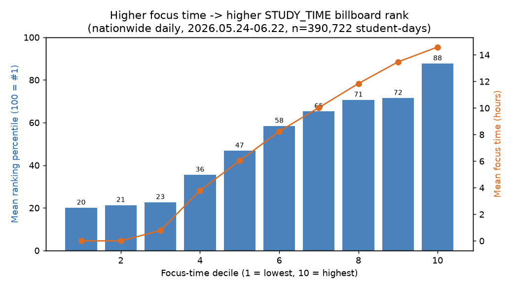
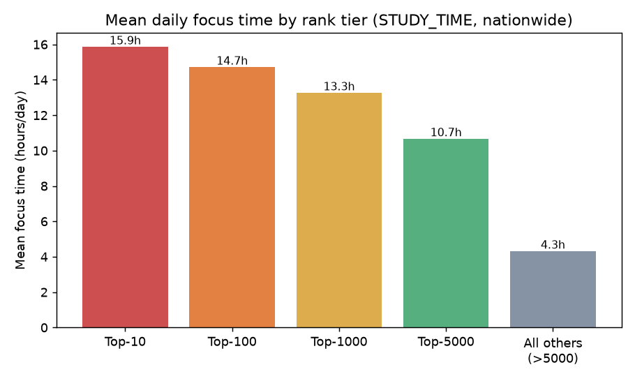
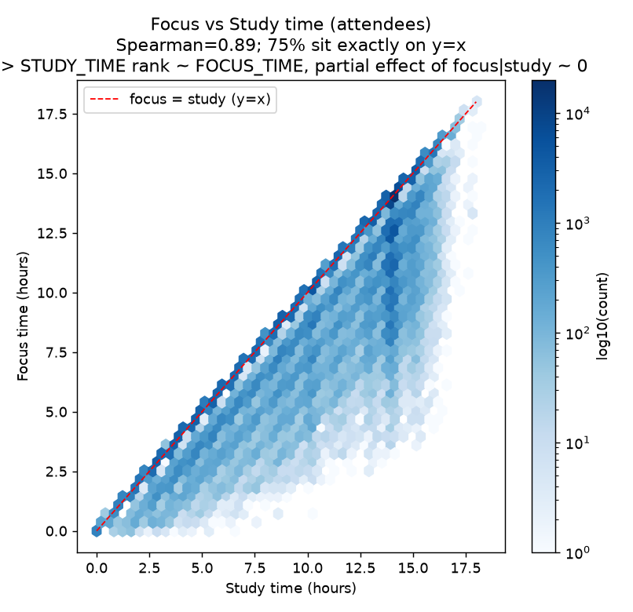

# 01. 몰입시간 절대량 ↔ 빌보드 순위

> **명제** · 일일/주간 몰입시간 절대량이 높을수록 빌보드(STUDY_TIME) 순위가 높다  
> **카테고리** A · 몰입시간 × 성과 · **상태** ✅ 완료 · **데이터** 🟦 확보 · **출처** 시트1-0 / 시트2-0

---

## 한 줄 결론

> **표면적으로는 강하게 참(✅), 그러나 "직접 원인"은 아니다.**
> 빌보드(STUDY_TIME 랭킹)는 **학습시간**으로 매겨지고, 몰입시간은 학습시간과 거의 동일(ρ=0.89, 학생 75%는 완전 일치)하기 때문에 **따라 올라가는 간접 효과**다. 학습시간을 통제하면 몰입시간의 순위 기여는 **0**(부분상관 +0.0003, p=0.88)이다.

마케팅·제품 메시지로 *"몰입시간이 긴 학생이 빌보드 상위권"* 은 데이터로 확실히 뒷받침된다. 다만 *"학습시간 대비 몰입 '효율'이 순위를 가른다"* 는 더 강한 주장은 데이터가 지지하지 않는다 — 순위는 절대 학습시간의 길이로 결정된다.

→ 이 한계가 **[02 일관성](02-focus-consistency-vs-rank.md)·[03 연속블록](03-continuous-focus-block-vs-rank.md)·[04 선행하락](04-focus-leading-drop-early-warning.md)** 분석의 출발점이다.

## 필요 데이터

- `student_daily_report.focus_time` (aggregation DB)
- `rank` (type=STUDY_TIME, range=NATIONWIDE, days=DAY)

**가용성**: 확보 (운영 DB 확인됨)

## 분석 방법

`(stu_id, date)` 조인 후 focus_time↔rank 상관·10분위 단조성·Top-N 비교. study_time 통제 부분상관으로 동어반복 분리.

| 항목 | 값 |
|------|-----|
| 기간 | 2026.05.24 ~ 06.22 (최근 30일, 일별) |
| 범위 | 전국(NATIONWIDE), STUDY_TIME 일별 랭킹 |
| 표본 | **390,722 학생-일**, 고유 학생 **15,036명** |
| 조인 키 | `(stu_id, date)` |

**선정합성 확인**: `rank.value == student_daily_report.study_time` 일치 비율 = **1.0000**
→ STUDY_TIME 랭킹의 점수는 정확히 그날의 학습시간(초)이다.

> ⚠️ `rank=1`이 1등. 매일 등원자 수가 달라 일자 내 **백분위(`pct_rank`)** 로 정규화해 비교했다.

## ⚠️ 교란요인 · 주의

STUDY_TIME 랭킹은 학습시간의 함수 → focus≈study(ρ0.89)라 표면상관은 강하나 직접인과 아님(부분상관≈0). 이 한계가 02·03·04번의 설계 원칙이 된다.

---

## 결과

### 1. 표면적 검증 — 명제는 강하게 성립

| 지표 | 값 | 해석 |
|------|-----|------|
| Pearson(focus, rank) | −0.654 | 음수 = 몰입↑ → 순위↑ |
| Spearman(focus, rank) | −0.647 | 순위상관 동일 방향 |
| Spearman(focus, **pct_rank**) | **−0.822** | 일자 정규화 시 더 강함 |
| Spearman(학생 30일 평균, ≥5일) | **−0.925** | 노이즈 제거 시 거의 단조 |

전 구간 p < 1e-300.



| 몰입 분위 | 평균 몰입(h) | 평균 상위백분위 |
|:---:|:---:|:---:|
| D1 (최하위) | 0.0 | 79.9% (하위권) |
| D5 | 6.0 | 53.2% |
| D10 (최상위) | 14.6 | **12.3% (상위권)** |

몰입 분위가 오를수록 평균 순위가 **단조적으로** 상승. 예외 구간 없음.



| 구간 | 평균 몰입시간 | 그 외 대비 |
|------|:---:|:---:|
| Top-10 | 15.85h | **2.31×** |
| Top-100 | 14.71h | 2.16× |
| Top-1000 | 13.26h | 2.09× |

### 2. 엄밀 검증 — "왜" 성립하는가

**A. 미등원(0시간) 제외**: 전체 25.2%(98,523행)가 몰입 0시간. 제외해도 Spearman(focus, pct_rank) = **−0.817** — 등원생 사이에서도 몰입이 순위를 가른다.

**B. 학습시간 통제 부분상관 — ★결정적**

| 지표 | 값 |
|------|-----|
| 부분 Spearman(focus, pct_rank \| **study 통제**) | **+0.0003 (p=0.88)** |
| (참고) Spearman(focus, study), 등원자 | **+0.887** |



학습시간을 고정하면 몰입시간의 순위 기여는 **통계적으로 0**. 이유는 산점도가 말해준다: **몰입시간 ≈ 학습시간**(75% 학생이 `focus=study` 직선 위). 외출·공용공간·상담을 거의 안 쓰기 때문.

**C. 외출/공용공간 사용 학생만(focus_ratio<1, 45.1%)**: 학습시간 통제 부분상관 +0.029 (효과크기 무시 가능) — "같은 학습시간이면 몰입이 길수록 순위 높다"는 추가 효과는 없다.

### 3. 종합 해석

```
몰입시간 ↑  ──(ρ=0.89, 거의 동일)──▶  학습시간 ↑  ──(정의상)──▶  STUDY_TIME 순위 ↑
                                          ▲
              몰입시간의 순위 효과는 이 경로를 100% 경유 (직접 경로 ≈ 0)
```

| ✅ 데이터가 지지 | ❌ 데이터가 지지하지 않음 |
|------|------|
| "몰입시간 긴 학생이 빌보드 상위권" | "몰입 '효율'이 순위를 가른다" |
| "오래 집중해 앉아있을수록 순위↑" | "같은 학습시간이면 몰입이 길어 순위↑" |

## 한계 & 후속

1. **관측 데이터의 한계**: 인과가 아닌 상관. → [04 선행하락](04-focus-leading-drop-early-warning.md)·[05 시차효과](05-focus-lag-next-month-rank.md)로 시계열 보강.
2. **빌보드 정의 의존성**: "빌보드=STUDY_TIME 랭킹" 가정에 묶임. 학습시간과 독립된 지표(연속등원 등)로 보면 몰입의 **고유** 효과를 검증 가능 → [02](02-focus-consistency-vs-rank.md)·[03](03-continuous-focus-block-vs-rank.md).
3. **focus_time 산정 신뢰도**: 외출·공용공간·상담 차감 로직 의존. focus_ratio<1 그룹은 별도 검증 권장.

## 선행 · 연관 분석

_(없음 — 전체 분석의 출발점)_ → 직접 파생: [02](02-focus-consistency-vs-rank.md), [04](04-focus-leading-drop-early-warning.md), [05](05-focus-lag-next-month-rank.md), [26](26-public-seat-vs-rank.md)

## 부록: 재현

- 추출: 운영 aggregation DB read-only (`find`만). 대상: `rank`(STUDY_TIME/NATIONWIDE/DAY), `student_daily_report`.
- 분석: Python pandas/scipy. 차트: `../assets/01/`.

## 📊 데이터 출처 & 표본

| 항목 | 내용 |
|------|------|
| 출처 | 운영 DocumentDB(aggregation): `rank`(STUDY_TIME/NATIONWIDE/DAY) + `student_daily_report` |
| 기간/범위 | 2026.05.24~06.22 (30일, 일별) |
| 표본 | 390,722 학생-일 · 고유 15,036명 |
| 분석 방법 | (stu_id,date) 조인, study_time 통제 부분상관 |
| 추출 | 운영 DB **read-only** (MongoDB `find` / PostgreSQL `SELECT`, 쓰기 호출 없음) |
| 환경 | 격리 venv(uv, pandas/scipy/sklearn), 자격증명 비저장 |

---
◀ [전체 명제 목록](../README.md)
