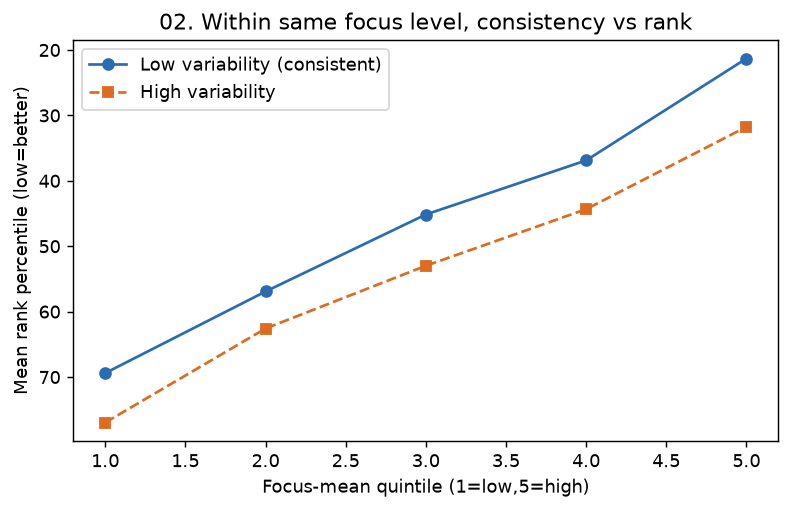

# 02. 몰입시간 일관성(저변동) ↔ 순위

> **명제** · 절대량보다 몰입시간의 일관성(낮은 표준편차)이 높은 학생이 순위가 높다
> **카테고리** A · 몰입시간 × 성과 · **상태** ✅ 완료 · **데이터** 🟦 확보 · **출처** 시트2-1

## 한 줄 결론

> **✅ 강하게 지지 — 01번의 동어반복을 처음으로 벗어난 독립 효과.**
> 평균 몰입량을 통제한 뒤에도 일관성(낮은 변동계수)이 순위와 **부분 Spearman +0.42**로 연결된다. "같은 몰입량이어도 꾸준한 학생이 순위가 높다."

## 가설
절대량보다 몰입시간의 일관성(낮은 표준편차)이 높은 학생이 순위가 높다.

## 필요 데이터
- `student_daily_report.focus_time` (학생별 분산)
- `rank`

**가용성**: 확보 (운영 DB 확인됨)

## 분석 방법
학생별(≥10일 출현, n=13,768) focus_time 평균·표준편차·변동계수(CV) 산출 → 평균 순위백분위와 상관. **평균 몰입량을 통제한 부분상관**으로 일관성의 고유효과를 분리.

## 결과

| 지표 | 값 | 해석 |
|------|-----|------|
| Spearman(CV, pct_rank) | +0.845 | 변동 클수록 순위↓ (raw) |
| **부분 Spearman(CV, pct_rank \| 평균)** | **+0.416** (p≈0) | 평균 통제 후에도 일관성 고유효과 큼 |

**몰입량 5분위 내 저변동/고변동 그룹의 평균 순위백분위**(낮을수록 상위):

| 몰입량 분위 | 평균 몰입(h) | 저변동 그룹 | 고변동 그룹 | 저변동 우위 |
|:---:|:---:|:---:|:---:|:---:|
| 1 (최저) | 2.6 | 69.4% | 77.0% | 7.6%p |
| 3 | 7.1 | 45.2% | 53.0% | 7.8%p |
| 5 (최고) | 11.0 | **21.3%** | 31.8% | **10.5%p** |

→ **모든 몰입량 구간에서** 저변동 그룹이 순위 우위. 몰입량이 많을수록 일관성의 이득이 더 커진다(최고분위 10.5%p).

## ⚠️ 교란요인 · 주의
평균과 분산은 음의 상관 경향(많이 하는 학생이 더 꾸준) → 평균 통제 필수. 통제 후에도 +0.42가 남아 고유효과 확인됨. CV는 평균 0 학생에서 정의 불가라 제외.

> ⚠️ **STUDY 빌보드 한정**: 이 +0.42는 **STUDY_TIME 순위 outcome 한정**이다. **FOCUS_TIME 순위**로 재검증하면 일관성의 부분상관은 ≈0(−0.07)으로 **소멸**한다. 즉 일관성의 순위 이득은 `study_time` 경로로 실현되며, 몰입 자체의 안정성이 순위를 가르는 건 아니다. 견고한 순위 동인은 연속등원([P43](../proposed/P43-consecutive-attendance-vs-rank.md))뿐. 상세: [방법론 노트](../METHODOLOGY_billboard_choice.md).

## 선행 · 연관 분석
- [01 몰입 절대량 ↔ 순위](01-focus-absolute-vs-billboard-rank.md) (출발점)
- 연관: [09](09-weekday-variance-toptier.md), [15](15-billboard-retention-vs-focus-var.md), [35](35-attendance-regularity-vs-rank.md)

## 📊 데이터 출처 & 표본

| 항목 | 내용 |
|------|------|
| 출처 | 운영 DocumentDB(aggregation): `rank`(STUDY_TIME/NATIONWIDE/DAY) + `student_daily_report` |
| 기간/범위 | 30일 |
| 표본 | ≥10일 출현 13,768명 |
| 분석 방법 | 학생별 focus CV, 평균 통제 부분상관 |
| 추출 | 운영 DB **read-only** (MongoDB `find` / PostgreSQL `SELECT`, 쓰기 호출 없음) |
| 환경 | 격리 venv(uv, pandas/scipy/sklearn), 자격증명 비저장 |

---
◀ [전체 명제 목록](../README.md)
