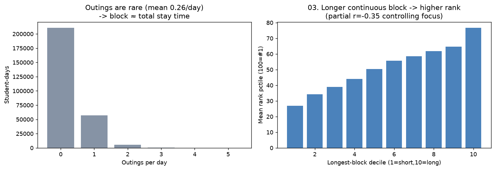

# 03. 연속 몰입 블록 길이 ↔ 순위

> **명제** · 순공시간 중 끊김 없는 연속 몰입 블록의 길이가 길수록 순위가 높다
> **카테고리** A · 몰입시간 × 성과 · **상태** ✅ 완료 · **데이터** 🟦 확보 · **출처** 시트2-4

## 한 줄 결론
> **◐ 블록 길수록 순위↑(몰입 통제 후 −0.35)지만, "연속성"보다 "체류량" 효과다.** 결정적 발견: **외출이 하루 평균 0.1~0.3회로 극히 드물어**, 대부분 학생은 입실~하원이 통째 한 블록이다. 즉 "연속 블록"이 사실상 "총 체류시간"과 같아진다. 블록(=체류)이 몰입시간을 통제한 뒤에도 순위를 추가로 설명(−0.35)하지만, *끊김 없음 자체*의 고유 효과는 외출이 드물어 분리할 수 없다.

> **트랙 안내**: `attendance.outing_log`(CHECK_IN/OUTING/RETURN/CHECK_OUT 이벤트)로 착석 블록·외출 구간 재구성. 30일, outing_log 보유 293,007 학생-일 → ≥5일 13,552명.

## 결과 (≥5일 13,552명)

| 지표 | 값 |
|------|-----|
| 최장 블록 ↔ 순위 (raw) | Spearman −0.826 |
| **최장 블록 ↔ 순위 (몰입 통제)** | **−0.350** (p≈0) |
| 평균 블록 ↔ 순위 (몰입 통제) | −0.335 |
| 평균 최장 블록 | 10.0h |
| 외출 빈도 | 0.1~0.3회/일 (대부분 0) |

→ 블록(≈체류시간)은 몰입시간 외에 추가로 순위를 설명한다. "오래 앉아있기"가 몰입의 절대량과 별개로 순위에 기여. 단 외출이 드물어 max_block ≈ study_time이라, 이는 [01번](01-focus-absolute-vs-billboard-rank.md)에서 본 "study_time 통제 시 focus 효과 0"의 거울상(focus 통제 시 study 효과는 남음)이다.

## ⚠️ 교란요인 · 주의
- **외출 희소성**: 외출 0.1~0.3/일 → 블록과 총 체류시간이 거의 동일. "연속 블록 vs 같은 양을 쪼갠 학습"의 비교는 외출이 흔한 소수에서만 가능(표본 부족).
- 이 희소성 자체가 발견: 잇올 학생은 한번 앉으면 거의 안 나간다 → [01]의 focus≈study(75% 일치) 원인.

## 선행 · 연관 분석
- [01 몰입↔순위](01-focus-absolute-vs-billboard-rank.md), [02 일관성](02-focus-consistency-vs-rank.md), [36 휴식 패턴](36-rest-pattern-vs-efficiency.md)

## 📊 데이터 출처 & 표본

| 항목 | 내용 |
|------|------|
| 출처 | main `attendance.outing_log` + 운영 DocumentDB(aggregation): `rank`(STUDY_TIME/NATIONWIDE/DAY) + `student_daily_report` |
| 기간/범위 | 30일 |
| 표본 | outing_log 293,007 학생-일 → ≥5일 13,552명 |
| 분석 방법 | 블록 재구성(CHECK_IN/OUTING/RETURN/CHECK_OUT), 몰입 통제 부분상관 |
| 추출 | 운영 DB **read-only** (MongoDB `find` / PostgreSQL `SELECT`, 쓰기 호출 없음) |
| 환경 | 격리 venv(uv, pandas/scipy/sklearn), 자격증명 비저장 |

---
◀ [전체 명제 목록](../README.md)
