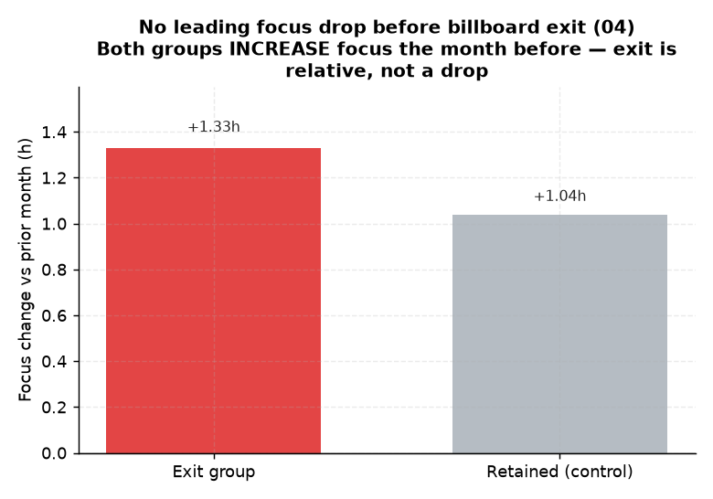

# 04. 빌보드 이탈 선행 몰입 하락 (조기경보)

> **명제** · 빌보드 이탈(순위 하락) 2~4주 전 몰입시간이 선행 하락한다
> **카테고리** A · 몰입시간 × 성과 · **상태** ✅ 완료 · **데이터** 🟦 확보 · **출처** 시트2-7

## 한 줄 결론
> **✗ 기각 — 선행 하락 없음(30일·1년 월별 모두).** Top-1000 이탈 직전월 몰입은 그 전월보다 오히려 **+1.33h 증가**(유지군 +1.04h와 비슷). 이탈 전에 몰입이 떨어지는 조기경보 신호는 관측되지 않는다 — 순위 이탈은 몰입 하락보다 **다른 학생들의 상대적 상승**(전국 경쟁)으로 일어난다.

> **트랙 안내**: `rank_month`+`sdr_month`(1년 13개월). 이탈 이벤트(전월 Top-1000→당월 이탈) 1,042건.

## 결과
| 그룹 | 직전월 − 그 전월 몰입 변화 |
|------|:---:|
| 이탈군 | **+1.33h** (t=14.6, p≈0) |
| 유지군(대조) | +1.04h |
| 차이 | +0.28h |

→ 이탈군·유지군 모두 몰입 증가(1월 급등 등 사이클 영향). 선행 하락 패턴 없음. 30일 윈도우 예비분석과 동일 결론.

*이탈군·유지군 **모두 직전월 몰입이 증가**한다(+1.33h vs +1.04h). 순위 이탈은 본인 몰입 하락이 아니라 경쟁자의 상대적 상승으로 일어난다.*

## ⚠️ 교란요인 · 주의
- 월 해상도라 "2~4주 선행"의 주 단위는 못 봄. 단 1년·30일 모두 하락 미검출이라 결론은 일관.
- 빌보드(전국 STUDY_TIME)는 상대 순위라, 본인 몰입이 일정해도 남이 더 하면 이탈 → 몰입 하락이 이탈의 선행 지표가 아님.

## 선행 · 연관 분석
- [05 시차효과](05-focus-lag-next-month-rank.md), [41 이탈 예측](41-dropout-prediction.md)

## 📊 데이터 출처 & 표본

| 항목 | 내용 |
|------|------|
| 출처 | 운영 DocumentDB(aggregation): `rank`(STUDY_TIME/NATIONWIDE/DAY) + `student_daily_report` 월별집계 |
| 기간/범위 | 1년 13개월 |
| 표본 | 이탈 이벤트 1,042건 |
| 분석 방법 | 이탈 직전월 vs 그 전월 몰입 변화(유지군 대조) |
| 추출 | 운영 DB **read-only** (MongoDB `find` / PostgreSQL `SELECT`, 쓰기 호출 없음) |
| 환경 | 격리 venv(uv, pandas/scipy/sklearn), 자격증명 비저장 |

---
◀ [전체 명제 목록](../README.md)
