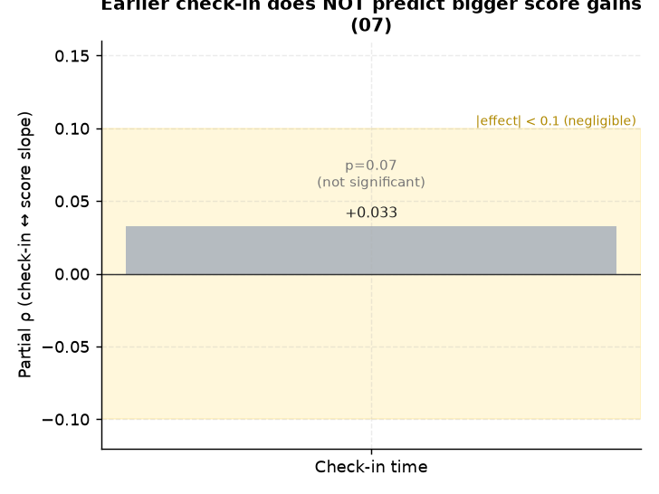

# 07. 입실시각(오전형) ↔ 성적상승

> **명제** · 입실시각이 이른(오전형) 학생이 성적상승폭이 크다
> **카테고리** A · 몰입시간 × 성과 · **상태** ✅ 완료 · **데이터** 🟦 확보 · **출처** 시트2-3

## 한 줄 결론
> **✗ 효과 없음.** 입실시각과 성적상승 부분상관 +0.033(p=0.07, 무의미). 일찍 온다고 더 오르지 않는다.

> **트랙 안내**: 성적상승 = 현재 재원생(분석모집단)의 모의고사 백분위 시계열 기울기(3회+ 응시 2,903명). 행동/서비스는 DocumentDB 30일(몰입·입실·외출) + Q&A/CA. **성적평균(천장효과) 통제 부분상관**으로 봄.

## 결과
- 부분 Spearman(입실시각, 성적기울기 | 성적평균) = **+0.033 (p=0.074)** — 통계적으로 유의하지 않음.

> **메타 결론(중요)**: 모든 행동/서비스의 성적상승 부분상관이 |ρ|<0.08로 매우 작다. **입시결과 트랙(행동 AUC 0.52)·순위 트랙(몰입 동어반복)과 동일** — 잇올 행동지표는 성과(순위·성적상승·입시) 변별력이 일관되게 약하다. 변별은 '양'이 아니라 [02 일관성](02-focus-consistency-vs-rank.md)·[32 성적안정성](32-score-stability-vs-admission.md) 같은 '안정성'에서 난다.

*입실시각의 성적상승 부분상관 +0.033(p=0.07)은 통계적으로 유의하지 않다 — 일찍 온다고 더 오르지 않는다.*

## 선행 · 연관 분석
- [35 출결 규칙성](35-attendance-regularity-vs-rank.md)

## 📊 데이터 출처 & 표본

| 항목 | 내용 |
|------|------|
| 출처 | 운영 DocumentDB(aggregation): `rank`(STUDY_TIME/NATIONWIDE/DAY) + `student_daily_report` (checkin) + exam_management(PostgreSQL, intra-tools RDS) |
| 기간/범위 | 30일 + 성적 |
| 표본 | 2,903명 |
| 분석 방법 | 입실시각 ↔ 성적기울기, 평균 통제 |
| 추출 | 운영 DB **read-only** (MongoDB `find` / PostgreSQL `SELECT`, 쓰기 호출 없음) |
| 환경 | 격리 venv(uv, pandas/scipy/sklearn), 자격증명 비저장 |

---
◀ [전체 명제 목록](../README.md)
