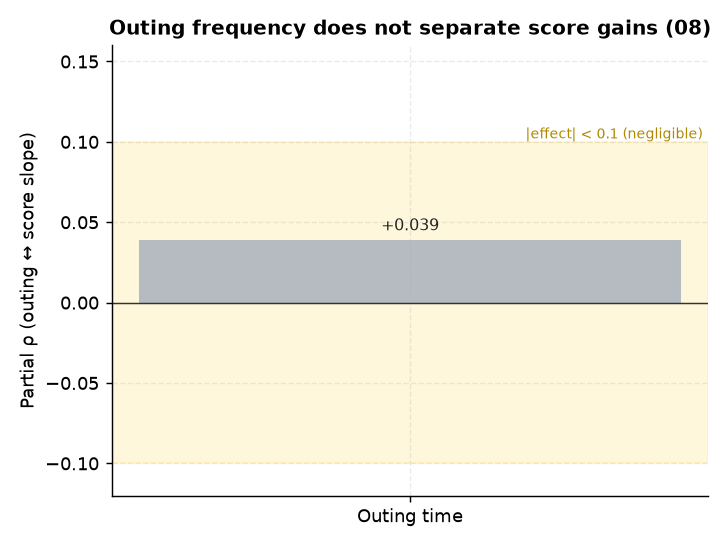

# 08. 외출·조퇴 빈도 ↔ 순위·성적

> **명제** · 외출·조퇴 빈도가 낮을수록 순위·성적이 높다
> **카테고리** A · 몰입시간 × 성과 · **상태** ✅ 완료 · **데이터** 🟦 확보 · **출처** 시트2-8

## 한 줄 결론
> **✗ 지지 안 됨.** 외출시간(study−focus)과 성적상승 부분상관 +0.039 — 명제와 반대 방향(외출 많을수록 상승 약간 큼)이고 효과 미미. 외출은 이미 몰입시간 계산에서 차감되므로 추가 효과 없음.

> **트랙 안내**: 성적상승 = 현재 재원생(분석모집단)의 모의고사 백분위 시계열 기울기(3회+ 응시 2,903명). 행동/서비스는 DocumentDB 30일(몰입·입실·외출) + Q&A/CA. **성적평균(천장효과) 통제 부분상관**으로 봄.

## 결과
- 부분 Spearman(외출시간, 성적기울기 | 성적평균) = **+0.039 (p=0.036)**

→ 명제는 "외출 적을수록 좋다"이나 데이터는 미미한 반대. 외출 빈도는 성적상승을 가르지 못한다.

> **메타 결론(중요)**: 모든 행동/서비스의 성적상승 부분상관이 |ρ|<0.08로 매우 작다. **입시결과 트랙(행동 AUC 0.52)·순위 트랙(몰입 동어반복)과 동일** — 잇올 행동지표는 성과(순위·성적상승·입시) 변별력이 일관되게 약하다. 변별은 '양'이 아니라 [02 일관성](02-focus-consistency-vs-rank.md)·[32 성적안정성](32-score-stability-vs-admission.md) 같은 '안정성'에서 난다.

*외출시간의 성적상승 부분상관 +0.039는 명제와 반대 방향이면서 무효 구간 — 외출 빈도는 성적상승을 가르지 못한다.*

## ⚠️ 주의
외출 시간 = study_time − focus_time(외출+공용공간+상담 합산 근사). 순수 외출만 분리하려면 raw 외출 로그 필요([03](03-continuous-focus-block-vs-rank.md)와 연계).

## 선행 · 연관 분석
- [26 공용공간](26-public-seat-vs-rank.md), [01 몰입↔순위](01-focus-absolute-vs-billboard-rank.md)

## 📊 데이터 출처 & 표본

| 항목 | 내용 |
|------|------|
| 출처 | 운영 DocumentDB(aggregation): `rank`(STUDY_TIME/NATIONWIDE/DAY) + `student_daily_report` (study−focus) + exam_management(PostgreSQL, intra-tools RDS) |
| 기간/범위 | 30일 + 성적 |
| 표본 | 2,903명 |
| 분석 방법 | 외출시간 근사 ↔ 성적기울기 |
| 추출 | 운영 DB **read-only** (MongoDB `find` / PostgreSQL `SELECT`, 쓰기 호출 없음) |
| 환경 | 격리 venv(uv, pandas/scipy/sklearn), 자격증명 비저장 |

---
◀ [전체 명제 목록](../README.md)
