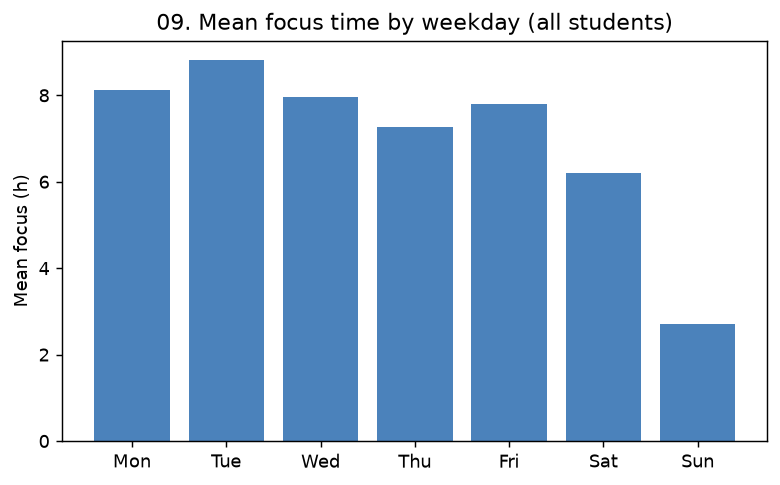

# 09. 요일별 몰입 편차 ↔ 상위권

> **명제** · 상위권 학생은 요일별 몰입 편차가 작다(월요병·금요일 이완이 적다)
> **카테고리** A · 몰입시간 × 성과 · **상태** ✅ 완료(혼재) · **데이터** 🟦 확보 · **출처** 시트2-9

## 한 줄 결론

> **⚠️ 부분 지지 / 해석 주의.** 가장 큰 요일 효과는 '월요병'이 아니라 **주말 급감**(일요일 2.7h vs 화요일 8.8h)이다. 단순 "요일 편차"로 보면 하위권은 *항상 0시간*이라 편차도 0이 되어, 편차가 큰 쪽이 오히려 상위권으로 뒤집히는 착시가 생긴다.

## 가설
상위권 학생은 요일별 몰입 편차가 작다(월요병/금요일 이완이 적다).

## 필요 데이터
- `student_daily_report.focus_time` (요일별)
- `rank`

**가용성**: 확보 (운영 DB 확인됨)

## 분석 방법
`date`→요일 변환. (1) 전체 요일별 평균 몰입 패턴. (2) 학생별 요일평균 몰입의 표준편차 → 평균 통제 부분상관 + 상/하위권 직접 비교.

## 결과

**요일별 평균 몰입시간**(전체):

| 월 | 화 | 수 | 목 | 금 | 토 | 일 |
|:---:|:---:|:---:|:---:|:---:|:---:|:---:|
| 8.12 | **8.82** | 7.95 | 7.27 | 7.80 | 6.19 | **2.70** |

- '월요병'은 약함(월 8.12h, 오히려 화요일이 피크). **금요일 이완도 뚜렷하지 않음**(7.8h). 지배적 효과는 **주말, 특히 일요일 급감**.

**요일 편차 ↔ 순위**:

| 지표 | 값 |
|------|-----|
| 부분 Spearman(요일편차, pct_rank \| 평균) | +0.299 |
| 상위10% 평균 요일편차 | 1.83h |
| 하위10% 평균 요일편차 | 0.00h |

→ 부분상관은 "편차 클수록 순위↓"(명제 방향)이나, 상/하위 직접 비교는 **역전**(상위권 편차가 더 큼). 이유: 하위권 다수가 매일 0시간(미등원)이라 편차가 0. 즉 단순 편차 지표는 미등원에 오염된다.

## ⚠️ 교란요인 · 주의
- **미등원 오염**: "항상 0" 학생은 편차 0 → 일관성과 무활동을 구분 못 함. → 등원일만/변동계수 기반 재정의 필요.
- 명제를 제대로 보려면 **상위권 내부에서** 요일 편차와 순위를 봐야 함(향후 보강).

## 선행 · 연관 분석
- [02 몰입 일관성](02-focus-consistency-vs-rank.md) (일관성 본류)

## 📊 데이터 출처 & 표본

| 항목 | 내용 |
|------|------|
| 출처 | 운영 DocumentDB(aggregation): `rank`(STUDY_TIME/NATIONWIDE/DAY) + `student_daily_report` |
| 기간/범위 | 30일 |
| 표본 | 15,036명 (요일별 집계) |
| 분석 방법 | 요일 분산, 평균 통제 부분상관 |
| 추출 | 운영 DB **read-only** (MongoDB `find` / PostgreSQL `SELECT`, 쓰기 호출 없음) |
| 환경 | 격리 venv(uv, pandas/scipy/sklearn), 자격증명 비저장 |

---
◀ [전체 명제 목록](../README.md)
