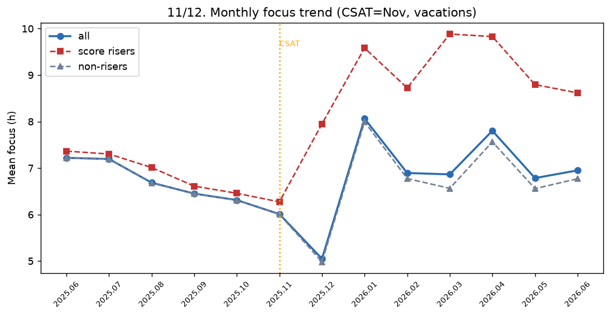

# 11. 수능 N개월 전 몰입 급증 시점

> **명제** · 성적상승 학생의 몰입시간 급증 시점은 수능 O개월 전이다
> **카테고리** A · 몰입시간 × 성과 · **상태** ✅ 완료 · **데이터** 🟦 확보 · **출처** 시트2-32 / 시트1-10

## 한 줄 결론
> **✗ 기각 — 수능 전 급증은 없다(오히려 하락). 재수종합반 사이클이 지배.** 수능(11월)으로 갈수록 몰입은 하락(9월 6.45→11월 6.01), **12월 최저(5.05, 수능 직후 휴식) → 1월 급등(8.06, 새 출발)**. 성적상승군은 특정 시점 급증이 아니라 **전 기간 일관되게 높다**.

> **트랙 안내**: 1년 월별 집계(2025.06~2026.06, 13개월, 42,249명). DocumentDB가 1년치 일별 rank/sdr을 보관해 월별로 집계. 성적상승군 = exam_management 성적기울기 상위 절반.

## 결과: 월별 평균 몰입(h)

| 월 | 25.09 | 25.10 | 25.11(수능) | 25.12 | 26.01 | 26.04 |
|----|:---:|:---:|:---:|:---:|:---:|:---:|
| 전체 | 6.45 | 6.31 | 6.01 | **5.05** | **8.06** | 7.80 |

→ 일반고 기준 "수능 전 급증"과 정반대. 잇올은 재수종합반이라 **수능 후 12월 휴식 → 1월 새 학년 급등**의 사이클. 성적상승군(빨강)은 비상승군보다 항상 ~2h 높지만, 그 격차가 특정 시점에 벌어지는 게 아니라 상시적.

## ⚠️ 교란요인 · 주의
- 11월은 수능 응시생이 빠져 표본·몰입이 함께 하락(응시 후 이탈).
- "성적상승"을 모의고사 기울기로 정의 → 재원 중 상승. 현재 재원생의 2026 수능 전 패턴은 아직 미관측(미래).

## 선행 · 연관 분석
- [12 방학 몰입](12-vacation-focus-growth-vs-score.md), [10 재원 정점](10-tenure-focus-peak.md)

## 📊 데이터 출처 & 표본

| 항목 | 내용 |
|------|------|
| 출처 | 운영 DocumentDB(aggregation): `rank`(STUDY_TIME/NATIONWIDE/DAY) + `student_daily_report` 월별집계 + exam_management(PostgreSQL, intra-tools RDS) 성적 |
| 기간/범위 | 1년 13개월 |
| 표본 | 42,249명 월별(성적상승군 라벨) |
| 분석 방법 | 월별 몰입 추이, 수능(11월)/시즌 패턴 |
| 추출 | 운영 DB **read-only** (MongoDB `find` / PostgreSQL `SELECT`, 쓰기 호출 없음) |
| 환경 | 격리 venv(uv, pandas/scipy/sklearn), 자격증명 비저장 |

---
◀ [전체 명제 목록](../README.md)
