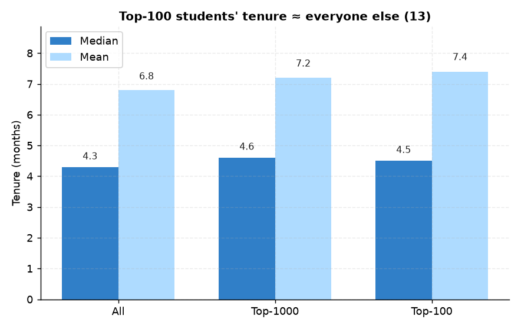

# 13. 빌보드 100위내 평균 재원기간

> **명제** · 빌보드 100위 내 학생의 평균 재원기간은 O개월이다
> **카테고리** B · 빌보드 순위 동역학 · **상태** ✅ 완료 · **데이터** 🟦 확보 · **출처** 시트1-3 / 시트2-11

## 한 줄 결론

> **◐ 재원기간은 순위 진입의 결정요인이 아니다.** Top-100 경험자 재원기간 중앙값 **4.5개월**은 전체(4.3개월)와 거의 차이가 없다. "오래 다녀야 상위권"이 아니라, **짧은 재원기간에도 상위 진입이 가능**하다.

## 가설
빌보드 100위 내 학생의 평균 재원기간은 O개월이다.

## 필요 데이터
- `rank`(Top-100 식별), `enrollment_history.start_date`(재원기간)

**가용성**: 확보 (운영 DB 확인됨).

## 분석 방법
학생별 최초 입소일(`min start_date`)로 재원기간(개월) 산출. Top-100/Top-1000 경험자와 전체의 분포 비교. 기준일 2026-06-22.

## 결과

| 그룹 | 중앙값(월) | 평균(월) | n |
|------|:---:|:---:|:---:|
| 전체 | 4.3 | 6.8 | 15,033 |
| Top-1000 경험 | 4.6 | 7.2 | 5,925 |
| **Top-100 경험** | **4.5** | 7.4 | 840 |

→ **答: Top-100 학생의 재원기간 중앙값 ≈ 4.5개월** (평균 7.4개월). 단 전체와 격차가 작아, 재원기간 자체가 순위를 가르지는 않는다.

*Top-100 경험자 재원기간 중앙값 4.5개월은 전체(4.3개월)와 거의 차이 없다 — 짧은 재원기간에도 상위 진입이 가능.*

## ⚠️ 교란요인 · 주의
- 재원기간 = 최초 입소일 기준(재등록 갭 무시). 회차별 분리 시 값 달라질 수 있음.
- 평균(7.4)과 중앙값(4.5) 격차 큼 → 장기 재원 소수가 평균을 끌어올림. 중앙값이 대표적.
- 신규 입소자도 단기간에 상위 진입 → 몰입량이 재원기간보다 지배적([01](01-focus-absolute-vs-billboard-rank.md)).

## 선행 · 연관 분석
- [14 빌보드 진입 소요기간](14-time-to-first-billboard.md), [10 재원 정점](10-tenure-focus-peak.md)

## 📊 데이터 출처 & 표본

| 항목 | 내용 |
|------|------|
| 출처 | 운영 DocumentDB(aggregation): `rank`(STUDY_TIME/NATIONWIDE/DAY) + `student_daily_report` + main `enrollment_history` |
| 기간/범위 | 30일 + 입소이력 |
| 표본 | Top-100 경험 840명 / 전체 15,033 |
| 분석 방법 | 재원기간 분포 비교 |
| 추출 | 운영 DB **read-only** (MongoDB `find` / PostgreSQL `SELECT`, 쓰기 호출 없음) |
| 환경 | 격리 venv(uv, pandas/scipy/sklearn), 자격증명 비저장 |

---
◀ [전체 명제 목록](../README.md)
