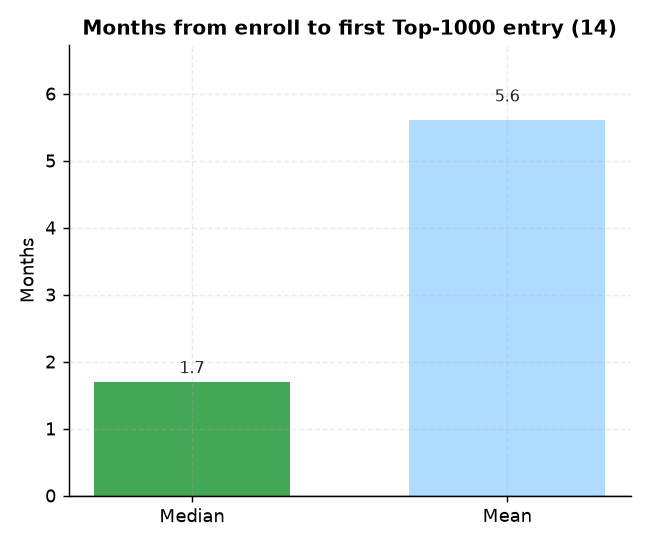

# 14. 입소 → 빌보드 첫 진입 소요기간

> **명제** · 입소 후 빌보드 첫 진입까지 평균 O개월 걸린다
> **카테고리** B · 빌보드 순위 동역학 · **상태** ✅ 완료 · **데이터** 🟦 확보 · **출처** 시트2-12

## 한 줄 결론
> **✅ 입소 → 첫 Top-1000 진입 중앙값 1.7개월.** 1년 월별 데이터로 보니, 진입하는 학생은 입소 후 비교적 빠르게(중앙 1.7개월) 진입한다. 평균(5.6개월)이 중앙값보다 큰 건 일부 늦깎이 진입자 때문.

> **트랙 안내**: `rank_month`(1년 월별) 첫 Top-1000 진입월 − `enrollment_history` 입소월. 입소·진입 모두 관측된 841명.

## 결과
| 지표 | 값 |
|------|-----|
| 입소→첫 Top-1000 진입 (중앙값) | **1.7개월** |
| 평균 | 5.6개월 |
| 관측 학생 | 841명 |

→ 30일 윈도우 예비분석(즉시 진입)보다 현실적. "빌보드는 입소 후 약 2개월 내 진입하거나, 아니면 장기간 미진입"의 이분 구조와 정합.

*입소→첫 Top-1000 진입 중앙값 1.7개월. 평균(5.6개월)이 큰 건 일부 늦깎이 진입자 때문 — '약 2개월 내 진입 or 장기 미진입'의 이분 구조.*

## ⚠️ 교란요인 · 주의
- 월 해상도(일 단위 아님). Top-1000은 전국 기준이라 진입 자체가 드묾(생존편향: 진입자만 관측).

## 선행 · 연관 분석
- [13 재원기간](13-top100-tenure.md), [17 진입 시점](17-entry-timing-vs-admission.md)

## 📊 데이터 출처 & 표본

| 항목 | 내용 |
|------|------|
| 출처 | 운영 DocumentDB(aggregation): `rank`(STUDY_TIME/NATIONWIDE/DAY) + `student_daily_report` 월별집계 + main `enrollment_history` |
| 기간/범위 | 1년 13개월 |
| 표본 | 입소·진입 관측 841명 |
| 분석 방법 | 첫 Top-1000 진입월 − 입소월 |
| 추출 | 운영 DB **read-only** (MongoDB `find` / PostgreSQL `SELECT`, 쓰기 호출 없음) |
| 환경 | 격리 venv(uv, pandas/scipy/sklearn), 자격증명 비저장 |

---
◀ [전체 명제 목록](../README.md)
