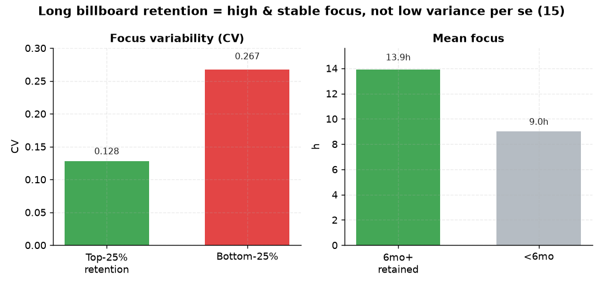

# 15. 빌보드 유지기간 ↔ 몰입 변동폭

> **명제** · 빌보드 장기 유지 학생은 몰입시간 변동폭이 작다
> **카테고리** B · 빌보드 순위 동역학 · **상태** ✅ 완료 · **데이터** 🟦 확보 · **출처** 시트2-13

## 한 줄 결론
> **◐ 유지기간과 안정성은 연관되나, 대부분 '상시 고몰입' 경유.** 1년 월별로 보면 Top-1000 유지 상위 25%의 몰입 변동(CV) 0.128 vs 하위 25% 0.267로 명제 방향. 6개월+ 유지 학생은 평균 몰입 13.9h(미만 9.0h). 단 평균 몰입을 통제하면 변동의 고유효과는 +0.022(약함) — 오래 유지하는 비결은 '낮은 변동' 자체보다 '높고 안정적인 몰입'.

> **트랙 안내**: 1년 월별 집계(2025.06~2026.06, 13개월, 42,249명). DocumentDB가 1년치 일별 rank/sdr을 보관해 월별로 집계. 성적상승군 = exam_management 성적기울기 상위 절반.

## 결과 (3개월+ 출현 2,427명, 평균 Top-1000 유지 1.4개월)

| 지표 | 값 |
|------|-----|
| 유지 상위25% 몰입 CV(중앙) | **0.128** |
| 유지 하위25% 몰입 CV | 0.267 |
| 6개월+ 유지 평균 몰입 | **13.9h** (미만 9.0h) |
| 부분 Spearman(유지개월, CV \| 평균) | +0.022 (p=0.29, 약함) |

→ raw로는 명제 지지(유지 길수록 변동 작음), 평균 통제 시 변동 고유효과는 미미. [02 일관성](02-focus-consistency-vs-rank.md)과 정합(일관성↔성과는 평균과 얽힘).

*유지 상위25%의 몰입 변동(CV 0.128)이 하위25%(0.267)보다 작고, 6개월+ 유지군 몰입(13.9h)이 높다 — 단 평균 통제 시 변동 고유효과는 미미(오래 유지의 비결은 '높고 안정적인 몰입').*

## ⚠️ 교란요인 · 주의
Top-1000은 전국 기준이라 유지 개월수가 짧음(평균 1.4개월) → 더 느슨한 임계(Top-5000)로 보면 분포가 달라질 수 있음.

## 선행 · 연관 분석
- [02 몰입 일관성](02-focus-consistency-vs-rank.md), [05 시차효과](05-focus-lag-next-month-rank.md)

## 📊 데이터 출처 & 표본

| 항목 | 내용 |
|------|------|
| 출처 | 운영 DocumentDB(aggregation): `rank`(STUDY_TIME/NATIONWIDE/DAY) + `student_daily_report` 월별집계 |
| 기간/범위 | 1년 13개월(2025.06~2026.06) |
| 표본 | 3개월+ 출현 2,427명 |
| 분석 방법 | Top-1000 유지개월수 ↔ 몰입CV, 평균 통제 |
| 추출 | 운영 DB **read-only** (MongoDB `find` / PostgreSQL `SELECT`, 쓰기 호출 없음) |
| 환경 | 격리 venv(uv, pandas/scipy/sklearn), 자격증명 비저장 |

---
◀ [전체 명제 목록](../README.md)
