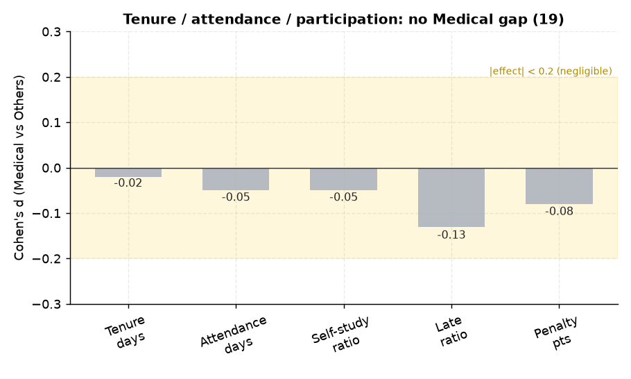

# 19. 순위권 메디컬 입시결과 ↔ 재원기간

> **명제** · 빌보드 순위권 중 메디컬 이상 입시결과 학생의 재원기간은 O개월 이상이다
> **카테고리** B · 빌보드 순위 동역학 · **상태** ✅ 완료 · **데이터** 🟦 확보 · **출처** 시트1-4 / 시트2-14

## 한 줄 결론

> **✗ 재원기간도 메디컬을 가르지 못한다.** 메디컬 평균 재원 131일, 기타 133일(Cohen d=−0.02). 오래 다닌다고 메디컬에 가는 게 아니다.

> **트랙 안내**: 입시결과(`admission_results`, 2026 입시)는 **작년 졸업생** 데이터다. 현재 30일 재원생(DocumentDB)이 아닌, `exam_management` 내부의 **작년 행동(`student_behavior_stats`)·성적(`student_records`)** 과 결합해 분석했다. 표본: 입시결과 보유 7,290명(메디컬 523), 행동결합 99%.

## 결과

| 그룹 | 평균 재원일 | 총 등원일 | 자율참여율 |
|------|:---:|:---:|:---:|
| 메디컬 | 131 | 147 | 0.97 |
| 기타 | 133 | 152 | 0.97 |
| Cohen d | −0.02 | −0.05 | −0.05 |

→ 재원기간·등원일·자율참여 모두 차이 없음. (유의미하게 작은 차이: 메디컬이 지각률 약간 낮음 d=−0.13, 벌점 약간 적음 d=−0.08 — 성실성의 미세한 흔적이나 효과 작음)

*재원일·등원일·자율참여 모두 메디컬과 기타가 동일(|d|≤0.05). 지각률(d=−0.13)·벌점(−0.08)에 성실성의 미세 흔적만.*

## ⚠️ 교란요인 · 주의
- 졸업생 모집단이라 재원기간이 대체로 1년 내외로 수렴 → 변별 폭 자체가 작음.

## 선행 · 연관 분석
- [20 메디컬↔몰입](20-toptier-medical-focus.md), [13 재원기간↔순위](13-top100-tenure.md)

## 📊 데이터 출처 & 표본

| 항목 | 내용 |
|------|------|
| 출처 | exam_management(PostgreSQL, intra-tools RDS) `admission_results`+`student_behavior_stats` |
| 기간/범위 | 2026 입시(작년 졸업생) |
| 표본 | 메디컬 523 vs 기타 6,767 |
| 분석 방법 | Mann-Whitney + Cohen d |
| 추출 | 운영 DB **read-only** (MongoDB `find` / PostgreSQL `SELECT`, 쓰기 호출 없음) |
| 환경 | 격리 venv(uv, pandas/scipy/sklearn), 자격증명 비저장 |

---
◀ [전체 명제 목록](../README.md)
