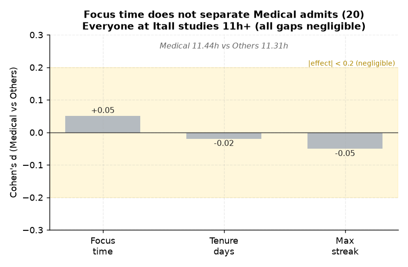

# 20. 순위권 메디컬 입시결과 ↔ 몰입시간

> **명제** · 빌보드 순위권 중 메디컬 이상 입시결과 학생의 몰입시간은 O시간 이상이다
> **카테고리** B · 빌보드 순위 동역학 · **상태** ✅ 완료 · **데이터** 🟦 확보 · **출처** 시트1-5 / 시트2-15

## 한 줄 결론

> **✗ 몰입시간은 메디컬을 가르지 못한다.** 메디컬 합격자의 작년 평균 몰입은 11.44h, 기타는 11.31h로 사실상 동일(Cohen d=+0.05, p=0.12). 잇올 재원생은 입시결과와 무관하게 다들 11시간 이상 몰입한다. → [39](39-composite-index-vs-admission.md)의 "행동 변별력 ≈ 0"과 일치.

> **트랙 안내**: 입시결과(`admission_results`, 2026 입시)는 **작년 졸업생** 데이터다. 현재 30일 재원생(DocumentDB)이 아닌, `exam_management` 내부의 **작년 행동(`student_behavior_stats`)·성적(`student_records`)** 과 결합해 분석했다. 표본: 입시결과 보유 7,290명(메디컬 523), 행동결합 99%.

## 결과

| 그룹 | 평균 몰입(h) | 재원일 | 최대연속 |
|------|:---:|:---:|:---:|
| 메디컬 | 11.44 | 131 | 140 |
| 기타 | 11.31 | 133 | 144 |
| Cohen d | +0.05 | −0.02 | −0.05 |

→ 몰입·재원·연속등원 모두 메디컬과 기타가 거의 동일. "메디컬은 몰입시간 O시간 이상"이라는 임계값을 그을 만한 분리가 없다.

*몰입·재원·연속등원의 메디컬 vs 기타 Cohen d가 모두 무효 구간(|d|<0.2). 잇올 재원생은 입시결과와 무관하게 다들 11h+ 몰입(천장효과).*

## ⚠️ 교란요인 · 주의
- 잇올 재원생 자체가 고몰입 집단(11h+)이라 천장효과 → 몰입으로 더 변별 안 됨.
- 1번(몰입↔순위 동어반복)과 같은 맥락: 행동은 "다들 비슷".

## 선행 · 연관 분석
- [19 메디컬↔재원](19-toptier-medical-tenure.md), [39 복합예측](39-composite-index-vs-admission.md), [01 몰입↔순위](01-focus-absolute-vs-billboard-rank.md)

## 📊 데이터 출처 & 표본

| 항목 | 내용 |
|------|------|
| 출처 | exam_management(PostgreSQL, intra-tools RDS) |
| 기간/범위 | 작년 졸업생 |
| 표본 | 메디컬 523 vs 기타 6,767 |
| 분석 방법 | Mann-Whitney + Cohen d |
| 추출 | 운영 DB **read-only** (MongoDB `find` / PostgreSQL `SELECT`, 쓰기 호출 없음) |
| 환경 | 격리 venv(uv, pandas/scipy/sklearn), 자격증명 비저장 |

---
◀ [전체 명제 목록](../README.md)
