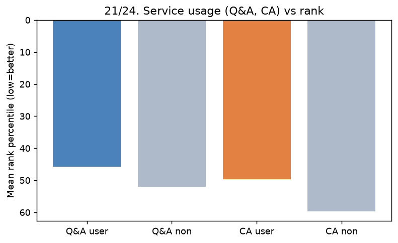

# 21. 빌보드 순위권 ↔ 온라인 Q&A 활용도

> **명제** · 빌보드 순위권 학생들의 온라인 Q&A 활용도가 높다
> **카테고리** C · 서비스 활용 · **상태** ✅ 완료 · **데이터** 🟦 확보 · **출처** 시트1-8 / 시트2-20

## 한 줄 결론

> **✅ 지지(효과는 작음).** Q&A를 많이 한 학생일수록 순위가 높다. 몰입량을 통제해도 부분상관 −0.10이 남는다. 단 **Q&A 사용자는 전체의 22.5%뿐**이라 보편적 행동은 아니다(소수 적극 사용자).

## 가설
빌보드 순위권 학생들의 온라인 Q&A 활용도가 높다.

## 필요 데이터
- `mentoring_questions` (main DB) — 학생별 질문 수, `created_at`, `counseling_type`(SUBJECT/ADMISSION)
- `rank`, `enrollment_history`(재원기간 통제)

**가용성**: 확보. 분석 모집단 중 3,249명(22.5%)이 Q&A 사용, 총 7.3만 질문.

## 분석 방법
학생별 Q&A 질문 수를 재원기간으로 정규화(월당) → 평균 순위백분위와 상관 + **몰입량 통제 부분상관**.

## 결과

| 지표 | 값 | 해석 |
|------|-----|------|
| Spearman(월당 Q&A, pct_rank) | −0.141 | Q&A 많을수록 순위 상위 |
| **부분 Spearman(월당 Q&A, pct_rank \| 몰입)** | **−0.103** (p≈0) | 몰입 통제 후에도 유지 |
| Q&A 사용자 평균 순위백분위 | **45.7%** | (미사용 52.0%보다 상위) |
| Top-1000 경험자 월당 Q&A | 1.53건 | (그외 0.90건의 1.7배) |

→ Q&A 활용이 순위와 독립적으로(몰입 통제 후) 양의 연관. 효과크기는 작지만 일관됨. [26 공용공간](26-public-seat-vs-rank.md)과 같은 "적극성 = 상위" 방향.

## ⚠️ 교란요인 · 주의
- Q&A 사용률 22.5%로 편중 → 0(미사용) 다수. 재원기간 정규화로 누적 편향 완화.
- 누적 Q&A(전 재원기간) vs 최근 30일 순위의 시점 불일치 → 월당 정규화로 근사.
- 인과 아님(열심히 하는 학생이 Q&A도 함). 시점 분석은 [18](18-pre-entry-behavior-change.md).

## 선행 · 연관 분석
- [24 CA 멘토상담 활용](24-ca-frequency-vs-score.md), [29 복합 서비스활용](29-early-service-usage-vs-achievement.md), [26 공용공간](26-public-seat-vs-rank.md)

## 📊 데이터 출처 & 표본

| 항목 | 내용 |
|------|------|
| 출처 | main `mentoring_questions` + 운영 DocumentDB(aggregation): `rank`(STUDY_TIME/NATIONWIDE/DAY) + `student_daily_report` |
| 기간/범위 | Q&A 누적 + 순위 30일 |
| 표본 | Q&A 사용 3,249명 / 분석 14,417명 |
| 분석 방법 | 월당 정규화, 몰입 통제 부분상관 |
| 추출 | 운영 DB **read-only** (MongoDB `find` / PostgreSQL `SELECT`, 쓰기 호출 없음) |
| 환경 | 격리 venv(uv, pandas/scipy/sklearn), 자격증명 비저장 |

---
◀ [전체 명제 목록](../README.md)
