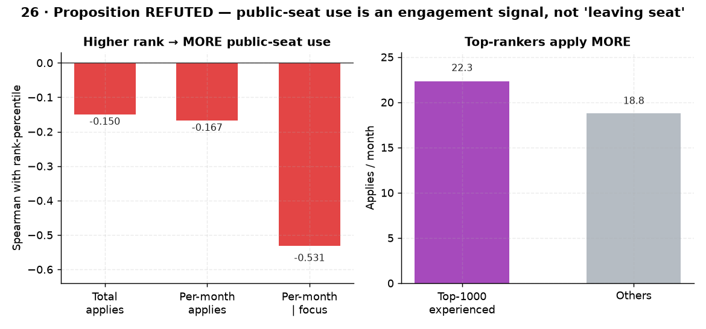

# 26. 공용공간 신청 ↔ 빌보드 순위

> **명제** · 빌보드 순위권 학생들은 공용공간을 적게 신청한다(자리 이탈이 적다)
> **카테고리** C · 서비스 활용 · **상태** ✅ 완료 · **데이터** 🟦 확보 · **출처** 시트1-6 / 시트2-25

## 한 줄 결론

> **✗ 기각 — 데이터는 정반대다.** 순위권 학생일수록 공용공간을 **더 많이** 신청한다. 몰입량을 통제한 부분상관도 **−0.53**(신청 많을수록 상위)으로 강하다. "공용공간 = 자리 이탈"이라는 명제의 전제가 틀렸고, 오히려 **적극적 학습공간 활용** 신호로 보인다.

## 가설
빌보드 순위권 학생들은 공용공간을 적게 신청한다(자리 이탈이 적다). → **반증됨**

## 필요 데이터
- `attendance_ticket` (tic_type=`공용공간`) — 학생별 신청 count
- `rank`, `enrollment_history`(재원기간 통제)

**가용성**: 확보 (운영 DB 확인됨). 분석 모집단 중 13,875명이 신청 이력 보유.

## 분석 방법
학생별 공용공간 신청 수 집계 → 평균 순위백분위와 상관. **재원기간으로 정규화한 '월당 신청률'** 및 **평균 몰입량 통제 부분상관**으로 교란 제거.

## 결과

| 지표 | 값 | 명제 방향? |
|------|-----|:---:|
| Spearman(총 신청, pct_rank) | −0.150 | ✗ 반대 |
| Spearman(월당 신청, pct_rank) | −0.167 | ✗ 반대 |
| **부분 Spearman(월당 신청, pct_rank \| 몰입)** | **−0.531** | ✗ 강하게 반대 |
| Top-1000 경험자 월당 신청 | **22.3** | (그외 18.8보다 많음) |

→ 모든 지표에서 명제와 **반대 방향**. 몰입량을 통제해도(같은 몰입량이어도) 공용공간을 더 신청한 학생이 순위가 높다.

*명제와 **정반대** — 순위권일수록 공용공간을 더 신청(월당 22.3 vs 18.8), 몰입 통제 부분상관 −0.531로 강하다. 공용공간은 '자리 이탈'이 아니라 적극적 공간 활용 신호.*

## ⚠️ 교란요인 · 주의
- 🔴 **상당 부분 STUDY_TIME 구성 artifact (중요)**: 공용공간 이용 시간은 `focus_time`에선 차감되지만 **`study_time`엔 포함**된다(study=체류−외출, focus=체류−외출−공용−상담). 따라서 공용 신청 많음 → study_time↑ → **STUDY_TIME 순위↑**가 *기계적으로* 발생한다. 실제로 **FOCUS_TIME 빌보드로 재검증하면 부호가 −0.15로 반전**한다(공용은 focus를 깎으니까). 즉 "순위권이 공용 더 씀(−0.53)"의 상당 부분은 적극성 신호가 아니라 outcome 메트릭 구성효과다. 상세: [방법론 노트](../METHODOLOGY_billboard_choice.md).
- (잔여 해석) 그럼에도 공용을 "비효율적 자리이탈"로 본 명제 전제는 여전히 빗나감 — 공용공간의 실제 용도(스터디룸/협업 등) 재정의는 유효.
- 신청 취소분(`tic_status`) 포함 — 승인분만으로 재검증 여지.

## 선행 · 연관 분석
- [01 몰입 절대량](01-focus-absolute-vs-billboard-rank.md)

## 📊 데이터 출처 & 표본

| 항목 | 내용 |
|------|------|
| 출처 | main `attendance_ticket`(공용공간) + 운영 DocumentDB(aggregation): `rank`(STUDY_TIME/NATIONWIDE/DAY) + `student_daily_report` |
| 기간/범위 | 신청 누적 + 순위 30일 |
| 표본 | 공용공간 신청 13,875명 |
| 분석 방법 | 월당 정규화, 몰입 통제 부분상관 |
| 추출 | 운영 DB **read-only** (MongoDB `find` / PostgreSQL `SELECT`, 쓰기 호출 없음) |
| 환경 | 격리 venv(uv, pandas/scipy/sklearn), 자격증명 비저장 |

---
◀ [전체 명제 목록](../README.md)
