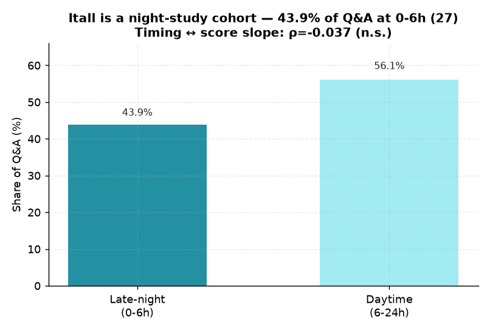

# 27. Q&A 시간대(수업직후 vs 심야) ↔ 성적

> **명제** · 심야·마감직전 Q&A보다 수업 직후 즉시 Q&A 학생의 성적이 좋다
> **카테고리** C · 서비스 활용 · **상태** ✅ 완료(해석 주의) · **데이터** 🟦 확보 · **출처** 시트2-26

## 한 줄 결론
> **✗ 무의미 — 시간대는 성적상승을 못 가른다.** 심야(0-6시) Q&A 비율과 성적기울기 부분상관 −0.037(p=0.37). 단 잇올은 **야간학습** 구조라(Q&A의 43.9%가 0-6시) 일반고식 "수업직후 vs 심야" 구분이 잘 맞지 않는다.

> **트랙 안내**: `mentoring_questions.created_at` 73,582건의 시간대 + 성적 시계열. Q&A 3건+ ∩ 성적 3회+ 594명.

## 결과
| 지표 | 값 |
|------|-----|
| Q&A 심야(0-6시) 비율 평균 | 43.9% |
| 심야 비율 ↔ 성적기울기 (성적평균 통제) | **−0.037 (p=0.37)** |
| Q&A 시간대 분포 | 0-13시 집중, 14시 이후 급감 |

→ 시간대는 성적과 무관. 잇올 시간대(야간~오후)가 일반고와 달라 명제의 전제(수업직후 즉시성)가 구조적으로 안 맞음.

*잇올은 야간학습 구조라 Q&A의 43.9%가 0–6시. 시간대↔성적상승 부분상관 −0.037(n.s.) — '수업직후 vs 심야' 구분이 구조적으로 안 맞는다.*

## 선행 · 연관 분석
- [21 Q&A↔순위](21-rank-vs-online-qna.md), [22 Q&A↔성적](22-qna-vs-score-tenure-controlled.md)

## 📊 데이터 출처 & 표본

| 항목 | 내용 |
|------|------|
| 출처 | main `mentoring_questions.created_at` + exam_management(PostgreSQL, intra-tools RDS) |
| 기간/범위 | Q&A 73,582건 시간대 + 성적 |
| 표본 | Q&A3건+∩성적3회+ 594명 |
| 분석 방법 | 심야(0-6시) 비율 ↔ 성적기울기 |
| 추출 | 운영 DB **read-only** (MongoDB `find` / PostgreSQL `SELECT`, 쓰기 호출 없음) |
| 환경 | 격리 venv(uv, pandas/scipy/sklearn), 자격증명 비저장 |

---
◀ [전체 명제 목록](../README.md)
