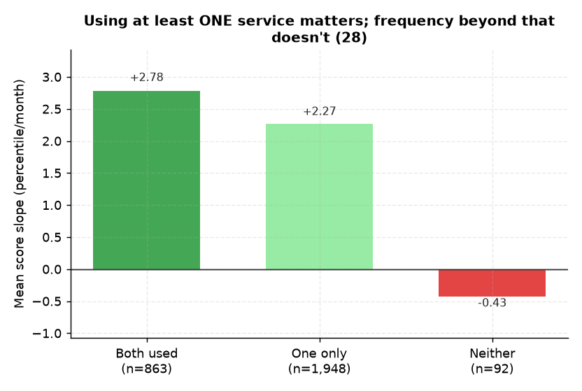

# 28. CA·Q&A 동시활용 ↔ 성적

> **명제** · CA·Q&A 둘 다 활용하는 학생이 한쪽만 쓰는 학생보다 상승폭이 크다
> **카테고리** C · 서비스 활용 · **상태** ✅ 완료 · **데이터** 🟦 확보 · **출처** 시트2-27

## 한 줄 결론
> **◐ 부분 지지 — "활용 여부"는 의미, "빈도"는 약함.** 둘 다 쓰는 학생의 성적기울기 +2.78 > 한쪽 +2.27 > **안 쓰는 학생 −0.43**. 서비스를 전혀 안 쓰는 소수(92명)만 성적 정체. 단 활용 빈도의 연속 효과는 작다([22](22-qna-vs-score-tenure-controlled.md)·[24](24-ca-frequency-vs-score.md) 각 |ρ|<0.06).

> **트랙 안내**: 성적상승 = 현재 재원생(분석모집단)의 모의고사 백분위 시계열 기울기(3회+ 응시 2,903명). 행동/서비스는 DocumentDB 30일(몰입·입실·외출) + Q&A/CA. **성적평균(천장효과) 통제 부분상관**으로 봄.

## 결과
| 활용 | 성적기울기 평균 | n |
|------|:---:|:---:|
| 둘 다 사용 | **+2.78** | 863 |
| 한쪽만 | +2.27 | 1,948 |
| 안 씀 | **−0.43** | 92 |

→ "최소한 하나라도 활용"하는 것의 이진 효과는 뚜렷(안 쓰면 성적 정체). 그 위로는 빈도가 더 늘어도 변별 약함.

> **메타 결론(중요)**: 모든 행동/서비스의 성적상승 부분상관이 |ρ|<0.08로 매우 작다. **입시결과 트랙(행동 AUC 0.52)·순위 트랙(몰입 동어반복)과 동일** — 잇올 행동지표는 성과(순위·성적상승·입시) 변별력이 일관되게 약하다. 변별은 '양'이 아니라 [02 일관성](02-focus-consistency-vs-rank.md)·[32 성적안정성](32-score-stability-vs-admission.md) 같은 '안정성'에서 난다.

*둘 다(+2.78)>한쪽(+2.27)>**안 씀(−0.43)**. '최소 하나라도 활용'의 이진 효과는 뚜렷하나, 그 위로 빈도 변별력은 약함.*

## 선행 · 연관 분석
- [22 Q&A↔성적](22-qna-vs-score-tenure-controlled.md), [24 CA↔성적](24-ca-frequency-vs-score.md), [29 복합 서비스활용](29-early-service-usage-vs-achievement.md)

## 📊 데이터 출처 & 표본

| 항목 | 내용 |
|------|------|
| 출처 | main `mentoring_questions`+`mentor_schedule_reservation` + exam_management(PostgreSQL, intra-tools RDS) |
| 기간/범위 | 서비스 + 성적 |
| 표본 | 2,903명 (둘다 863/없음 92) |
| 분석 방법 | 활용 조합별 성적기울기 |
| 추출 | 운영 DB **read-only** (MongoDB `find` / PostgreSQL `SELECT`, 쓰기 호출 없음) |
| 환경 | 격리 venv(uv, pandas/scipy/sklearn), 자격증명 비저장 |

---
◀ [전체 명제 목록](../README.md)
