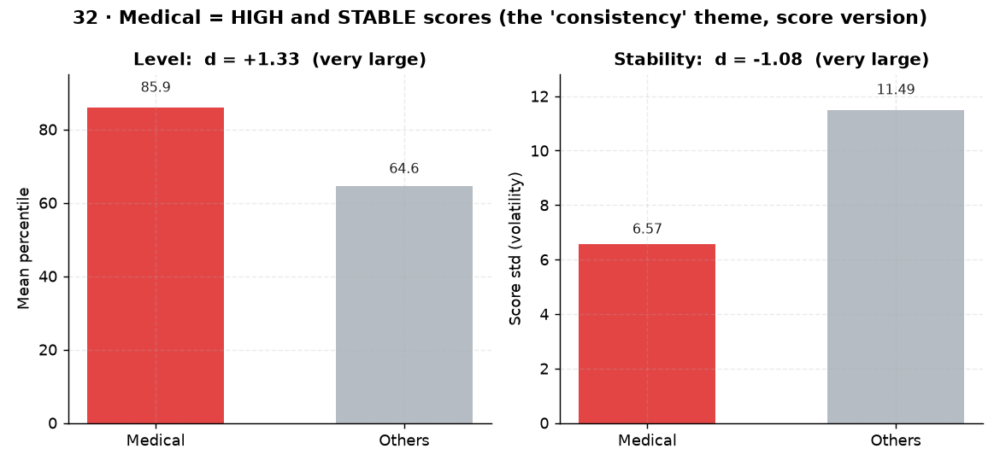

# 32. 모의고사 성적 안정성 ↔ 입시결과

> **명제** · 모의고사 성적의 안정성(저변동)이 높은 학생의 최종 입시결과가 좋다
> **카테고리** D · 모의고사·성적·입시 · **상태** ✅ 완료 · **데이터** 🟦 확보 · **출처** 시트2-33

## 한 줄 결론

> **✅ 강하게 지지.** 메디컬 합격자는 모의고사 성적 변동(std)이 6.57로 기타(11.49)의 절반 수준(Cohen d=**−1.08**, 큰 효과). 동시에 평균 백분위 자체도 85.9 vs 64.6으로 압도적으로 높다(d=**+1.33**). 즉 메디컬은 **높고 안정적인 성적**.

> **트랙 안내**: 입시결과(`admission_results`, 2026 입시)는 **작년 졸업생** 데이터다. 현재 30일 재원생(DocumentDB)이 아닌, `exam_management` 내부의 **작년 행동(`student_behavior_stats`)·성적(`student_records`)** 과 결합해 분석했다. 표본: 입시결과 보유 7,290명(메디컬 523), 행동결합 99%.

## 결과 (성적 3회+ 보유 3,270명)

| 지표 | 메디컬 | 기타 | Cohen d |
|------|:---:|:---:|:---:|
| 평균 백분위 | **85.9** | 64.6 | +1.33 (매우 큼) |
| 성적 변동성(std) | **6.57** | 11.49 | −1.08 (안정) |
| 월당 기울기 | −0.23 | −0.64 | +0.06 (미미) |

→ 안정성(저변동)과 절대 수준이 모두 메디컬과 강하게 연관. **02번(몰입 일관성)의 성적 버전** — "일관성이 성과를 가른다"가 성적에서도 재현.

*메디컬은 **높고(백분위 85.9, d+1.33)·안정적(std 6.57, d−1.08)** 성적. 02번 '몰입 일관성'의 성적 버전 — 안정성이 성과를 가른다.*

## ⚠️ 교란요인 · 주의
- 높은 성적이면 변동이 작은 건 부분적으로 천장효과(상위권은 백분위 90+에서 진동폭 작음)일 수 있음 → 변동성의 독립 효과는 백분위 통제 후 재확인 여지.

## 선행 · 연관 분석
- [33 상승기울기](33-slope-vs-baseline-prediction.md), [39 복합예측](39-composite-index-vs-admission.md), [02 몰입 일관성](02-focus-consistency-vs-rank.md)

## 📊 데이터 출처 & 표본

| 항목 | 내용 |
|------|------|
| 출처 | exam_management(PostgreSQL, intra-tools RDS) `student_records`+`admission_results` |
| 기간/범위 | 작년 졸업생 성적 시계열 |
| 표본 | 성적 3회+ 3,270명 |
| 분석 방법 | 백분위 std/평균, Cohen d |
| 추출 | 운영 DB **read-only** (MongoDB `find` / PostgreSQL `SELECT`, 쓰기 호출 없음) |
| 환경 | 격리 venv(uv, pandas/scipy/sklearn), 자격증명 비저장 |

---
◀ [전체 명제 목록](../README.md)
