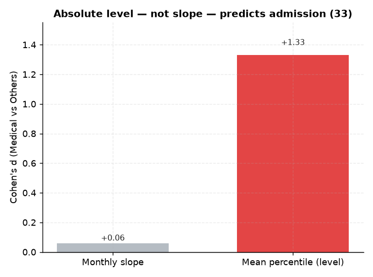

# 33. 초기성적 vs 상승기울기 예측력

> **명제** · 입소 시점 성적보다 상승 기울기가 입시결과를 더 잘 예측한다
> **카테고리** D · 모의고사·성적·입시 · **상태** ✅ 완료 · **데이터** 🟦 확보 · **출처** 시트2-34

## 한 줄 결론

> **✗ 기울기보다 절대 수준이 지배.** 메디컬과 기타의 월당 성적 기울기 차이는 d=+0.06로 미미한 반면, 평균 백분위 차이는 d=+1.33로 압도적. 입시결과를 가르는 건 **상승폭이 아니라 성적의 절대 수준**이다.

> **트랙 안내**: 입시결과(`admission_results`, 2026 입시)는 **작년 졸업생** 데이터다. 현재 30일 재원생(DocumentDB)이 아닌, `exam_management` 내부의 **작년 행동(`student_behavior_stats`)·성적(`student_records`)** 과 결합해 분석했다. 표본: 입시결과 보유 7,290명(메디컬 523), 행동결합 99%.

## 결과

| 지표 | 메디컬 | 기타 | Cohen d |
|------|:---:|:---:|:---:|
| 월당 성적 기울기 | −0.23 | −0.64 | +0.06 (미미) |
| 평균 백분위(절대수준) | 85.9 | 64.6 | **+1.33** |

→ 두 그룹 모두 후반부로 갈수록 백분위가 소폭 하락(기울기 음수, 모집단 확대 효과 추정). 기울기는 변별력 거의 없음. **명제와 반대**: 절대 수준이 기울기보다 훨씬 잘 예측.

*입시를 가르는 건 상승 기울기(d=+0.06)가 아니라 **성적의 절대 수준**(d=+1.33). 명제와 반대.*

## ⚠️ 교란요인 · 주의
- 기울기 음수는 시험 난이도·응시 모집단 변화(수능 임박 시 전국 응시) 영향 가능.
- "초기 성적"을 첫 회차로 근사 — 입소 직후 성적이 아닐 수 있음.

## 선행 · 연관 분석
- [32 성적 안정성](32-score-stability-vs-admission.md), [39 복합예측](39-composite-index-vs-admission.md)

## 📊 데이터 출처 & 표본

| 항목 | 내용 |
|------|------|
| 출처 | exam_management(PostgreSQL, intra-tools RDS) `student_records`+`admission_results` |
| 기간/범위 | 작년 졸업생 |
| 표본 | 성적 3회+ 3,270명 |
| 분석 방법 | 기울기 vs 절대수준 Cohen d |
| 추출 | 운영 DB **read-only** (MongoDB `find` / PostgreSQL `SELECT`, 쓰기 호출 없음) |
| 환경 | 격리 venv(uv, pandas/scipy/sklearn), 자격증명 비저장 |

---
◀ [전체 명제 목록](../README.md)
