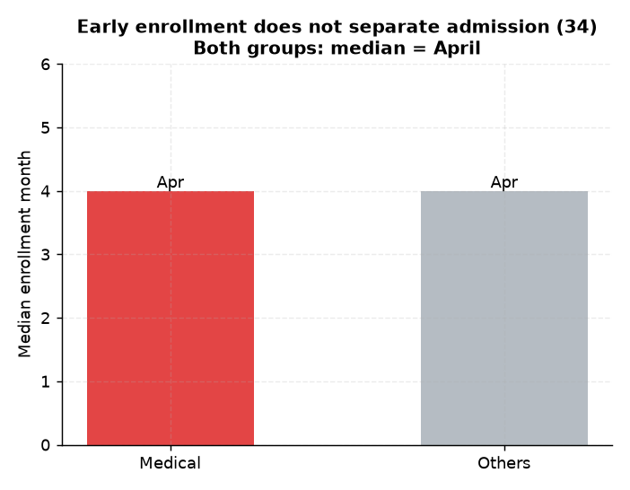

# 34. 조기 입소(고2~고3초) ↔ 입시결과

> **명제** · 고2~고3 초 조기 입소 학생의 입시결과가 좋다
> **카테고리** E · 생활·습관·복합 · **상태** ✅ 완료 · **데이터** 🟦 확보 · **출처** 시트2-36

## 한 줄 결론

> **✗ 조기 입소 효과 관측 안 됨.** 메디컬과 기타의 입소월 중앙값이 둘 다 4월로 동일하고, 학년(N수 추정) 분포도 유사. 일찍 들어온다고 입시결과가 좋아지는 신호는 이 데이터에 없다.

> **트랙 안내**: 입시결과(`admission_results`, 2026 입시)는 **작년 졸업생** 데이터다. 현재 30일 재원생(DocumentDB)이 아닌, `exam_management` 내부의 **작년 행동(`student_behavior_stats`)·성적(`student_records`)** 과 결합해 분석했다. 표본: 입시결과 보유 7,290명(메디컬 523), 행동결합 99%.

## 결과
- **입소월 중앙값**: 메디컬 4월 = 기타 4월 (차이 없음)
- **학년 분포**: 메디컬·기타 모두 grade 1~2에 집중(유사 형태)

→ 입소 시기·학년으로 메디컬 여부를 가를 수 없음.

*메디컬·기타 입소월 중앙값이 둘 다 4월로 동일 — 일찍 들어온다고 입시결과가 좋아지는 신호는 없다.*

## ⚠️ 교란요인 · 주의
- `grade` 코드 의미(재수/N수 여부) 해석 불확실 → 운영 정의 확인 시 재분석 여지.
- 졸업생이라 대부분 비슷한 시기 입소(연초) → 변별 폭 작음.

## 선행 · 연관 분석
- [19 재원기간](19-toptier-medical-tenure.md), [39 복합예측](39-composite-index-vs-admission.md)

## 📊 데이터 출처 & 표본

| 항목 | 내용 |
|------|------|
| 출처 | exam_management(PostgreSQL, intra-tools RDS) `admission_results`+`students` |
| 기간/범위 | 작년 졸업생 |
| 표본 | 입시결과 7,290명(메디컬 523) |
| 분석 방법 | 입소월/학년 분포 비교 |
| 추출 | 운영 DB **read-only** (MongoDB `find` / PostgreSQL `SELECT`, 쓰기 호출 없음) |
| 환경 | 격리 venv(uv, pandas/scipy/sklearn), 자격증명 비저장 |

---
◀ [전체 명제 목록](../README.md)
