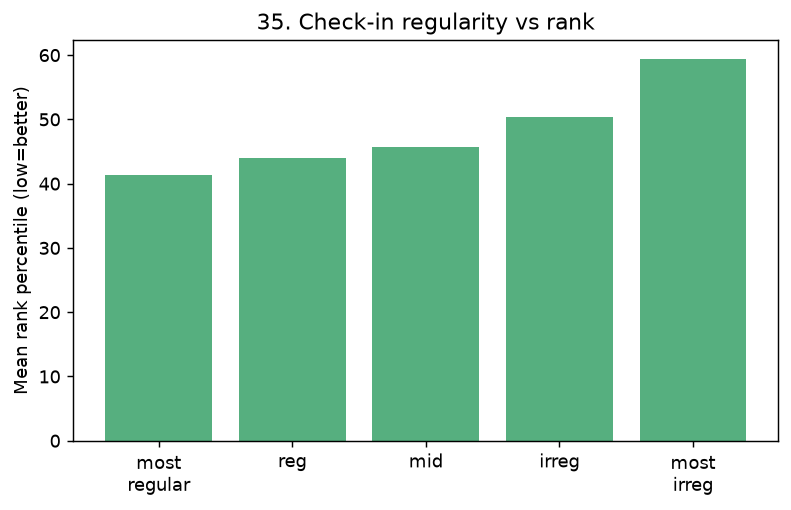

# 35. 출결 규칙성 ↔ 빌보드 순위

> **명제** · 입·퇴실 시각이 규칙적인 학생이 순위가 높다
> **카테고리** E · 생활·습관·복합 · **상태** ✅ 완료 · **데이터** 🟦 확보 · **출처** 시트2-37

## 한 줄 결론

> **◐ 표면적으로는 지지, 그러나 대부분 간접효과.** 입실시각이 규칙적인 학생일수록 순위가 높다(가장규칙 41% → 가장불규칙 59%). 하지만 **몰입량을 통제하면 고유효과는 −0.06으로 거의 소멸** — "규칙적인 학생이 몰입도 많아서"라는 경로가 대부분이다. (02 일관성이 통제 후에도 +0.42인 것과 대조.)

## 가설
입·퇴실 시각이 규칙적인 학생이 순위가 높다.

## 필요 데이터
- `student_daily_report.checkin` (입실 시각, 자정 기준 초 — 검증 완료: 중앙값 08:02)
- `rank`

**가용성**: 확보 (운영 DB 확인됨)

## 분석 방법
학생별(≥10일, checkin>0) 입실시각 표준편차 → 평균 순위백분위와 **평균 몰입량 통제 부분상관**. 규칙성 5분위별 순위 비교.

## 결과

**규칙성 5분위별 평균 순위백분위**(낮을수록 상위):

| 가장 규칙 | 규칙 | 보통 | 불규칙 | 가장 불규칙 |
|:---:|:---:|:---:|:---:|:---:|
| **41.3%** | 43.9% | 45.6% | 50.4% | **59.3%** |

→ raw로는 단조적으로 규칙적일수록 상위(명제 지지).

| 지표 | 값 |
|------|-----|
| 입실시각 표준편차 중앙값 | 2.14h |
| **부분 Spearman(입실변동, pct_rank \| 평균focus)** | **−0.056** (p=3e-10) |

→ 평균 몰입량 통제 시 고유효과 거의 0(방향도 미세하게 반대). 출결 규칙성의 순위 효과는 **대부분 몰입량을 경유**한다.

## ⚠️ 교란요인 · 주의
규칙적 입실 ↔ 많은 몰입은 강하게 묶임 → 통제 필수. 02(몰입 일관성)와 달리 통제 후 효과가 사라진다는 점이 핵심 대비. 퇴실시각·요일 분리는 후속.

## 선행 · 연관 분석
- [02 몰입 일관성](02-focus-consistency-vs-rank.md), [09 요일편차](09-weekday-variance-toptier.md)

---
◀ [전체 명제 목록](../README.md)
