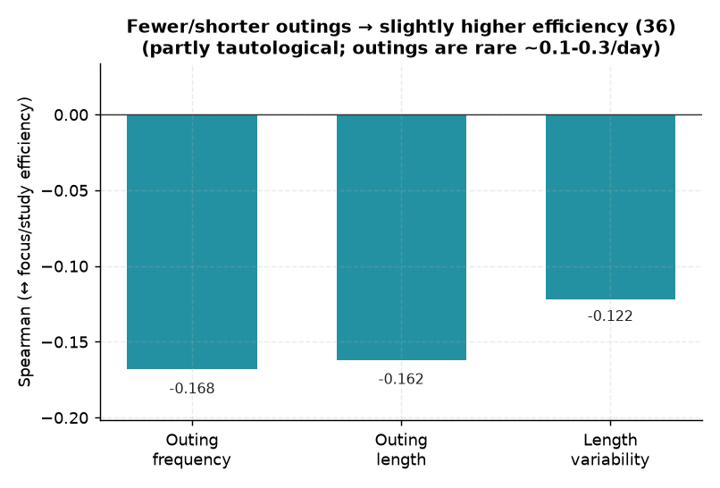

# 36. 휴식 패턴 규칙성 ↔ 순공 효율

> **명제** · 휴식 시간이 규칙적인(짧고 일정한) 학생의 순공 효율이 높다
> **카테고리** E · 생활·습관·복합 · **상태** ✅ 완료 · **데이터** 🟦 확보 · **출처** 시트2-38

## 한 줄 결론
> **◐ 외출 적을수록 효율↑(−0.17)이나 부분적으로 정의상 당연하고, 애초에 외출이 드물다.** 외출 빈도·길이·변동이 모두 몰입효율(focus/study)과 약한 음의 상관. 단 `focus = study − 외출`이라 외출 많으면 효율 낮은 건 일부 정의상 결과. 게다가 외출 자체가 하루 평균 0.1~0.3회로 드물어, 휴식 패턴의 변별력은 제한적.

> **트랙 안내**: `attendance.outing_log`(CHECK_IN/OUTING/RETURN/CHECK_OUT 이벤트)로 착석 블록·외출 구간 재구성. 30일, outing_log 보유 293,007 학생-일 → ≥5일 13,552명.

## 결과 (외출 평균 0.1~0.3회/일, 평균 외출길이 ~10분)

| 휴식 지표 | ↔ 몰입효율(focus/study) |
|------|:---:|
| 외출 빈도 | Spearman −0.168 |
| 평균 외출 길이 | −0.162 |
| 외출 길이 변동(std) | −0.122 |

→ 외출이 적고·짧고·일정할수록 효율이 약간 높음(명제 방향). 단 ① focus 정의에 외출 차감이 포함돼 부분 동어반복 ② 외출이 워낙 드물어 대부분 학생이 "외출 0" → 변별 폭 작음.

*외출 빈도·길이·변동 모두 효율과 약한 음의 상관(−0.12~−0.17). 단 focus 정의에 외출 차감이 포함돼 일부 동어반복이고, 외출 자체가 드물어(0.1~0.3회/일) 변별 폭이 작다.*

## ⚠️ 교란요인 · 주의
- `focus_ratio = focus/study`에서 외출은 분자에서 차감 → "외출 많음 → 효율 낮음"은 일부 정의상 자명.
- 외출 희소성([03](03-continuous-focus-block-vs-rank.md))으로 휴식 패턴 자체의 분산이 작음.

## 선행 · 연관 분석
- [03 연속 몰입 블록](03-continuous-focus-block-vs-rank.md), [08 외출 빈도](08-outing-frequency-vs-rank-score.md)

## 📊 데이터 출처 & 표본

| 항목 | 내용 |
|------|------|
| 출처 | main `attendance.outing_log` + 운영 DocumentDB(aggregation): `rank`(STUDY_TIME/NATIONWIDE/DAY) + `student_daily_report` |
| 기간/범위 | 30일 |
| 표본 | ≥5일 13,552명 |
| 분석 방법 | 외출 빈도·길이·변동 ↔ focus/study 효율 |
| 추출 | 운영 DB **read-only** (MongoDB `find` / PostgreSQL `SELECT`, 쓰기 호출 없음) |
| 환경 | 격리 venv(uv, pandas/scipy/sklearn), 자격증명 비저장 |

---
◀ [전체 명제 목록](../README.md)
