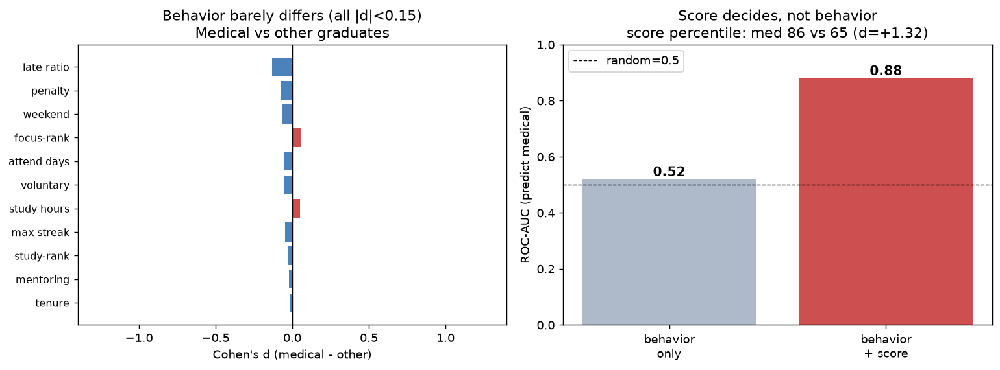

# 39. 복합지표 ↔ 입시결과 예측

> **명제** · 몰입·Q&A·모의고사를 합친 종합점수가 단일 지표보다 입시결과를 잘 예측한다
> **카테고리** E · 생활·습관·복합 · **상태** ✅ 완료 · **데이터** 🟦 확보 · **출처** 시트2-41

## 한 줄 결론

> **✅ 핵심 결론 — 입시(메디컬)는 행동이 아니라 성적이 결정한다.** 잇올 행동지표(몰입·출결·멘토링·랭킹진입)만으로 메디컬 합격을 예측하면 ROC-AUC **0.52**(거의 무작위). 여기에 모의고사 성적을 더하면 **0.88**로 급등한다. 즉 "다들 비슷하게 열심히 하고", 변별은 실력(성적)에서 난다.

> **트랙 안내**: 입시결과(`admission_results`, 2026 입시)는 **작년 졸업생** 데이터다. 현재 30일 재원생(DocumentDB)이 아닌, `exam_management` 내부의 **작년 행동(`student_behavior_stats`)·성적(`student_records`)** 과 결합해 분석했다. 표본: 입시결과 보유 7,290명(메디컬 523), 행동결합 99%.

## 결과

| 모형 | ROC-AUC (메디컬 예측) |
|------|:---:|
| 행동지표만 (몰입·재원·연속·지각·자율·멘토링·랭킹진입) | **0.52** (≈무작위) |
| 행동 + 모의고사 성적(평균백분위·기울기·변동성) | **0.88** |

→ 성적을 넣기 전엔 예측 불가, 넣으면 강력. **복합지표의 설명력은 거의 전적으로 성적에서 온다.** 행동지표는 "잇올에 다닌다"는 공통점이라 변별력이 없다.

## ⚠️ 교란요인 · 주의
- 메디컬 합격은 성적 컷이 높은 정시/수시라 성적이 지배하는 게 당연할 수 있음(구조적).
- 행동→성적→입시의 매개 경로일 가능성(행동이 성적을 통해 간접 영향) — 본 모형은 직접 예측만 봄.

## 선행 · 연관 분석
- [20 메디컬↔몰입](20-toptier-medical-focus.md), [32 성적안정성↔입시](32-score-stability-vs-admission.md), [33 상승기울기](33-slope-vs-baseline-prediction.md)

---
◀ [전체 명제 목록](../README.md)
