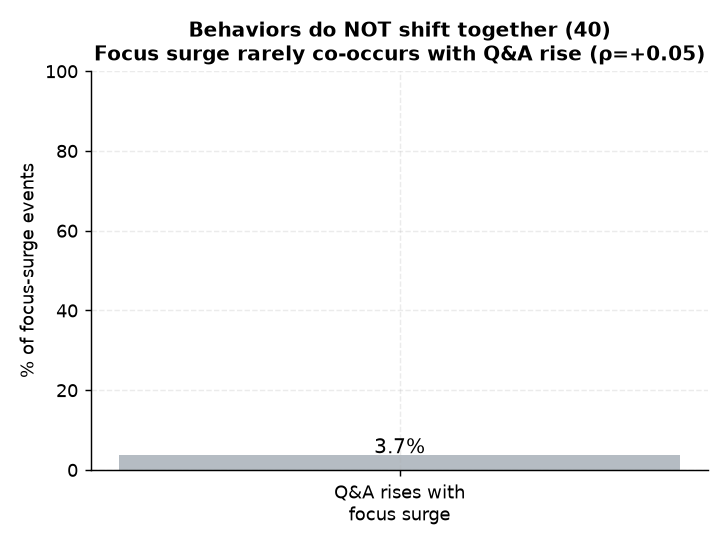

# 40. 행동 동시변화 시점 ↔ 성취

> **명제** · 성취 학생은 특정 시점에 몰입↑·Q&A↑·외출↓의 동시다발 변화가 나타난다
> **카테고리** E · 생활·습관·복합 · **상태** ✅ 완료 · **데이터** 🟦 확보 · **출처** 시트2-42

## 한 줄 결론
> **✗ 동시변화 없음 — 몰입이 급증해도 Q&A는 따라 늘지 않는다.** 학생별 몰입 급증 시점(7일 이동평균 최대 점프)에 Q&A가 동반 증가한 비율은 **3.7%**뿐이고, 몰입변화↔Q&A변화 상관도 ρ=+0.05로 무의미. "몰입·Q&A·외출이 한 시점에 동시 변한다"는 패턴은 관측되지 않는다.

> **트랙 안내**: `sdr`(일별 몰입)·Q&A 날짜별. 몰입 변화점 보유 8,786명의 변화점 전후 Q&A 동반성.

## 결과
| 지표 | 값 |
|------|-----|
| 몰입 급증 시점 Q&A 동반증가 비율 | **3.7%** |
| 몰입변화 ↔ Q&A변화 Spearman | +0.052 (p=1e-6) |

→ 행동들이 한 시점에 동시 변하는 "전환점" 패턴 없음. 몰입과 서비스 활용은 각자 따로 움직인다.

*몰입 급증 시점에 Q&A가 동반 증가한 비율은 3.7%뿐, 상관도 +0.05 — 몰입·Q&A·외출이 한 시점에 동시 변하는 '전환점' 패턴은 없다.*

## ⚠️ 교란요인 · 주의
30일 일별이라 change-point 탐지가 제한적. 외출은 별도 시점해상도(outing 30일)라 3-way 동시성은 몰입-Q&A 쌍으로 근사.

## 선행 · 연관 분석
- [18 진입 직전 행동변화](18-pre-entry-behavior-change.md), [04 선행 하락](04-focus-leading-drop-early-warning.md)

## 📊 데이터 출처 & 표본

| 항목 | 내용 |
|------|------|
| 출처 | 운영 DocumentDB(aggregation): `rank`(STUDY_TIME/NATIONWIDE/DAY) + `student_daily_report` + main `mentoring_questions` 날짜별 |
| 기간/범위 | 30일 일별 |
| 표본 | 몰입 변화점 8,786명 |
| 분석 방법 | 몰입 급증점 전후 Q&A 동반성(동시성) |
| 추출 | 운영 DB **read-only** (MongoDB `find` / PostgreSQL `SELECT`, 쓰기 호출 없음) |
| 환경 | 격리 venv(uv, pandas/scipy/sklearn), 자격증명 비저장 |

---
◀ [전체 명제 목록](../README.md)
