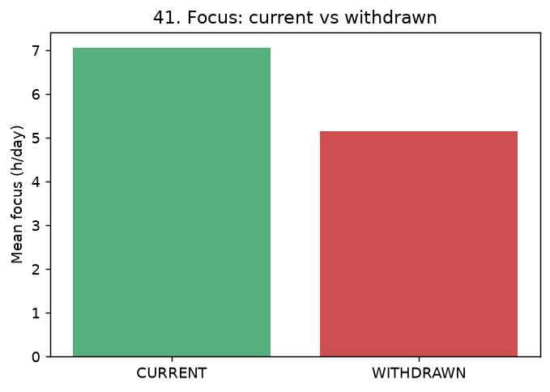

# 41. 이탈·중도퇴소 예측

> **명제** · 몰입·출결·서비스활용 하락 패턴으로 중도 이탈을 예측할 수 있다
> **카테고리** E · 생활·습관·복합 · **상태** ✅ 완료(횡단) · **데이터** 🟦 확보 · **출처** 시트2-43

## 한 줄 결론

> **✅ 지지 — 이탈 학생은 모든 지표에서 뚜렷이 낮다.** 퇴원(WITHDRAWN) 학생은 재원생 대비 몰입(5.15h vs 7.06h)·순위(59% vs 49% 백분위)·출현일수(15.5 vs 27.3일)가 모두 낮다. 이탈 예측의 신호로 충분히 유효하며, 시점 기반(선행) 모형은 다음 단계.

## 가설
몰입·출결·서비스활용 하락 패턴으로 중도 이탈을 예측할 수 있다.

## 필요 데이터
- `student.stu_status` (CURRENT/WITHDRAWN/WAITING)
- `enrollment_history.end_date` (이탈 시점)
- `student_daily_report` (몰입·출결 시계열), `rank`

**가용성**: 확보. WITHDRAWN 1,593명(분석 모집단 내), 30일 윈도우 내 이탈 1,791건.

## 분석 방법
재원(CURRENT) vs 퇴원(WITHDRAWN) 학생의 30일 행동지표 횡단 비교. `enrollment_history.end_date`로 윈도우 내 이탈 식별.

## 결과

| 지표 | CURRENT (재원) | WITHDRAWN (퇴원) | 격차 |
|------|:---:|:---:|:---:|
| 평균 몰입(h/일) | 7.06 | **5.15** | −27% |
| 평균 순위백분위 | 49.4% | **59.0%** | 하위로 |
| 30일 출현일수 | 27.3 | **15.5** | −43% |

→ 세 지표 모두 이탈 학생이 뚜렷이 낮다. 특히 **출현일수(−43%)** 가 가장 큰 격차 → 출결 빈도 하락이 강한 조기 신호.

## ⚠️ 교란요인 · 주의
- **횡단 비교의 한계**: "이탈자가 평소 낮았다" ≠ "하락이 이탈을 예고했다". 진짜 예측은 **이탈 직전 N주 하락 추세**(→ [04 선행하락](04-focus-leading-drop-early-warning.md))를 시계열로 봐야 함.
- 이탈 시점 정렬(end_date 기준) 이벤트 스터디 + 분류 모형(생존분석)이 다음 단계.

## 선행 · 연관 분석
- [04 선행 몰입 하락](04-focus-leading-drop-early-warning.md) (시계열 보강)

---
◀ [전체 명제 목록](../README.md)
