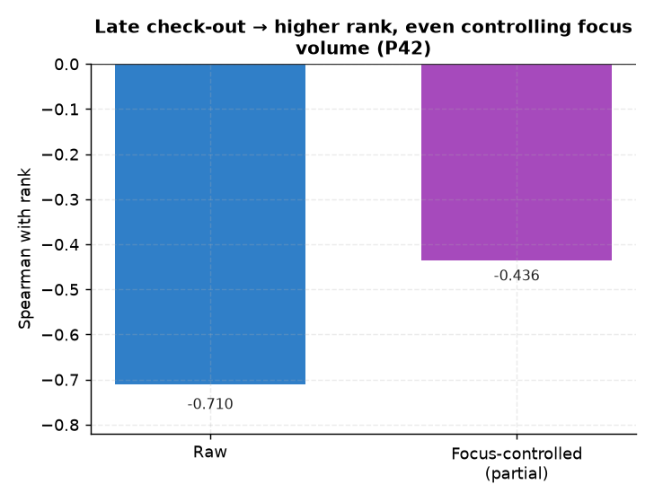

# P42. 퇴실시각 ↔ 순위

> **명제(제안)** · 퇴실시각이 늦은(오래 남는) 학생이 순위가 높다
> **분류** A 몰입×성과 · **상태** ✅ 지지(강) · *AI 도출 명제(origin.xlsx 외)*

## 한 줄 결론
> **✅ 강하게 지지.** 퇴실시각이 늦을수록 순위가 높다(몰입 통제 후 부분상관 **−0.436**). 평균 퇴실 15.8시(야간학습). 02 일관성·03 블록과 같은 '오래 머무름' 계열의 강한 독립효과 — 단 퇴실시각은 체류시간과 강하게 묶여 03과 메커니즘 중첩.

## 결과
| 지표 | 값 |
|---|---|
| 퇴실시각 ↔ 순위 (raw) | −0.710 |
| **몰입 통제 부분상관** | **−0.436** (p≈0) |
| 평균 퇴실시각 | 15.8h |

## 도출 근거
기존 분석은 입실시각(checkin, 07·35)만 봤고 퇴실시각(checkout)은 미분석. '얼마나 오래 남느냐'를 직접 검증.

*퇴실시각이 늦을수록 순위가 높다 — raw −0.710, 몰입 통제 후에도 −0.436으로 강하다. 02·03과 같은 '오래 머무름' 계열.*

## 시사점 · 한계 · 연관

- **저비용 조기신호 후보**: `checkout`(퇴실시각)은 `student_daily_report`에 이미 적재된 필드로 추가 추출 비용이 없다. '오래 남는 학생 = 상위권' 연관이 강해(몰입 통제 후 −0.436), **퇴실시각의 급격한 단축**은 슬럼프·이탈의 선행지표 후보로 모니터링할 가치가 있다.
- **한계(메커니즘 중첩)**: 퇴실시각은 체류시간과 강하게 묶여 [03 연속 블록](03-continuous-focus-block-vs-rank.md)·체류량의 또 다른 표현일 수 있다. 독립 개입 레버로 쓰기 전, 체류시간을 추가 통제한 인과 검증이 필요하다.
- **연관**: [02 일관성](../analyses/02-focus-consistency-vs-rank.md) · [P43 연속등원](P43-consecutive-attendance-vs-rank.md) · [35 출결 규칙성](../analyses/35-attendance-regularity-vs-rank.md)

## 📊 데이터 출처 & 표본

| 항목 | 내용 |
|------|------|
| 출처 | DocumentDB `rank`+`student_daily_report`(checkout) |
| 표본 | ≥10일 13,768명 |
| 방법 | 평균 checkout ↔ 순위, 몰입 통제 부분상관 |
| 추출 | 운영 DB read-only |
| 환경 | 격리 venv(pandas/scipy) |

---
◀ [제안 명제 목록](README.md) · [전체 명제](../README.md)
