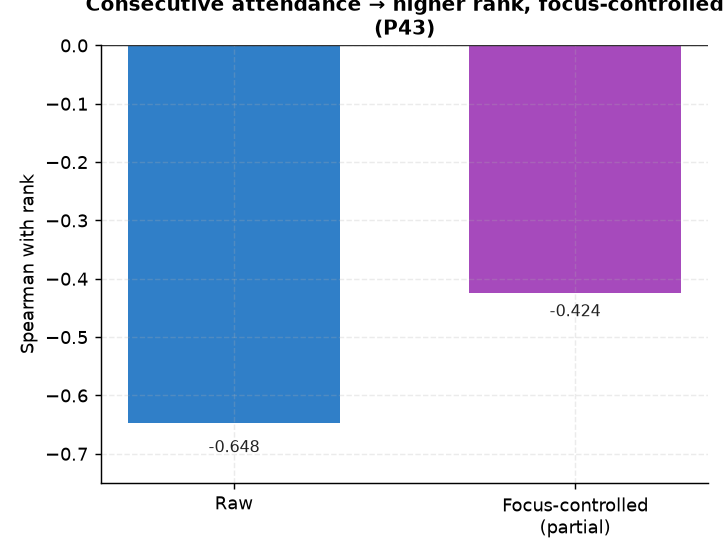

# P43. 연속등원 ↔ 순위

> **명제(제안)** · 연속등원일수가 길수록 순위가 높다
> **분류** A 몰입×성과 · **상태** ✅ 지지(강) · *AI 도출 명제(origin.xlsx 외)*

## 한 줄 결론
> **✅ 강하게 지지.** 연속등원일수가 길수록 순위가 높다(몰입 통제 부분상관 **−0.424**). 02 일관성·P42 퇴실과 함께 '꾸준함'이 몰입량과 별개로 순위를 끌어올린다는 일관된 증거.

## 결과
| 지표 | 값 |
|---|---|
| 연속등원 ↔ 순위 (raw) | −0.648 |
| **몰입 통제 부분상관** | **−0.424** (p≈0) |

## 도출 근거
`student_daily_report.consecutive_attendance` 필드가 미사용 상태였음. 출석 지속성의 직접 지표.

*연속등원이 길수록 순위가 높다 — raw −0.648, 몰입 통제 −0.424. 02 일관성·P42와 함께 '꾸준함'이 몰입량과 별개로 순위를 끌어올린다.*

## 시사점 · 한계 · 연관

- **즉시 감지 가능한 이탈 선행지표**: `consecutive_attendance`는 출결 시스템에서 실시간 산출되는 값이라, **연속등원 끊김**은 별도 모델 없이도 잡아낼 수 있는 이탈/슬럼프 후보 신호다. 02 일관성·P42 퇴실과 함께 '꾸준함' 레버군을 이룬다.
- **한계**: 몰입량을 통제해도 강하게 남지만(−0.424), 연속등원이 길수록 자연히 누적 몰입도 커져 부분적 상호의존이 있다. '끊김 → 순위 하락'의 방향성은 within-student 패널로 보강 권장.
- **연관**: [02 일관성](../analyses/02-focus-consistency-vs-rank.md) · [P42 퇴실시각](P42-checkout-time-vs-rank.md) · [41 이탈 예측](../analyses/41-dropout-prediction.md)

## 📊 데이터 출처 & 표본

| 항목 | 내용 |
|------|------|
| 출처 | DocumentDB `student_daily_report.consecutive_attendance`+`rank` |
| 표본 | ≥10일 13,768명 |
| 방법 | 최대 연속등원 ↔ 순위, 몰입 통제 |
| 추출 | 운영 DB read-only |
| 환경 | 격리 venv(pandas/scipy) |

---
◀ [제안 명제 목록](README.md) · [전체 명제](../README.md)
