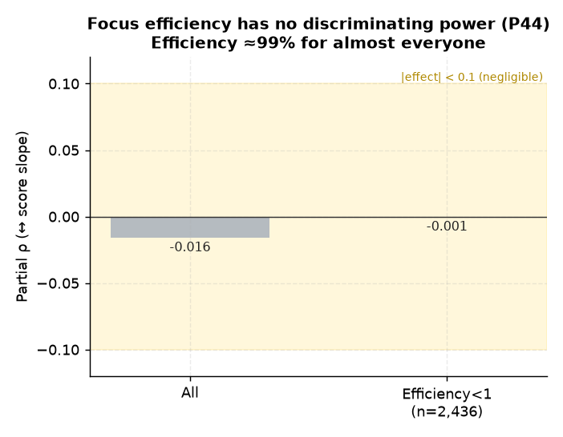

# P44. 몰입효율(focus/study) ↔ 성적상승

> **명제(제안)** · 체류 대비 몰입효율이 높을수록 성적상승이 크다
> **분류** A 몰입×성과 · **상태** ✗ 무의미 · *AI 도출 명제(origin.xlsx 외)*

## 한 줄 결론
> **✗ 무의미.** 몰입효율(focus/study)과 성적기울기 부분상관 −0.016(p=0.41), 효율<1 학생만 봐도 −0.001. 효율이 99%로 수렴(대부분 외출/공용 안 씀)해 변별력이 없다.

## 결과
| 지표 | 값 |
|---|---|
| 전체 효율 ↔ 성적기울기 | −0.016 (p=0.41) |
| 효율<1 (2,436명) | −0.001 (p=0.96) |

## 도출 근거
비효율 학습(study는 높은데 focus 낮음)이 성적을 못 올리는지. 결과: 효율 자체가 거의 1이라 변별 불가([03] 외출 희소와 정합).

*몰입효율(focus/study)이 99%로 수렴해 변별력이 없다 — 전체 −0.016, 효율<1 학생만 봐도 −0.001(무효).*

## 연관

효율이 99%로 수렴하는 근본 원인(외출·공용공간 희소)은 [03 연속 블록](../analyses/03-continuous-focus-block-vs-rank.md)·[36 휴식 패턴](../analyses/36-rest-pattern-vs-efficiency.md)에서 확인된다. 반례 프로파일은 [P51 비효율 학습자](P51-inefficient-learner-profile.md) 참고.

## 📊 데이터 출처 & 표본

| 항목 | 내용 |
|------|------|
| 출처 | `student_daily_report`(focus/study) + `exam_management` 성적 |
| 표본 | 성적3회+ 매칭 |
| 방법 | 효율 ↔ 성적기울기, 성적평균 통제 |
| 추출 | 운영 DB read-only |
| 환경 | 격리 venv(pandas/scipy) |

---
◀ [제안 명제 목록](README.md) · [전체 명제](../README.md)
