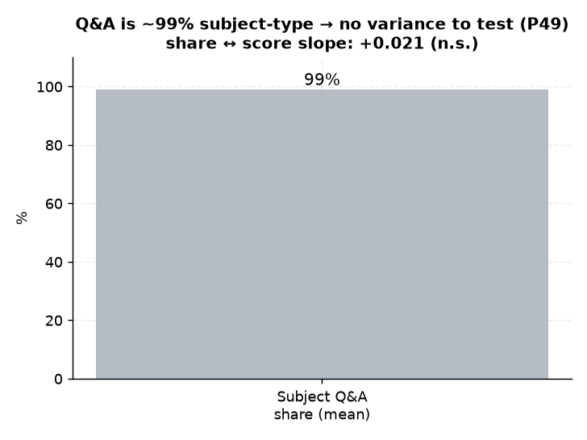

# P49. 교과 Q&A 비중 ↔ 성적상승

> **명제(제안)** · 교과(SUBJECT) Q&A 비중이 높은 학생이 성적상승이 크다
> **분류** C 서비스 활용 · **상태** ✗ 무의미 · *AI 도출 명제(origin.xlsx 외)*

## 한 줄 결론
> **✗ 무의미.** 교과 Q&A 비중 ↔ 성적기울기 +0.021(p=0.61). 단 애초에 Q&A의 99%가 교과(SUBJECT)라 입시(ADMISSION) Q&A가 드물어 변별 불가.

## 결과
부분상관 +0.021 (n=594), 교과Q&A 비중 평균 99%

*Q&A의 99%가 교과(SUBJECT)라 입시 Q&A가 드물어 변별 불가 — 교과비중↔성적상승 +0.021(n.s.).*

## 연관

Q&A 구조 자체는 [21 Q&A↔순위](../analyses/21-rank-vs-online-qna.md) · [27 Q&A 시간대](../analyses/27-qna-timing-vs-score.md) · [22 Q&A↔성적](../analyses/22-qna-vs-score-tenure-controlled.md) 참고. 입시(ADMISSION) 유형 Q&A가 1%에 그쳐 유형 분석의 표본이 부족하다.

## 📊 데이터 출처 & 표본

| 항목 | 내용 |
|------|------|
| 출처 | `mentoring_questions`(counseling_type)+`exam_management` 성적 |
| 표본 | Q&A3건+∩성적3회+ 594명 |
| 방법 | 교과비중 ↔ 성적기울기, 평균 통제 |
| 추출 | 운영 DB read-only |
| 환경 | 격리 venv(pandas/scipy) |

---
◀ [제안 명제 목록](README.md) · [전체 명제](../README.md)
