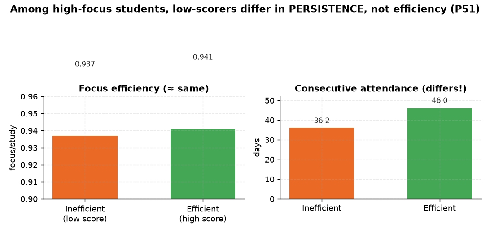

# P51. 비효율 학습자 프로파일

> **명제(제안)** · 몰입은 높은데 성적이 낮은 '비효율 학습자'는 덜 꾸준하다
> **분류** A 몰입×성과 · **상태** ✅ 발견 · *AI 도출 명제(origin.xlsx 외)*

## 한 줄 결론
> **✅ 발견 — 비효율 학습자는 덜 꾸준하다.** 고몰입군(상위40%) 중 성적 하위(비효율) 961명과 성적 상위(효율) 1,231명을 비교하면, 몰입효율(focus/study)은 비슷(0.937 vs 0.941)하나 **연속등원이 36.2 vs 46.0으로 비효율군이 뚜렷이 짧다**. 같은 몰입량이어도 성적을 못 내는 학생은 '꾸준함'에서 갈린다([02]·[P43]과 정합).

## 결과
| | 비효율(성적하위) | 효율(성적상위) |
|---|:---:|:---:|
| n | 961 | 1,231 |
| 몰입효율 | 0.937 | 0.941 |
| **연속등원** | **36.2** | **46.0** |

## 도출 근거
'고몰입인데 저성적' 학생이 존재하는지, 그들의 구별 특징은 무엇인지. → 몰입의 질(효율)이 아니라 지속성(연속등원)이 갈림.

*같은 고몰입군에서 성적 하위(비효율)는 효율(0.937 vs 0.941)이 아니라 **연속등원(36.2 vs 46.0)** 에서 갈린다 — 몰입의 질이 아니라 지속성이 성적을 가른다.*

## 시사점 · 한계 · 연관

- **개입 포인트의 전환**: '고몰입·저성적' 학생의 갈림은 몰입의 *질*(효율 0.937 vs 0.941, 거의 동일)이 아니라 *지속성*(연속등원 36.2 vs 46.0)이다. 즉 처방은 "더 오래 앉아라"가 아니라 **"끊김 없이 꾸준히 나오게 하라"** — 02·P43과 같은 결론.
- **한계**: cross-section 군 비교라 인과가 아니다. '성적 하위' 정의(분위 컷)에 따른 민감도와, 역인과(성적 부진 → 등원 동기 저하) 가능성을 함께 봐야 한다.
- **연관**: [02 일관성](../analyses/02-focus-consistency-vs-rank.md) · [P43 연속등원](P43-consecutive-attendance-vs-rank.md) · [01 몰입↔순위](../analyses/01-focus-absolute-vs-billboard-rank.md)

## 📊 데이터 출처 & 표본

| 항목 | 내용 |
|------|------|
| 출처 | `student_daily_report`(몰입/연속등원)+`exam_management` 성적 |
| 표본 | 고몰입군 2,192명 |
| 방법 | 몰입5분위×성적5분위 교차, 군간 비교 |
| 추출 | 운영 DB read-only |
| 환경 | 격리 venv(pandas/scipy) |

---
◀ [제안 명제 목록](README.md) · [전체 명제](../README.md)
