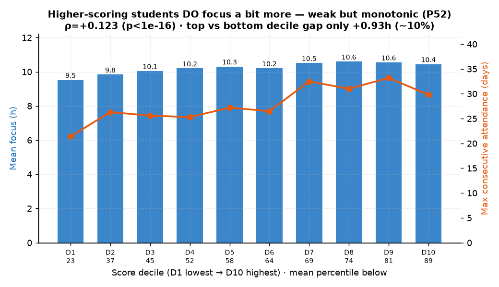

# P52. 성적 수준(연속) ↔ 몰입·꾸준함

> **명제(제안)** · 성적이 높은 학생일수록 몰입시간이 길고 꾸준하다 (방향을 뒤집은 서술적 명제)
> **분류** A 몰입×성과 · **상태** ◐ 약한 지지(서술적) · *AI 도출 명제(origin.xlsx 외)*

## 한 줄 결론
> **◐ 약하지만 통계적으로 확실한 양의 기울기 — 단 인과는 아니다.** 성적 상위권일수록 몰입시간이 *조금* 더 길고(재원생 ρ=+0.123, p<1e-16) 더 꾸준하다(연속등원 ρ=+0.078). 성적분위 D1(백분위 23) 9.52h → D10(백분위 89) 10.45h로 **단조 증가**한다. 다만 양극단 차이가 +0.93h(약 10%)에 불과해 "압도적"이라 할 수 없고, 방향상 *몰입→성적*의 인과 근거로는 쓸 수 없다(상관은 방향 대칭).

## 도출 근거
"행동이 성적을 가르지 못한다([20](../analyses/20-toptier-medical-focus.md)·[39](../analyses/39-composite-index-vs-admission.md))"는 결론을 **방향을 뒤집어** 검증한 명제: "그렇다면 *성적 높은 학생*이 몰입·꾸준함이 더 좋다고는 말할 수 있나?" 기존 분석은 ① 성적 *상승(기울기)* ↔ 행동(메타②, ≈0)과 ② **메디컬 이진컷** ↔ 행동(d≈0)만 봤다. 이 명제는 빠져 있던 ③ **성적 *수준(연속 백분위)* ↔ 행동**을 본다.

## 결과

**현재 재원생** (성적 2회+ ∩ 등원 5일+, n=4,789)

| 지표 | 값 |
|------|-----|
| Spearman(평균 백분위, 평균 몰입h) | **+0.123** (p=1.6e-17) |
| Spearman(평균 백분위, 최대 연속등원) | +0.078 (p=6e-8) |
| 성적 최하위10% 몰입 → 최상위10% | 9.52h → **10.45h** (+0.93h, 약 10%) |
| 성적 최하위10% 연속등원 → 최상위10% | 21.4일 → 33.2일 |

*성적분위가 오를수록 몰입(파랑 막대)·연속등원(주황 선)이 단조 증가. 단 몰입 차이는 0~12h 전체 축에서 보듯 완만하다(+0.93h). 통계적으론 확실하나 크기는 작다.*

**졸업생** (성적 2회+, n=3,725) — 천장효과로 더 약함

| 지표 | 값 |
|------|-----|
| Spearman(백분위, avg_study_hours) | +0.065 (p=6e-5) |
| Spearman(백분위, 지각률) | **−0.095** (상위권이 지각 약간 적음) |
| Spearman(백분위, 자율참여·연속·총등원) | −0.01 ~ −0.02 (무효) |
| 성적 최상위10% study_hours vs 최하위10% | 12.08h vs 11.92h (+0.16h) |

## 시사점 · 한계 · 연관

- **쓸 수 있는 주장 vs 못 쓰는 주장**:

  | 주장 | 가능? | 근거 |
  |------|:---:|------|
  | "성적 상위권은 몰입·꾸준함이 더 높은 **경향**"(서술적) | ✅ | 인과 미주장, ρ+0.12로 사실 |
  | "몰입하면 성적이 오른다"(인과) | ❌ | 성적상승 기울기 ↔ 행동 ≈0(메타②), ρ는 상관일 뿐 |
  | "성적 상위권은 몰입이 **압도적**"(과장) | ❌ | 양극단 +0.93h(~10%)뿐 |

- **상관의 방향 대칭**: `성적↔몰입 = 0.12`는 "몰입→성적"과 "성적→몰입"이 **같은 0.12**다. 방향을 비틀어도 효과 크기는 커지지 않는다 — 비틀기로 얻는 건 *더 센 숫자*가 아니라 *인과를 주장하지 않는 더 안전한 서술 프레임*이다.
- **이진컷 vs 연속(범위 제한)**: 메디컬 이진컷(d=0.05≈0, [20](../analyses/20-toptier-medical-focus.md))은 상위 ~5% 극단만 잘라 천장효과+범위 제한으로 신호가 죽었다. 성적 *전 구간*으로 펴면 +0.12의 약한 우상향이 살아난다. "추출 각도를 바꾸면 약한 신호가 보인다"의 사례.
- **정직한 종합 서사**: *"잇올은 성적과 무관하게 전원을 고몰입(재원생 10h+, 졸업생 12h)으로 끌어올린다 — 내부에서 몰입으로 우열이 안 갈리는 건 바닥이 이미 높기 때문. 그 위에서도 성적 상위권일수록 한 단계 더 몰입·꾸준하다(약한 양의 기울기)."*
- **더 강한 inversion은 따로**: 빌보드 순위는 동어반복이라 "상위권=몰입 2.31배"가 강하게 참([01](../analyses/01-focus-absolute-vs-billboard-rank.md)). 성적 안정성·균형도 강함([32](../analyses/32-score-stability-vs-admission.md)·[P48](P48-subject-balance-vs-medical.md)).
- **연관**: [01 몰입↔순위](../analyses/01-focus-absolute-vs-billboard-rank.md) · [20 메디컬↔몰입](../analyses/20-toptier-medical-focus.md) · [02 일관성](../analyses/02-focus-consistency-vs-rank.md) · [P43 연속등원](P43-consecutive-attendance-vs-rank.md)

## 📊 데이터 출처 & 표본

| 항목 | 내용 |
|------|------|
| 출처 | `exam_management.student_records`(백분위) + DocumentDB `student_daily_report`(몰입·연속등원) / 졸업생 `admission_results`+`student_behavior_stats` |
| 표본 | 재원생 4,789명(성적2회+ ∩ 등원5일+) · 졸업생 3,725명 |
| 방법 | 학생별 평균 백분위 ↔ 평균 몰입/연속등원 Spearman, 성적 10분위 단조성 |
| 추출 | 운영 DB read-only |
| 환경 | 격리 venv(pandas/scipy) |

---
◀ [제안 명제 목록](README.md) · [전체 명제](../README.md)
