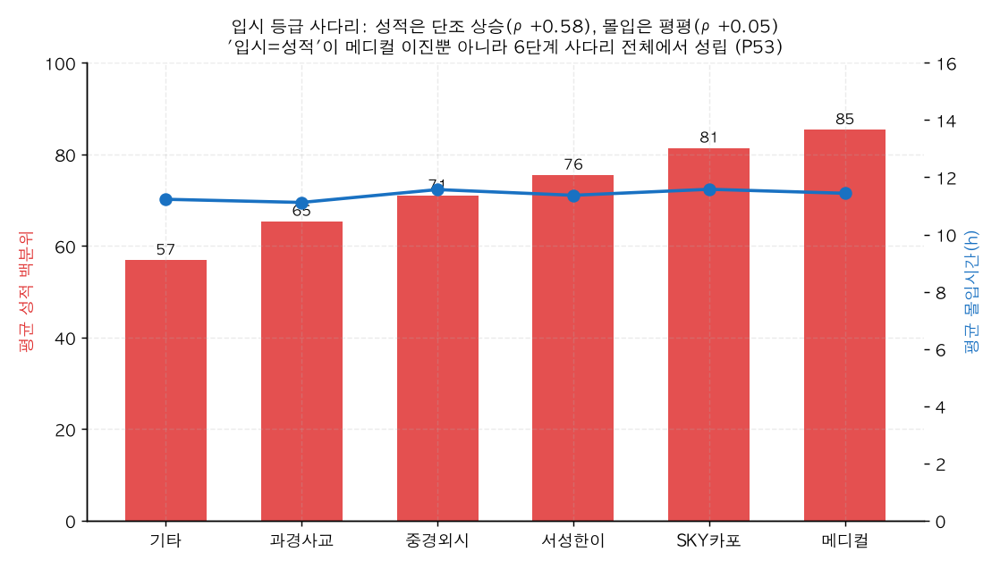

# P53. 입시 등급 사다리 ↔ 성적·행동

> **명제(제안)** · 입시 등급(메디컬>SKY카포>서성한이>중경외시>기타)이 올라갈수록 성적은 오르지만 행동지표는 안 오른다
> **분류** D 모의고사·성적·입시 · **상태** ✅ 지지(강) · *AI 도출 명제(origin.xlsx 외)*

## 한 줄 결론
> **✅ 강하게 지지 — 메타① "입시=성적"이 6단계 사다리 전체에서 성립.** 입시 등급이 오를수록 성적 백분위는 단조 상승(기타 56.9 → 메디컬 85.4, Spearman ρ=**+0.584**)하지만, **몰입·재원·지각·빌보드출현·벌점·휴일등원 등 모든 행동지표는 등급 사다리에서도 평평**(|ρ|≤0.06)하다. 기존 메타결론(메디컬 *이진*컷에서 행동 변별력 ≈0)이 **메디컬뿐 아니라 입시 등급 전체에 일반화**된다.

## 결과 (졸업생 n=7,290, adm_group)

| 입시 등급 | n | 성적 백분위 | 몰입(h) | 재원일 | 지각률 | 빌보드출현 |
|------|:---:|:---:|:---:|:---:|:---:|:---:|
| 기타 | 4,416 | 56.9 | 11.23 | 134 | 0.132 | 6.8 |
| 과경사교 | 204 | 65.4 | 11.12 | 129 | 0.118 | 8.8 |
| 중경외시 | 820 | 71.0 | 11.57 | 141 | 0.128 | 8.1 |
| 서성한이 | 720 | 75.5 | 11.37 | 128 | 0.115 | 8.0 |
| SKY카포 | 607 | 81.4 | 11.58 | 126 | 0.113 | 8.8 |
| **메디컬** | 523 | **85.4** | 11.44 | 131 | 0.112 | 8.6 |

*성적 백분위(빨강 막대)는 등급 따라 단조 상승하지만 몰입(파란 선)은 11h 부근에서 평평. 등급 ordinal과의 Spearman: 성적 +0.584, 몰입 +0.050, 재원 −0.023, 지각률 −0.062, 빌보드출현 +0.043, 벌점 −0.034.*

## 도출 근거
기존 입시 분석(19·20·39·P45~48)은 전부 **메디컬 vs 기타 이진**이었다. `adm_group`엔 6단계 등급(메디컬/SKY카포/서성한이/중경외시/과경사교/기타)이 있어, "행동 변별력 ≈0"이 이진 극단컷의 한계인지 *전체 사다리*에서도 성립하는지 검증.

## 시사점 · 한계 · 연관
- **메타① 강화**: 행동 무변별이 메디컬 이진의 artifact가 아니라 입시 등급 전반의 구조적 특성임을 확인. "다들 비슷하게 열심히, 변별은 성적"이 사다리 전체에서 성립.
- **한계**: 과경사교(과기원·경찰대·사관·교대)는 성격이 섞인 특수 트랙이라 성적-입결 매핑이 다름(몰입 최저인데 성적 중간). 순수 ordinal로 보기엔 주의.
- **연관**: [39 복합예측](../analyses/39-composite-index-vs-admission.md) · [32 성적안정성](../analyses/32-score-stability-vs-admission.md) · [P54 과목별](P54-subject-medical-discrimination.md)

## 📊 데이터 출처 & 표본

| 항목 | 내용 |
|------|------|
| 출처 | `exam_management.admission_results`(adm_group)+`student_records`(성적)+`student_behavior_stats`(행동) |
| 표본 | 졸업생 7,290명 (6개 등급) |
| 방법 | 등급별 평균 + ordinal Spearman |
| 추출 | 운영 DB read-only |
| 환경 | 격리 venv(pandas/scipy) |

---
◀ [제안 명제 목록](README.md) · [전체 명제](../README.md)
