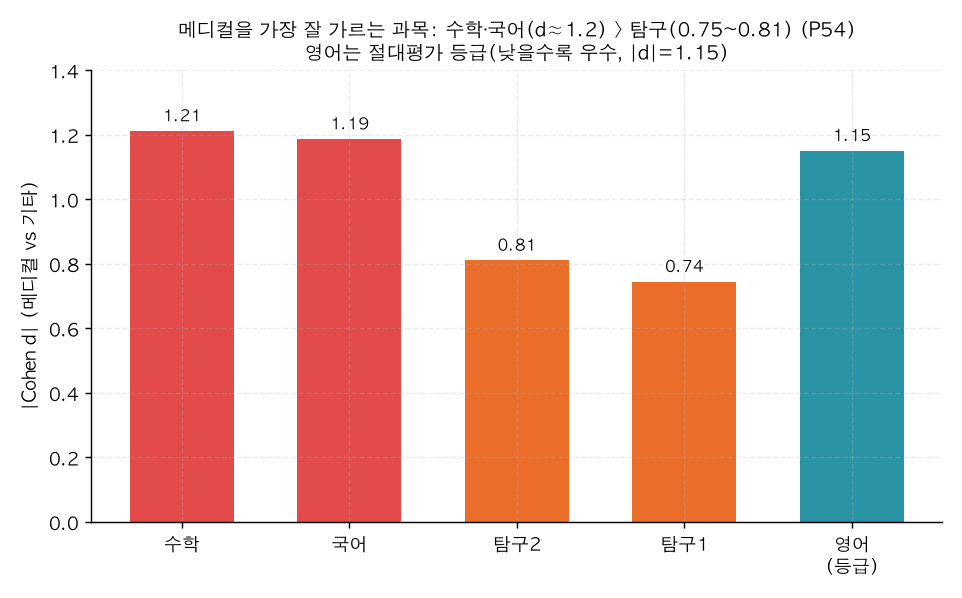

# P54. 과목별 백분위 ↔ 메디컬 (어느 과목이 변별?)

> **명제(제안)** · 메디컬 합격은 특정 과목(수학) 백분위가 가장 강하게 가른다
> **분류** D 모의고사·성적·입시 · **상태** ✅ 지지(강) · *AI 도출 명제(origin.xlsx 외)*

## 한 줄 결론
> **✅ 강하게 지지 — 수학·국어가 거의 동급 최강 변별.** 메디컬을 가르는 과목별 효과크기는 **수학 d=+1.21 ≈ 국어 d=+1.19 > 탐구2 +0.81 ≈ 탐구1 +0.75**, 영어(절대평가 등급) |d|=1.15. 메디컬은 수학 89.5 vs 기타 60.8로 **29%p** 격차. P48(과목 *균형*)과 합치면 "메디컬은 전 과목 고른 동시에 특히 수학·국어가 정점".

## 결과 (졸업생, 학생별 과목 평균 백분위)

| 과목 | 메디컬 d | 메디컬 | 기타 |
|------|:---:|:---:|:---:|
| **수학** | **+1.212** | 89.5 | 60.8 |
| **국어** | **+1.187** | 88.1 | 62.1 |
| 탐구2 | +0.811 | 81.6 | 64.3 |
| 탐구1 | +0.745 | 81.6 | 65.8 |
| 영어(등급) | −1.151 | 1.6등급 | 2.6등급 |

*수학·국어가 d≈1.2로 최강, 탐구는 d 0.75~0.81로 한 단계 낮음. 영어는 절대평가라 메디컬 1.6등급 vs 기타 2.6등급(|d|=1.15).*

## 도출 근거
P48은 과목 *균형*(편차)만 봤다. 정시 메디컬은 전 과목 고득점이 필요하지만, *어느 과목*이 가장 변별력 있는지(컨설팅 우선순위)는 미검증. 과목별 효과크기 비교.

## 시사점 · 한계 · 연관
- **컨설팅 시사점**: 메디컬 지망 변별의 핵심은 **수학·국어**(d≈1.2). 탐구는 상대적으로 약함 — "수·국 먼저, 탐구는 그 다음"의 데이터 근거. 영어는 등급제라 1등급 확보가 사실상 필수 조건.
- **한계**: 과목 백분위는 서로 강한 상관(상위권은 다 잘함) → 단일 과목의 *독립* 기여는 다변량(로지스틱)으로 재확인 여지. 천장효과 가능.
- **연관**: [P48 과목 균형](P48-subject-balance-vs-medical.md) · [32 성적 안정성](../analyses/32-score-stability-vs-admission.md) · [P53 등급 사다리](P53-admission-ladder-vs-score-behavior.md)

## 📊 데이터 출처 & 표본

| 항목 | 내용 |
|------|------|
| 출처 | `exam_management.student_records`(과목별 percentile/grade)+`admission_results` |
| 표본 | 졸업생 성적 보유(메디컬 523 vs 기타) |
| 방법 | 학생별 과목 평균 ↔ 메디컬 Cohen d |
| 추출 | 운영 DB read-only |
| 환경 | 격리 venv(pandas/scipy) |

---
◀ [제안 명제 목록](README.md) · [전체 명제](../README.md)
