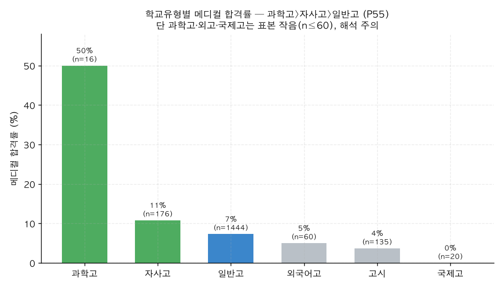

# P55. 학교 유형 ↔ 메디컬 합격률

> **명제(제안)** · 출신 고교 유형에 따라 메디컬 합격률이 다르다
> **분류** E 생활·습관·복합 · **상태** ✅ 지지(표본 주의) · *AI 도출 명제(origin.xlsx 외)*

## 한 줄 결론
> **✅ 학교 유형별 메디컬률 격차 뚜렷 — 단 특목 표본 작음.** 과학고 50%(n=16) > 자사고 10.8%(n=176) > 일반고 7.3%(n=1,444) > 외국어고 5.0% > 고시 3.7% > 국제고 0%. 자사고·과학고가 일반고 대비 높으나, 과학고·외고·국제고는 표본이 작아(n≤60) 확정적 결론은 일반고·자사고 비교에 한함.

## 결과 (졸업생 n=7,290 중 학교유형 보유)

| 학교 유형 | n | 메디컬률 |
|------|:---:|:---:|
| **과학고** | 16 | **50.0%** |
| 자사고 | 176 | 10.8% |
| 일반고 | 1,444 | 7.3% |
| 외국어고 | 60 | 5.0% |
| 고시(검정고시) | 135 | 3.7% |
| 국제고 | 20 | 0.0% |

*과학고가 압도적이나 n=16으로 작음. 통계적으로 의미 있는 비교는 자사고(10.8%) vs 일반고(7.3%) — 약 1.5배.*

## 도출 근거
`school_type` 필드 미사용. 입시결과가 학생 *배경*(출신고)과 연관되는지 — 잇올의 부가가치(환경·관리)와 선발효과(우수 학생 유입)를 구분하는 단서.

## 시사점 · 한계 · 연관
- **선택편향 주의**: 자사고·과학고 출신이 메디컬률 높은 건 잇올 효과가 아니라 **입학 전 학력**(선발효과)일 수 있다. 메디컬은 결국 성적이 가르므로([39](../analyses/39-composite-index-vs-admission.md)), 학교유형은 입학 시점 성적의 대리지표로 봐야 한다.
- **한계**: 과학고·외고·국제고 n≤60 → 과학고 50%는 점추정 불안정. 자사고 vs 일반고만 안정적.
- **연관**: [P56 N수 차수](P56-grade-rounds-vs-medical.md) · [P53 등급 사다리](P53-admission-ladder-vs-score-behavior.md) · [34 조기 입소](../analyses/34-early-enrollment-vs-admission.md)

## 📊 데이터 출처 & 표본

| 항목 | 내용 |
|------|------|
| 출처 | `exam_management.admission_results`(school_type, is_medical) |
| 표본 | 졸업생 학교유형 보유 |
| 방법 | 유형별 메디컬 합격률 |
| 추출 | 운영 DB read-only |
| 환경 | 격리 venv(pandas/scipy) |

---
◀ [제안 명제 목록](README.md) · [전체 명제](../README.md)
