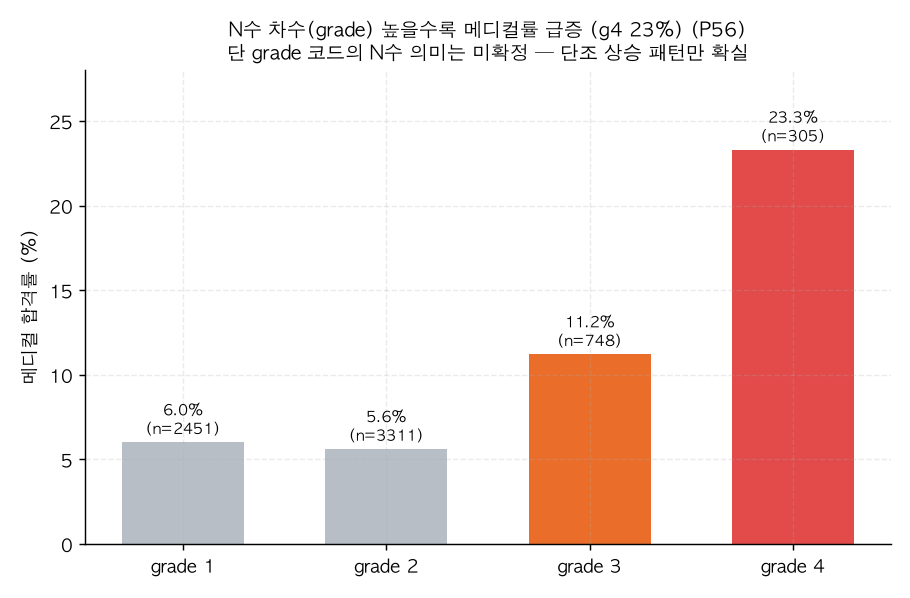

# P56. N수 차수(grade) ↔ 메디컬 합격률

> **명제(제안)** · 재수·N수 차수가 높을수록 메디컬 합격률이 높다
> **분류** E 생활·습관·복합 · **상태** ✅ 발견(grade 해석 주의) · *AI 도출 명제(origin.xlsx 외)*

## 한 줄 결론
> **✅ 발견 — grade 높을수록 메디컬률 급증(단조).** grade 1·2에서 메디컬률 6.0%·5.6%이던 것이 grade 3에서 11.2%, **grade 4에서 23.3%**로 급증한다. 'N수를 거듭할수록 메디컬'이라는 강한 패턴 — 단 `grade` 코드가 정확히 몇 수인지 운영 정의 미확인(34번과 동일 caveat)이라 *단조 상승 패턴* 자체만 확실하다.

## 결과 (졸업생, grade별)

| grade | n | 메디컬률 | 성적 백분위 |
|:---:|:---:|:---:|:---:|
| 1 | 2,451 | 6.0% | 65.4 |
| 2 | 3,311 | 5.6% | 63.5 |
| 3 | 748 | 11.2% | 68.7 |
| **4** | 305 | **23.3%** | 72.2 |

*grade 3·4에서 메디컬률이 2배·4배로 뛴다. 성적 백분위도 함께 상승(65→72) — N수 누적이 성적·메디컬 양쪽과 연관.*

## 도출 근거
`grade` 필드 미사용(34번이 입소시점만 봄). 메디컬은 재도전이 흔한 트랙이라 N수 차수와 강하게 연관될 것이라는 가설. 강하게 확인.

## 시사점 · 한계 · 연관
- **해석**: N수를 거듭하는 학생이 메디컬에 더 도달 = ① 메디컬 지망생이 목표 달성까지 재수를 반복(생존편향) ② N수로 성적이 실제 상승(72.2 vs 63.5). 둘이 섞여 있어 "N수가 메디컬을 만든다"는 인과로 단정 불가.
- **🔴 한계(중요)**: `grade` 코드의 N수 매핑이 미확정(1=재수? 2=삼수? 음수·10 값도 존재). **단조 상승 패턴만 신뢰**하고 절대 차수 라벨은 운영 확인 필요.
- **연관**: [P55 학교유형](P55-school-type-vs-medical.md) · [34 조기 입소](../analyses/34-early-enrollment-vs-admission.md) · [P50 재등록 회차](P50-reenroll-rounds-vs-rank.md)

## 📊 데이터 출처 & 표본

| 항목 | 내용 |
|------|------|
| 출처 | `exam_management.admission_results`(grade, is_medical) |
| 표본 | 졸업생 grade 보유 |
| 방법 | grade별 메디컬률·성적 |
| 추출 | 운영 DB read-only |
| 환경 | 격리 venv(pandas/scipy) |

---
◀ [제안 명제 목록](README.md) · [전체 명제](../README.md)
