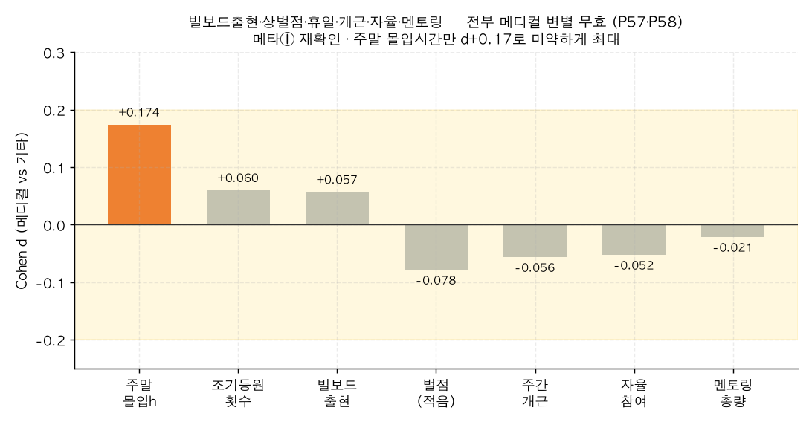

# P58. 빌보드출현·상벌점·휴일·개근·자율·멘토링 ↔ 메디컬 (무변별 묶음)

> **명제(제안)** · 빌보드 출현빈도·상벌점·휴일등원·주간개근·자율참여·멘토링이 메디컬을 가른다
> **분류** E 생활·습관·복합 · **상태** ✗ 무의미(메타① 재확인) · *AI 도출 명제(origin.xlsx 외)*

## 한 줄 결론
> **✗ 전부 무효 — 메타① 재확인.** 그동안 안 본 6개 행동지표(빌보드 출현빈도·상벌점·휴일등원·주간개근·자율참여·멘토링 총량)를 메디컬 기준으로 검증했으나 **모두 |Cohen d|<0.08**로 무효. "잇올 행동지표는 입시 변별력이 없다"는 메타결론이 새 지표들에서도 그대로 재현된다. (주말 몰입시간만 d+0.17로 미약, [P57](P57-weekend-study-hours-vs-medical.md).)

## 결과 (졸업생, 메디컬 vs 기타 Cohen d)

| 지표 | Cohen d | 메디컬 | 기타 |
|------|:---:|:---:|:---:|
| 조기등원 랭킹 횟수 | +0.060 | 8.64 | 7.26 |
| 빌보드(focus) 출현 | +0.057 | 8.64 | 7.33 |
| 벌점(적을수록 메디컬) | −0.078 | 0.53 | 0.68 |
| 주간 개근 횟수 | −0.056 | 6.97 | 7.38 |
| 자율참여율 | −0.052 | 0.97 | 0.97 |
| 멘토링 총량 | −0.021 | 0.00 | 0.07 |
| 휴일 등원 횟수 | +0.011 | 10.29 | 10.16 |

*모든 막대가 노란 무효 구간(|d|<0.2) 안. 벌점이 d−0.08로 '성실성 미세 신호'([19](../analyses/19-toptier-medical-tenure.md)·[P45](P45-late-ratio-vs-admission.md))를 재현하나 효과는 미미.*

## 도출 근거
미사용 행동 필드(`focus_rank_count`·`study_rank_count`·`early_arrival_rank_count`·`holiday_attend_count`·`behavior_penalty_count`·`weekly_perfect_count`·`voluntary_ratio`·`mentoring_total`)를 한 번에 메디컬 변별 검증. "혹시 안 본 지표 중 변별력 있는 게 있나"의 완결성 점검.

## 시사점 · 연관
- **완결성 확인**: 남은 행동 지표를 전수 점검해도 변별력이 없음을 확인 → 메타①("입시=성적, 행동 아님")이 측정 가능한 거의 모든 행동에서 견고함을 보강.
- **연관**: [39 복합예측](../analyses/39-composite-index-vs-admission.md) · [20 메디컬↔몰입](../analyses/20-toptier-medical-focus.md) · [P53 등급 사다리](P53-admission-ladder-vs-score-behavior.md)

## 📊 데이터 출처 & 표본

| 항목 | 내용 |
|------|------|
| 출처 | `exam_management.admission_results`+`student_behavior_stats`(8개 행동 필드) |
| 표본 | 졸업생(메디컬 523 vs 기타 6,767) |
| 방법 | 지표별 Cohen d |
| 추출 | 운영 DB read-only |
| 환경 | 격리 venv(pandas/scipy) |

---
◀ [제안 명제 목록](README.md) · [전체 명제](../README.md)
