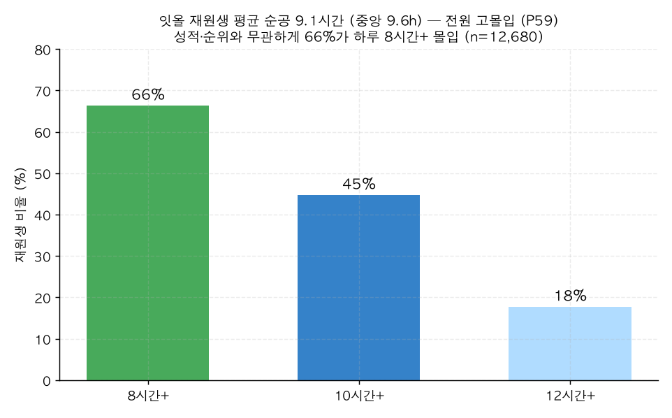

# P59. 고몰입 환경 — 잇올생은 전원이 길게 몰입한다 (마케팅)

> **명제(제안)** · 잇올에 다니면 성적·순위와 무관하게 전원이 고몰입 학습 환경에 들어간다
> **분류** 마케팅 가치제안 · **상태** ✅ 마케팅 가능(가장 깨끗) · *AI 도출 명제(origin.xlsx 외)*

## 한 줄 결론
> **✅ 가장 방어 가능한 마케팅 주장.** 잇올 재원생 평균 순공 **9.1시간**(중앙 9.6h), **66%가 하루 8시간+, 45%가 10시간+** 몰입한다. 이 분석 전체에서 "행동이 성과를 못 가른다"가 반복된 *진짜 이유*가 바로 이것 — **바닥이 이미 높아서** 내부에서 우열이 안 갈린다. 즉 "상위권만 열심히"가 아니라 **전원을 고몰입으로 끌어올리는 환경**이라는 가치제안으로 뒤집을 수 있다. 인과 가정이 필요 없는(순수 서술) 사실이라 가장 안전하다.

## 결과 (현재 재원생 n=12,680, ≥10일 등원)

| 지표 | 값 |
|------|-----|
| 평균 몰입(순공) | **9.1시간/일** |
| 중앙값 | 9.6시간 |
| 8시간+ 비율 | **66.3%** |
| 10시간+ 비율 | 44.7% |
| 12시간+ 비율 | 17.7% |

*성적·순위와 무관하게 3명 중 2명이 하루 8시간+ 몰입. 일반 수험생 평균을 크게 상회하는 학습 밀도.*

## 마케팅 카피 제안
- *"잇올에 오면 하루 9시간 순공이 '기본값'인 환경에 들어옵니다."*
- *"우리는 상위권만 열심히 하게 두지 않습니다 — 재원생 66%가 하루 8시간 이상 몰입합니다."*

## 🔴 정직한 한계
- **현재 재원생(생존자) 기준**: 이미 다니고 있는 학생의 몰입이라, 이탈자는 빠져 있다(상향 편의 가능). 단 "재원 중 학습 밀도"라는 주장 자체엔 영향 없음.
- **순수 서술**: "잇올이 몰입을 *만들었다*"는 인과가 아니라 "잇올 재원생이 고몰입 *상태*"라는 사실. 인과 주장으로 확대 금지.
- 몰입(focus)은 등원인정 교시 일부 포함 가능([DATA_QUALITY](../DATA_QUALITY_focus_time.md)), 보정해도 결론 견고.

## 연관
[01 몰입↔순위](../analyses/01-focus-absolute-vs-billboard-rank.md) · [P60 전국 위치](P60-national-percentile-position.md) · [20 메디컬↔몰입](../analyses/20-toptier-medical-focus.md)(천장효과)

## 📊 데이터 출처 & 표본
| 항목 | 내용 |
|------|------|
| 출처 | `student_daily_report`(focus_time, 30일) |
| 표본 | 현재 재원생 12,680명(≥10일 등원) |
| 방법 | 학생별 평균 몰입 분포·임계 비율 |
| 추출 | 운영 DB read-only |
| 환경 | 격리 venv(pandas/scipy) |

---
◀ [제안 명제 목록](README.md) · [전체 명제](../README.md)
