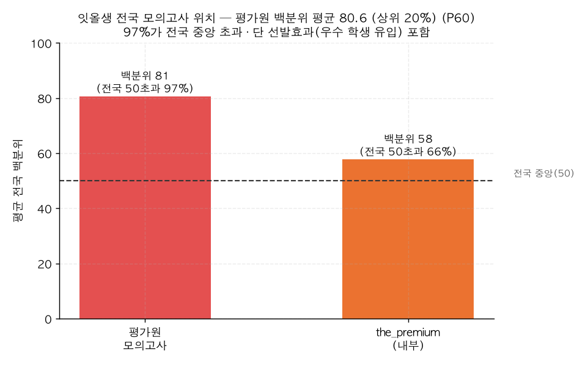

# P60. 전국 상위권 포진 — 잇올생 평균 백분위 80 (마케팅)

> **명제(제안)** · 잇올생은 전국 모의고사에서 상위권에 포진한다
> **분류** 마케팅 가치제안 · **상태** ✅ 마케팅 가능(선발효과 주의) · *AI 도출 명제(origin.xlsx 외)*

## 한 줄 결론
> **✅ 강한 포지셔닝 주장 — 단 선발효과 명시 필요.** 잇올생의 **평가원 모의고사 평균 백분위는 80.6**(전국 중앙 50 대비 +31, 사실상 **상위 20%**), **97%가 전국 중앙을 초과**한다. 내부 시험(the_premium)으로 봐도 평균 57.7, 66%가 중앙 초과. "잇올에는 전국 상위권이 모인다"는 사실은 강력하지만, 이는 *잇올이 만든 결과*가 아니라 *우수 학생이 모인 현재 위치*(선발효과)일 수 있으므로 인과 주장은 피해야 한다.

## 결과 (졸업생 성적 보유)

| 시험 | 평균 전국 백분위 | 전국 중앙(50) 초과 비율 |
|------|:---:|:---:|
| **평가원 모의고사**(공식) | **80.6** (상위 ~20%) | **97%** |
| the_premium(내부) | 57.7 | 66% |

*평가원(전국 공식) 기준 잇올생 평균은 상위 20%권. 두 시험의 차이는 응시 성격·난이도 차(평가원은 전국 공식, the_premium은 내부)에서 옴.*

## 마케팅 카피 제안
- *"잇올생의 97%가 전국 모의고사 평균(백분위 50)을 넘습니다."*
- *"평가원 모의고사 기준 잇올생 평균은 전국 상위 20%."*

## 🔴 정직한 한계
- **🔴 선발효과(가장 중요)**: 백분위 80은 "잇올이 끌어올렸다"의 증거가 아니라 "우수 학생이 잇올에 모인다"의 결과일 수 있다. 입학 전 실력 통제 없이는 잇올의 *순수 기여*를 분리 못 한다 → "잇올에는 상위권이 모인다"(현재 위치)로만 쓰고, "잇올이 상위권으로 만든다"(인과)로 확대 금지. 인과 주장은 [P61 성적 향상](P61-score-growth-during-enrollment.md)에서 *제한적으로* 다룸.
- **평가원 vs 내부 시험 격차(80.6 vs 57.7)**: 보수적으로 쓰려면 내부 시험 기준(평균 58, 66% 초과)도 병기 권장.

## 연관
[P62 배출 실적](P62-admission-track-record.md) · [P61 성적 향상](P61-score-growth-during-enrollment.md) · [39 복합예측](../analyses/39-composite-index-vs-admission.md)

## 📊 데이터 출처 & 표본
| 항목 | 내용 |
|------|------|
| 출처 | `exam_management.student_records`(percentile, 평가원·the_premium) |
| 표본 | 졸업생 성적 보유 |
| 방법 | 학생별 평균 백분위, 전국 중앙(50) 초과 비율 |
| 추출 | 운영 DB read-only |
| 환경 | 격리 venv(pandas/scipy) |

---
◀ [제안 명제 목록](README.md) · [전체 명제](../README.md)
