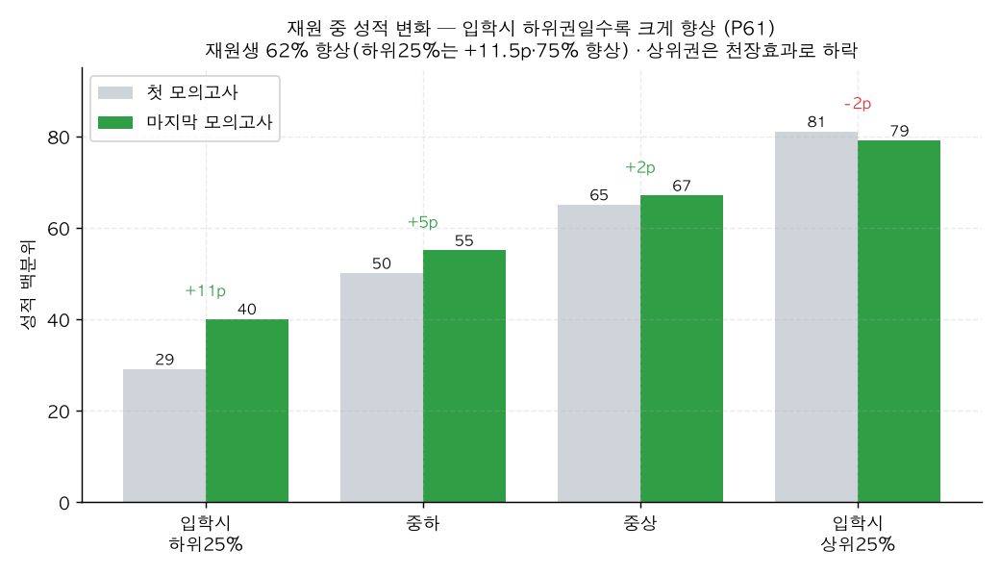

# P61. 재원 중 성적 향상 — 입학시 하위권일수록 크게 (마케팅)

> **명제(제안)** · 잇올 재원 중 모의고사 성적이 오른다, 특히 입학 시 하위권일수록
> **분류** 마케팅 가치제안 · **상태** ◐ 조건부 마케팅(RTM·대조군 주의) · *AI 도출 명제(origin.xlsx 외)*

## 한 줄 결론
> **◐ 조건부로 사용 가능 — "재원 중 다수가, 특히 하위권이 향상".** 현재 재원생의 내부 모의고사(the_premium) 3회+ 추적 시 첫 시험 56.2 → 마지막 60.4(**+4.2p**), **62%가 향상**(5p+ 향상 45.6%). 특히 **입학 시 하위25%는 29→40으로 +11.5p, 75%가 향상**. 다만 ⚠️ 상위권은 천장효과로 하락하고, 졸업생 전체로는 −2.3p이며, 대조군이 없어 **평균 회귀(RTM)**와 순수 잇올 효과를 분리하지 못한다.

## 결과 (현재 재원생, the_premium 3회+ n=2,096)

| 입학 시 성적 | 첫 → 마지막 | 변화 | 향상 비율 |
|------|:---:|:---:|:---:|
| **하위 25%** | 29 → 40 | **+11.5p** | **75%** |
| 중하 | 50 → 55 | +5.4p | 67% |
| 중상 | 65 → 67 | +2.4p | 62% |
| 상위 25% | 81 → 79 | −2.5p | 44% |
| **전체** | 56.2 → 60.4 | **+4.2p** | 62% |

*입학 시 낮을수록 향상폭이 크고(하위 +11.5p), 상위권은 천장효과로 정체·하락. 향상과 회귀가 섞여 있음.*

## 마케팅 카피 제안 (보수적)
- *"잇올 재원생의 62%가 모의고사 성적이 올랐습니다."* (현재생·내부 모의고사 기준)
- *"특히 입학 시 중하위권 학생의 4명 중 3명이 향상했습니다."*

## 🔴 정직한 한계
- **🔴 평균 회귀(RTM)**: 하위권 상승·상위권 하락은 통계적 평균 회귀로도 나타나는 패턴이다. 대조군(비잇올 동급생)이 없어 **+11.5p 중 얼마가 잇올 효과인지 분리 불가**. "향상했다"(사실)는 OK, "잇올이 향상시켰다"(인과)는 과장.
- **🔴 졸업생은 −2.3p**: 졸업생 the_premium은 수능 임박 난이도 상승 등으로 오히려 하락. → "성적이 오른다"를 *전체*에 일반화 금지. **"재원 중 다수가, 특히 하위권이"** 로 한정.
- 상위권(입학시 상위25%)은 향상 비율 44%로 절반 미만.

## 연관
[33 절대수준 vs 기울기](../analyses/33-slope-vs-baseline-prediction.md) · [P60 전국 위치](P60-national-percentile-position.md) · [P52 성적수준↔몰입](P52-score-level-vs-focus.md)

## 📊 데이터 출처 & 표본
| 항목 | 내용 |
|------|------|
| 출처 | `exam_management.student_records`(the_premium 백분위 시계열) |
| 표본 | 현재 재원생 the_premium 3회+ 2,096명 (졸업생 2,664 대조) |
| 방법 | 학생별 첫 vs 마지막 시험, 입학분위별 변화 |
| 추출 | 운영 DB read-only |
| 환경 | 격리 venv(pandas/scipy) |

---
◀ [제안 명제 목록](README.md) · [전체 명제](../README.md)
