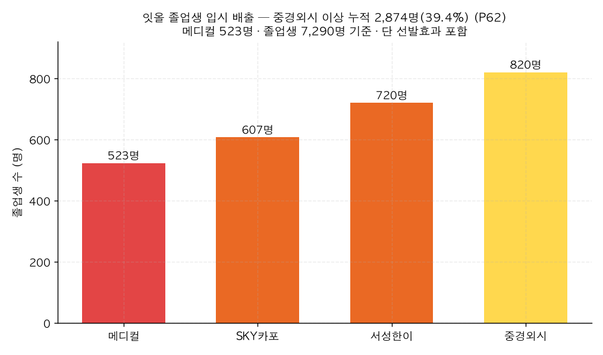

# P62. 입시 배출 실적 — 중경외시 이상 39%, 메디컬 523명 (마케팅)

> **명제(제안)** · 잇올 졸업생은 상위권 대학에 다수 합격한다
> **분류** 마케팅 가치제안 · **상태** ✅ 마케팅 가능(사실·선발효과 주의) · *AI 도출 명제(origin.xlsx 외)*

## 한 줄 결론
> **✅ 사실 기반 실적 주장.** 졸업생 7,290명 중 **메디컬 523명(7.2%)·SKY카포 607명·서성한이 720명·중경외시 820명** — **중경외시 이상 누적 2,874명(39.4%)**. 졸업생 5명 중 2명이 중경외시 이상에 진학한 *사실*은 강한 실적이다. 단 이는 잇올의 부가가치와 선발효과(우수 학생 유입)가 섞인 결과이므로 "배출했다"(사실)로 쓰고 "만들었다"(인과)로 단정하지 않는다.

## 결과 (졸업생 n=7,290, adm_group)

| 입시 등급 | 인원 | 비율 |
|------|:---:|:---:|
| 메디컬 | 523 | 7.2% |
| SKY카포 | 607 | 8.3% |
| 서성한이 | 720 | 9.9% |
| 중경외시 | 820 | 11.2% |
| **중경외시 이상 누적** | **2,874** | **39.4%** |

*메디컬 523명을 포함해 졸업생의 39.4%가 중경외시 이상에 진학.*

## 마케팅 카피 제안
- *"잇올 졸업생 5명 중 2명이 중경외시 이상 (메디컬 523명 배출)."*
- *"한 해 메디컬 합격생 523명 — 잇올이 함께했습니다."*

## 🔴 정직한 한계
- **🔴 선발효과**: 입시 결과는 입학 시점 성적이 거의 전적으로 가른다([39](../analyses/39-composite-index-vs-admission.md) AUC 0.88은 성적, 0.52는 행동). 즉 실적의 상당 부분은 우수 학생 유입에서 옴. "배출 실적"(사실)은 정당하나 "잇올이 합격시켰다"(인과)는 분리 불가.
- **분모 정의**: 7,290명은 입시결과 보유 졸업생 기준. 전체 재원/졸업 모집단과 다를 수 있어 "졸업생 중" 명시 권장.
- 적정 비교: 동일 입학 성적대의 타 기관 대비 진학률(부가가치)이 진짜 효과지만 데이터 부재.

## 연관
[P53 입시 등급 사다리](P53-admission-ladder-vs-score-behavior.md) · [39 복합예측](../analyses/39-composite-index-vs-admission.md) · [P60 전국 위치](P60-national-percentile-position.md)

## 📊 데이터 출처 & 표본
| 항목 | 내용 |
|------|------|
| 출처 | `exam_management.admission_results`(adm_group) |
| 표본 | 졸업생 입시결과 7,290명 |
| 방법 | 등급별 인원·누적 비율 |
| 추출 | 운영 DB read-only |
| 환경 | 격리 venv(pandas/scipy) |

---
◀ [제안 명제 목록](README.md) · [전체 명제](../README.md)
