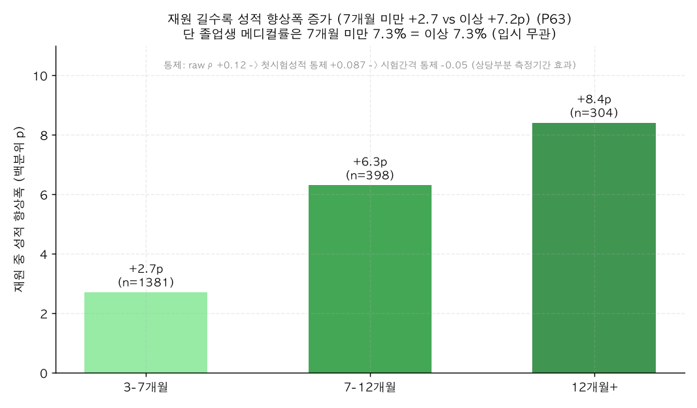

# P63. 재원기간 임계(7개월+) ↔ 성적 향상·입시 (마케팅)

> **명제(제안)** · "7개월 이상 다니면 도움이 된다" — 재원기간 임계로 성과를 주장할 수 있나
> **분류** 마케팅 가치제안 · **상태** ◐ 성적향상은 조건부 가능 / ✗ 입시는 불가 · *AI 도출 명제(origin.xlsx 외)*

## 한 줄 결론
> **갈린다 — 성적 향상으로는 ◐ 쓸 수 있고, 입시결과로는 ✗ 절대 못 쓴다.**
> - **✗ 입시**: 졸업생 메디컬률이 7개월 미만 **7.3%** = 7개월 이상 **7.3%**(완전 평평, 12개월+는 오히려 4.5%). "7개월+ 다니면 입시 좋다"는 데이터가 정면으로 반박.
> - **◐ 성적 향상**: 7개월 미만 +2.7p vs **7개월 이상 +7.2p**, 재원 길수록 단조 증가(3-7 +2.7 → 7-12 +6.3 → 12+ +8.4p). 같은 시작 성적대 내에서도 성립(시작 하위: +6.7 vs **+13.6p**). 단 ⚠️ **시험 간격(측정 기간)을 통제하면 효과가 −0.05로 사라져**, 상당 부분이 "오래 측정할수록 변화폭이 크다"는 기계적 효과 + 평균회귀다.

## 결과

**① 입시결과 — 재원기간 무관 (졸업생 n=6,975)**

| 재원기간 | n | 메디컬률 | 중경외시+ |
|------|:---:|:---:|:---:|
| 0-3개월 | 3,062 | 7.1% | 37.1% |
| 3-7개월 | 2,065 | 7.6% | 36.7% |
| 7-12개월 | 1,809 | 7.4% | 35.5% |
| 12개월+ | 354 | 4.5% | 37.6% |
| **7개월 미만** | 5,127 | **7.3%** | 36.9% |
| **7개월 이상** | 1,848 | **7.3%** | 35.8% |

**② 성적 향상 — 재원 길수록 단조 증가 (현재생 the_premium 3회+, n=2,096)**

| 재원기간 | n | 성적 향상 | 향상 비율 |
|------|:---:|:---:|:---:|
| 3-7개월 | 1,381 | +2.7p | 61% |
| 7-12개월 | 398 | +6.3p | 63% |
| 12개월+ | 304 | **+8.4p** | 67% |
| **7개월 미만** | 1,394 | +2.7p | 61% |
| **7개월 이상** | 702 | **+7.2p** | 65% |

*재원 길수록 성적 향상폭이 단조 증가하지만, 입시(메디컬)는 7개월 임계로 전혀 안 갈린다.*

## 교란 통제 (정직성)

| 재원개월 ↔ 성적향상 | ρ |
|------|:---:|
| raw | +0.120 |
| 첫시험 성적 통제(평균회귀 제거) | +0.087 |
| **시험 간격(측정기간) 통제** | **−0.052 (소멸)** |
| (참고) 시험 간격 ↔ 향상 | +0.225 |

→ 향상의 상당 부분은 **재원기간 자체가 아니라 "첫–마지막 시험 간격이 길수록 변화폭이 크다"는 측정 효과**다. 단, **같은 시작 성적대 내에서도 7개월+가 더 향상**(시작 하위 +13.6 vs +6.7p)하는 패턴은 남는다.

## 마케팅 카피 제안 (성적 향상 한정)
- *"7개월 이상 다닌 학생은 모의고사 성적이 평균 +7p 향상 (7개월 미만의 약 2.7배)."*
- *"특히 입학 시 성적이 낮았던 학생은 7개월 이상 다니면 +13p 향상."*

## 🔴 정직한 한계 (반드시 함께)
- **🔴 입시결과엔 절대 쓰지 말 것**: 재원기간 임계는 메디컬·중경외시 합격률을 전혀 안 가른다(7.3%=7.3%). "오래 다니면 입시 좋다"는 거짓.
- **🔴 측정기간 교란**: 향상 dose-response의 상당 부분은 재원기간이 아니라 *측정 구간이 길어서* 생긴다(span 통제 시 −0.05). "잇올 7개월의 효과"가 아니라 "더 오래 추적하니 더 변했다"에 가깝다.
- **평균 회귀·대조군 부재**: 오래 다니는 학생은 시작 성적이 낮고(52.7 vs 60.0), 향상엔 평균 회귀가 섞임. 대조군 없어 순수 잇올 효과 분리 불가.
- 안전한 표현은 **"7개월 이상 다닌 학생은 성적이 평균 +7p 올랐다"(서술적 사실)** — "잇올 7개월이 +7p 올린다"(인과)로 확대 금지.

## 연관
[P61 재원 중 성적향상](P61-score-growth-during-enrollment.md) · [13 Top-100 재원기간](../analyses/13-top100-tenure.md)(순위 무관) · [19 메디컬↔재원](../analyses/19-toptier-medical-tenure.md)(입시 무관)

## 📊 데이터 출처 & 표본
| 항목 | 내용 |
|------|------|
| 출처 | `enrollment_history`(재원기간 합산) + `exam_management`(the_premium 성적·admission_results) |
| 표본 | 졸업생 입시 6,975명 / 현재생 성적향상 2,096명 |
| 방법 | 재원기간 임계·구간별 메디컬률·성적향상, 첫시험·시험간격 통제 부분상관 |
| 추출 | 운영 DB read-only |
| 환경 | 격리 venv(pandas/scipy) |

---
◀ [제안 명제 목록](README.md) · [전체 명제](../README.md)
