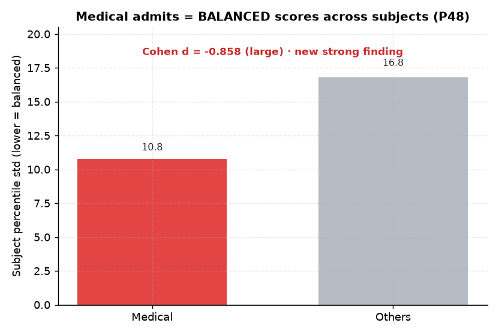

# 제안 명제 (AI 도출) — P42~P58

origin.xlsx의 41개 명제와 **별도로**, 분석 과정에서 쌓인 데이터·발견을 바탕으로 AI가 추가 도출한 명제 17개. 기존 데이터를 재활용해 검증.

> **P42~P52**: 순위·성적 동역학 재해석. **P53~P58(신규)**: 그동안 안 쓴 필드(입시 등급 사다리·과목별·학교유형·N수·빌보드출현·상벌점 등) 발굴.

## 결과 요약

| # | 명제 | 상태 | 핵심 수치 |
|---|------|------|------|
| [P42](P42-checkout-time-vs-rank.md) | 퇴실시각 ↔ 순위 | ◐ STUDY 빌보드 한정 | STUDY +0.46 / FOCUS +0.12 ⚠️ |
| [P43](P43-consecutive-attendance-vs-rank.md) | 연속등원 ↔ 순위 | ✅ **지지(강·견고)** | STUDY +0.42 / FOCUS +0.25 ✅ |
| [P44](P44-focus-efficiency-vs-score.md) | 몰입효율 ↔ 성적상승 | ✗ 무의미 | −0.016 (효율 99% 수렴) |
| [P45](P45-late-ratio-vs-admission.md) | 지각률 ↔ 메디컬 | ◐ 약한 지지 | d=−0.131 |
| [P46](P46-weekend-ratio-vs-admission.md) | 주말등원율 ↔ 메디컬 | ✗ 무의미 | d=−0.070 |
| [P47](P47-center-size-vs-rank.md) | 센터 규모 ↔ 순위 | ✗ 무의미 | −0.017 |
| [P48](P48-subject-balance-vs-medical.md) | 과목 균형 ↔ 메디컬 | ✅ **지지(강)** | **d=−0.858** |
| [P49](P49-subject-qna-ratio-vs-score.md) | 교과 Q&A 비중 ↔ 성적 | ✗ 무의미 | +0.021 (99% 교과) |
| [P50](P50-reenroll-rounds-vs-rank.md) | 재등록 회차 ↔ 순위 | ◐ 약한 음 | +0.029 |
| [P51](P51-inefficient-learner-profile.md) | 비효율 학습자 프로파일 | ✅ 발견 | 연속등원 36 vs 46 |
| [P52](P52-score-level-vs-focus.md) | 성적 수준(연속) ↔ 몰입·꾸준함 | ◐ 약한 지지(서술적) | ρ=+0.123 (분위 +0.93h) |
| [P53](P53-admission-ladder-vs-score-behavior.md) | 입시 등급 사다리 ↔ 성적·행동 | ✅ **지지(강)** | 성적 ρ+0.58 / 행동 ≤0.06 |
| [P54](P54-subject-medical-discrimination.md) | 과목별 백분위 ↔ 메디컬 | ✅ **지지(강)** | 수학 d+1.21·국어 +1.19 |
| [P55](P55-school-type-vs-medical.md) | 학교 유형 ↔ 메디컬 | ✅ 지지(표본주의) | 자사고 11% vs 일반고 7% |
| [P56](P56-grade-rounds-vs-medical.md) | N수 차수(grade) ↔ 메디컬 | ✅ 발견(해석주의) | g4 23% vs g1~2 6% |
| [P57](P57-weekend-study-hours-vs-medical.md) | 주말 몰입시간 ↔ 메디컬 | ◐ 약한 지지 | d=+0.174 (행동 중 최대) |
| [P58](P58-behavior-null-bundle-vs-medical.md) | 빌보드출현·상벌점·휴일·개근 외 | ✗ 무의미 | 전부 \|d\|<0.08 |

**집계**: ✅ 지지/발견 **7**(P43·P48·P51·P53·P54·P55·P56) · ◐ 약함/조건부 **5**(P42·P45·P50·P52·P57) · ✗ 무의미 **5**(P44·P46·P47·P49·P58)

> ⚠️ P42·P43은 [방법론 재검증](../METHODOLOGY_billboard_choice.md)에서 갈렸다: **FOCUS_TIME 빌보드로 보면 P43(연속등원)만 견고**하고 P42(퇴실)는 STUDY_TIME 구성효과(체류↑→study↑)로 약화. 26 공용공간도 같은 이유로 반전.

## 핵심 발견

1. **P48 과목 균형 ↔ 메디컬 (d=−0.86)** — 가장 강한 새 발견. 메디컬은 *높고(32: d+1.33)·안정적(32: d−1.08)·균형적(P48: d−0.86)* 성적. "한 과목 천재"보다 "전 과목 고른 학생"이 메디컬.

   

   *P48 — 메디컬 합격자의 과목별 백분위 편차(std 10.8)는 기타(16.8)의 2/3 수준. 전 과목 고득점이 필요한 정시 특성과 정합.*

2. **P43 연속등원·P51 비효율학습자 = 견고한 '꾸준함' 효과** — 02 일관성과 같은 테마. 특히 **P43은 STUDY·FOCUS 빌보드 양쪽에서 생존**하는 유일한 순위 동인. 단 **P42 퇴실시각은 같은 '오래 머무름' 테마지만 STUDY_TIME 구성효과(체류↑→study_time↑)에 의존** — FOCUS 빌보드선 약화([방법론 노트](../METHODOLOGY_billboard_choice.md), 메인 README ④).
3. **P44·P46·P47·P49 무의미** — 효율·주말·센터·Q&A유형의 변별력 없음. "행동 변별력 약함" 메타결론과 일치.
4. **P52 방향 뒤집기 — 성적 수준(연속) ↔ 몰입은 약하지만 확실한 양(+0.123)** — "행동→성과"가 0이어도 "성적 상위권일수록 몰입·꾸준함이 *조금* 더 높다"는 서술은 참(인과 아님). 메디컬 이진컷(d≈0)이 범위 제한으로 죽였던 약한 신호가 연속 분포에선 살아난다.
5. **P53 입시 등급 사다리 — 메타① 일반화** — '입시=성적'이 메디컬 *이진*뿐 아니라 6단계 등급 전체에서 성립(성적 ρ+0.58 단조 / 행동 ≤0.06). 행동 무변별이 극단컷 artifact가 아님을 확정.
6. **P54 과목별 — 수학·국어가 최강 변별(d≈1.2) > 탐구(0.75~0.81)** — P48(균형)을 보완: 메디컬은 *균형*잡힌 동시에 *수·국이 정점*. 컨설팅 우선순위 근거.
7. **P55 학교유형·P56 N수 — 배경이 메디컬과 연관** — 자사고>일반고(1.5배), N수 차수↑→메디컬률↑(g4 23%). 단 선발효과·grade 코드 해석 주의.

→ 제안 명제도 동일한 결론으로 수렴: **변별은 '얼마나'가 아니라 '얼마나 꾸준/균형적이냐', 그리고 성적이다.** P53~P58은 이를 ① 입시 등급 사다리 전체로 일반화하고 ② 성적 변별의 세부(수·국 정점)·배경(학교·N수)을 드러내되, ③ 새 행동지표(빌보드출현·상벌점·휴일·개근·자율·멘토링)는 여전히 전부 무변별(P58)임을 재확인한다.

---
◀ [전체 명제 목록](../README.md)
